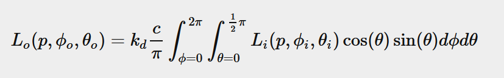
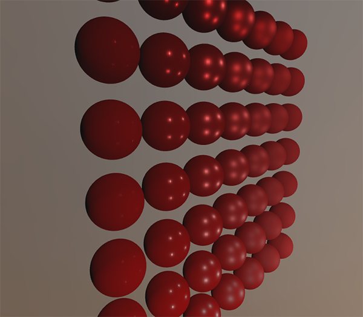

# IBL - Diffuse irradiance

## Diffuse irradiance(漫反射辐照度)

* IBL, image based lighting，用于照射物体的技术集合。不像上一章节的直接解析光照那样，而是将周围环境看成一个大的光源。通常通过一个cubemap environment map实现，cubemap environment map 可以从真实世界中得到或者三维场景中生成。将每个 cubemap 纹素看成一个光源发射器。
* 再看反射公式


* 我们的主要目标是求解所有入射光wi在半球上的积分。求解该公式有两个主要的要求：
  * 有某种方式在任意方向向量wi上返回场景的辐射
  * 能够快速实时的求解积分
* 第一个问题，环境立方体映射(environment cubemap)保存了环境或场景的辐照度。给了这样的立方体映射之后，立方体映射的每个纹素可以看成单个发射的光源。通过任意方向向量 wi 采样立方体映射，我们可以从该方向得到场景的辐射度。
* 任意方向向量 wi 的场景辐射度计算如下

```c++
vec3 radiance = texture(_cubemapEnvironment, w_i).rgb; 
```

* 然而，对于计算出半球上所有方向的辐射，在片段着色器中则太过昂贵。这里采用预处理或预计算的方式解决。
* 从反射公式可知， kd 和 ks 相互独立， 所以可以分解为两个部分


* 关注漫反射部分， 将常量的 Lambert 部分移到积分之外。


* 积分仅仅依赖于wi(假设p位于环境映射的中心)。我们可以在位置p处计算出一个新的 cubemap。通过卷积计算出上面每个纹素(也就是每个出射方向wo)的漫反射积分。卷积的数据集为场景的辐射或环境映射。建立的半球(用于采样方向wi)朝向 wo。


* 生成的 cubemap 称之为 irradiance map
* 可通过生成多个位置处反射探针的 irradiance map，并进行插值来解决某些场景的失真问题。
* 下图cubemap environment map 和相应的 irradiance map([Wave Engine](http://www.indiedb.com/features/using-image-based-lighting-ibl))。


## PBR 和 HDR

* 需要某种方式将照明的高动态范围存储到环境贴图中。

### 辐射(radiance) HDR 文件格式

* 扩展名为 .hdr，存储六个面的数据，数据范围可在 0.0 和 1.0 之外。使用了一个聪明的技巧存储每个浮点值，不用每个通道存储32位的值，而是使用颜色的 8 位 alpha 通道存储颜色的 alpha 值。该做法需要解析每个颜色至他们的浮点值。
* 可以从 sIBL archive 获得许多免费的辐射HDR环境映射文件。


* 注意该图是从球形映射到平面的结果。

### HDR 和 st_image.h

* stb_image 支持加载辐射HDR图像，将其转换为浮点值数组。

```c++

#include "stb_image.h"
[...]

stbi_set_flip_vertically_on_load(true);
int width, height, nrComponents;
float *data = stbi_loadf("newport_loft.hdr", &width, &height, &nrComponents, 0);
unsigned int hdrTexture;
if (data)
{
    glGenTextures(1, &hdrTexture);
    glBindTexture(GL_TEXTURE_2D, hdrTexture);
    glTexImage2D(GL_TEXTURE_2D, 0, GL_RGB16F, width, height, 0, GL_RGB, GL_FLOAT, data); 

    glTexParameteri(GL_TEXTURE_2D, GL_TEXTURE_WRAP_S, GL_CLAMP_TO_EDGE);
    glTexParameteri(GL_TEXTURE_2D, GL_TEXTURE_WRAP_T, GL_CLAMP_TO_EDGE);
    glTexParameteri(GL_TEXTURE_2D, GL_TEXTURE_MIN_FILTER, GL_LINEAR);
    glTexParameteri(GL_TEXTURE_2D, GL_TEXTURE_MAG_FILTER, GL_LINEAR);

    stbi_image_free(data);
}
else
{
    std::cout << "Failed to load HDR image." << std::endl;
}  
```

### 从 Equirectangular 变换至 Cubemap

* 虽然 equirectangular map 也可用于查找，但代价较为昂贵。
* 将 equirectangular 图像转换为 cubemap, 从内部投影 equirectangular map 至 cube 的六个面。 cube 的顶点着色器仅仅简单的渲染该 cube 后，将其自己的局部位置作为一个3D采样向量传递给片段着色器。

```c++
#version 330 core
layout (location = 0) in vec3 aPos;

out vec3 localPos;

uniform mat4 projection;
uniform mat4 view;

void main()
{
    localPos = aPos;  
    gl_Position =  projection * view * vec4(localPos, 1.0);
}
```

* 片段着色器将球面内容贴到立方体上

```c++
#version 330 core
out vec4 FragColor;
in vec3 localPos;

uniform sampler2D equirectangularMap;

const vec2 invAtan = vec2(0.1591, 0.3183);
vec2 SampleSphericalMap(vec3 v)
{
    vec2 uv = vec2(atan(v.z, v.x), asin(v.y));
    uv *= invAtan;
    uv += 0.5;
    return uv;
}

void main()
{
    vec2 uv = SampleSphericalMap(normalize(localPos)); // make sure to normalize localPos
    vec3 color = texture(equirectangularMap, uv).rgb;
    
    FragColor = vec4(color, 1.0);
}
```

* 结果如下


* 渲染六次，使用FBO记录结果

```c++
unsigned int captureFBO, captureRBO;
glGenFramebuffers(1, &captureFBO);
glGenRenderbuffers(1, &captureRBO);

glBindFramebuffer(GL_FRAMEBUFFER, captureFBO);
glBindRenderbuffer(GL_RENDERBUFFER, captureRBO);
glRenderbufferStorage(GL_RENDERBUFFER, GL_DEPTH_COMPONENT24, 512, 512);
glFramebufferRenderbuffer(GL_FRAMEBUFFER, GL_DEPTH_ATTACHMENT, GL_RENDERBUFFER, captureRBO);
```

* 生成对应的 cubemap 颜色纹理

```c++
unsigned int envCubemap;
glGenTextures(1, &envCubemap);
glBindTexture(GL_TEXTURE_CUBE_MAP, envCubemap);
for (unsigned int i = 0; i < 6; ++i)
{
    // note that we store each face with 16 bit floating point values
    glTexImage2D(GL_TEXTURE_CUBE_MAP_POSITIVE_X + i, 0, GL_RGB16F, 
                 512, 512, 0, GL_RGB, GL_FLOAT, nullptr);
}
glTexParameteri(GL_TEXTURE_CUBE_MAP, GL_TEXTURE_WRAP_S, GL_CLAMP_TO_EDGE);
glTexParameteri(GL_TEXTURE_CUBE_MAP, GL_TEXTURE_WRAP_T, GL_CLAMP_TO_EDGE);
glTexParameteri(GL_TEXTURE_CUBE_MAP, GL_TEXTURE_WRAP_R, GL_CLAMP_TO_EDGE);
glTexParameteri(GL_TEXTURE_CUBE_MAP, GL_TEXTURE_MIN_FILTER, GL_LINEAR);
glTexParameteri(GL_TEXTURE_CUBE_MAP, GL_TEXTURE_MAG_FILTER, GL_LINEAR);
```

* 建立6个不同的视图矩阵(面向cube的每个面)，建立90度的投影矩阵，渲染6次将结果保存至浮点帧缓存内。

```c++

glm::mat4 captureProjection = glm::perspective(glm::radians(90.0f), 1.0f, 0.1f, 10.0f);
glm::mat4 captureViews[] = 
{
   glm::lookAt(glm::vec3(0.0f, 0.0f, 0.0f), glm::vec3( 1.0f,  0.0f,  0.0f), glm::vec3(0.0f, -1.0f,  0.0f)),
   glm::lookAt(glm::vec3(0.0f, 0.0f, 0.0f), glm::vec3(-1.0f,  0.0f,  0.0f), glm::vec3(0.0f, -1.0f,  0.0f)),
   glm::lookAt(glm::vec3(0.0f, 0.0f, 0.0f), glm::vec3( 0.0f,  1.0f,  0.0f), glm::vec3(0.0f,  0.0f,  1.0f)),
   glm::lookAt(glm::vec3(0.0f, 0.0f, 0.0f), glm::vec3( 0.0f, -1.0f,  0.0f), glm::vec3(0.0f,  0.0f, -1.0f)),
   glm::lookAt(glm::vec3(0.0f, 0.0f, 0.0f), glm::vec3( 0.0f,  0.0f,  1.0f), glm::vec3(0.0f, -1.0f,  0.0f)),
   glm::lookAt(glm::vec3(0.0f, 0.0f, 0.0f), glm::vec3( 0.0f,  0.0f, -1.0f), glm::vec3(0.0f, -1.0f,  0.0f))
};

// convert HDR equirectangular environment map to cubemap equivalent
equirectangularToCubemapShader.use();
equirectangularToCubemapShader.setInt("equirectangularMap", 0);
equirectangularToCubemapShader.setMat4("projection", captureProjection);
glActiveTexture(GL_TEXTURE0);
glBindTexture(GL_TEXTURE_2D, hdrTexture);

glViewport(0, 0, 512, 512); // don't forget to configure the viewport to the capture dimensions.
glBindFramebuffer(GL_FRAMEBUFFER, captureFBO);
for (unsigned int i = 0; i < 6; ++i)
{
    equirectangularToCubemapShader.setMat4("view", captureViews[i]);
    glFramebufferTexture2D(GL_FRAMEBUFFER, GL_COLOR_ATTACHMENT0, 
                           GL_TEXTURE_CUBE_MAP_POSITIVE_X + i, envCubemap, 0);
    glClear(GL_COLOR_BUFFER_BIT | GL_DEPTH_BUFFER_BIT);

    renderCube(); // renders a 1x1 cube
}
glBindFramebuffer(GL_FRAMEBUFFER, 0);  
```

* 通过写一个简单的天空盒着色器测试刚生成的 cubemap

```c++
#version 330 core
layout (location = 0) in vec3 aPos;

uniform mat4 projection;
uniform mat4 view;

out vec3 localPos;

void main()
{
    localPos = aPos;

    mat4 rotView = mat4(mat3(view)); // remove translation from the view matrix
    vec4 clipPos = projection * rotView * vec4(localPos, 1.0);

    gl_Position = clipPos.xyww;
}
···

* xyww 这里只是确保深度永远最大。注意深度函数设置为 glDepthFunc(GL_LEQUAL);  
* 片段着色器

```c++
#version 330 core
out vec4 FragColor;

in vec3 localPos;
  
uniform samplerCube environmentMap;
  
void main()
{
    vec3 envColor = texture(environmentMap, localPos).rgb;
    
    envColor = envColor / (envColor + vec3(1.0));
    envColor = pow(envColor, vec3(1.0/2.2)); 
  
    FragColor = vec4(envColor, 1.0);
}
```

* 几乎所有的 HDR map 都处于线性空间内，所以在写入帧缓存之前需要应用伽玛校正。


* [源码](https://learnopengl.com/code_viewer_gh.php?code=src/6.pbr/2.1.1.ibl_irradiance_conversion/ibl_irradiance_conversion.cpp)

## Cubemap convolution

* 当以cubemap environment map的方式给出了场景的 irradiance (辐照)时，我们的主要目标是求解所有漫反射间接光照的积分。 通过在方向 wi 上采样 HDR 环境映射，我们可以在特定方向上得到场景的辐射 L(p,wi). 现在为了求解积分，我们需要在每个片段上在半球内的所有可能方向上采样场景的辐射。
* 通过均匀或随机采样有限的方向，我们获取一个近似的辐照度值，以有效离散地求解积分。
* 由于实时计算每个片段太过昂贵，所以我们这里预计算该效果。根据不同的半球朝向预计算辐照度。


* 在光照 pass 中，我们可以根据方向 wi 采样预先计算的irradiance map 得到总的漫反射辐照度。得到场景的辐照度方法很简单

```c++
vec3 irradiance = texture(irradianceMap, N).rgb;
```

* 为了生成 irradiance map, 我们需要卷积环境的光照，并转换为 cubemap。对于每个片段上的表面，其半球朝向法线 N, 卷积一个立体映射等同于计算半球上每个方向wi的平均辐亮度。


* 输入转换后的 cubemap, 在片段着色器中对其卷积, 通过帧缓存在6个面上保存新的cubemap.

```c++

#version 330 core
out vec4 FragColor;
in vec3 localPos;

uniform samplerCube environmentMap;

const float PI = 3.14159265359;

void main()
{
    // the sample direction equals the hemisphere's orientation 
    vec3 normal = normalize(localPos);
  
    vec3 irradiance = vec3(0.0);
  
    [...] // convolution code
  
    FragColor = vec4(irradiance, 1.0);
}

```

* 这里 environmentMap 为从等矩形 HDR environment map 转换而来的 HDR cubemap.
* 在 dw 上求解积分相当困难，则立在球面坐标上 θ 和 ϕ 上求解。


* 极方位角(polar azimuth) ϕ 围绕半球上的环采样，其范围 0 到 2pi, 倾角天顶角 θ 范围为 0 到 1/2pi，更新后的反射积分



* 根据 [Riemann sum](https://en.wikipedia.org/wiki/Riemann_sum) 给出 n1 和 n2 个离散样本。


* 由于离散的样本在倾角天顶角 θ 越大时，其采样面积越小，所以我们通过sinθ缩放该面积的作用。 

```c++
vec3 irradiance = vec3(0.0);  

vec3 up    = vec3(0.0, 1.0, 0.0);
vec3 right = cross(up, normal);
up         = cross(normal, right);

float sampleDelta = 0.025;
float nrSamples = 0.0; 
for(float phi = 0.0; phi < 2.0 * PI; phi += sampleDelta)
{
    for(float theta = 0.0; theta < 0.5 * PI; theta += sampleDelta)
    {
        // spherical to cartesian (in tangent space)
        vec3 tangentSample = vec3(sin(theta) * cos(phi),  sin(theta) * sin(phi), cos(theta));
        // tangent space to world
        vec3 sampleVec = tangentSample.x * right + tangentSample.y * up + tangentSample.z * N; 

        irradiance += texture(environmentMap, sampleVec).rgb * cos(theta) * sin(theta);
        nrSamples++;
    }
}
irradiance = PI * irradiance * (1.0 / float(nrSamples));
```

* 修改 sampleDelta 可以改变结果的近似程度
* cos(theta) 是由于角度更大时光线更弱，sin(theta)则是由于角度更小时面积更小。

```c++
unsigned int irradianceMap;
glGenTextures(1, &irradianceMap);
glBindTexture(GL_TEXTURE_CUBE_MAP, irradianceMap);
for (unsigned int i = 0; i < 6; ++i)
{
    glTexImage2D(GL_TEXTURE_CUBE_MAP_POSITIVE_X + i, 0, GL_RGB16F, 32, 32, 0, 
                 GL_RGB, GL_FLOAT, nullptr);
}
glTexParameteri(GL_TEXTURE_CUBE_MAP, GL_TEXTURE_WRAP_S, GL_CLAMP_TO_EDGE);
glTexParameteri(GL_TEXTURE_CUBE_MAP, GL_TEXTURE_WRAP_T, GL_CLAMP_TO_EDGE);
glTexParameteri(GL_TEXTURE_CUBE_MAP, GL_TEXTURE_WRAP_R, GL_CLAMP_TO_EDGE);
glTexParameteri(GL_TEXTURE_CUBE_MAP, GL_TEXTURE_MIN_FILTER, GL_LINEAR);
glTexParameteri(GL_TEXTURE_CUBE_MAP, GL_TEXTURE_MAG_FILTER, GL_LINEAR);
```

* 由于 irradiance map 对周围的幅亮度均匀地平均，因此不会有太多高频的细节，所以我们可以以一个很低的分辨率(32x32)存储结果，通过 OpenGL 的线性过滤完成多数工作。

```c++
glBindFramebuffer(GL_FRAMEBUFFER, captureFBO);
glBindRenderbuffer(GL_RENDERBUFFER, captureRBO);
glRenderbufferStorage(GL_RENDERBUFFER, GL_DEPTH_COMPONENT24, 32, 32);  
```

```c++

irradianceShader.use();
irradianceShader.setInt("environmentMap", 0);
irradianceShader.setMat4("projection", captureProjection);
glActiveTexture(GL_TEXTURE0);
glBindTexture(GL_TEXTURE_CUBE_MAP, envCubemap);

glViewport(0, 0, 32, 32); // don't forget to configure the viewport to the capture dimensions.
glBindFramebuffer(GL_FRAMEBUFFER, captureFBO);
for (unsigned int i = 0; i < 6; ++i)
{
    irradianceShader.setMat4("view", captureViews[i]);
    glFramebufferTexture2D(GL_FRAMEBUFFER, GL_COLOR_ATTACHMENT0, 
                           GL_TEXTURE_CUBE_MAP_POSITIVE_X + i, irradianceMap, 0);
    glClear(GL_COLOR_BUFFER_BIT | GL_DEPTH_BUFFER_BIT);

    renderCube();
}
glBindFramebuffer(GL_FRAMEBUFFER, 0);  
```

* 用新生成的环境映射替换之前的环境映射



## PBR 和间接辐照度(irradiance)光照

* 这里将漫反射和镜面的间接光照作为环境光照

```c++
uniform samplerCube irradianceMap;
```

* 通过法线和纹理获取值

```c++
// vec3 ambient = vec3(0.03);
vec3 ambient = texture(irradianceMap, N).rgb;
```

* 通过 Fresnel 方程确定面的间接光的漫反射比率

```c++
vec3 kS = fresnelSchlick(max(dot(N, V), 0.0), F0);
vec3 kD = 1.0 - kS;
vec3 irradiance = texture(irradianceMap, N).rgb;
vec3 diffuse    = irradiance * albedo;
vec3 ambient    = (kD * diffuse) * ao; 
```

* 这里通过法线和视线方向向量的角度计算 Fresnel. 表面的粗糙度影响该比率


* 减轻该问题(粗糙度)

```c++
vec3 fresnelSchlickRoughness(float cosTheta, vec3 F0, float roughness)
{
    return F0 + (max(vec3(1.0 - roughness), F0) - F0) * pow(max(1.0 - cosTheta, 0.0), 5.0);
}   

vec3 kS = fresnelSchlickRoughness(max(dot(N, V), 0.0), F0, roughness); 
vec3 kD = 1.0 - kS;
vec3 irradiance = texture(irradianceMap, N).rgb;
vec3 diffuse    = irradiance * albedo;
vec3 ambient    = (kD * diffuse) * ao; 
```


* [完整源码](https://learnopengl.com/code_viewer_gh.php?code=src/6.pbr/2.1.2.ibl_irradiance/ibl_irradiance.cpp)
* 进一步学习， [Coding Labs: Physically based rendering](http://www.codinglabs.net/article_physically_based_rendering.aspx), 介绍 PBR，以及为何要生成 irradiance map, [The Mathematics of Shading](http://www.scratchapixel.com/lessons/mathematics-physics-for-computer-graphics/mathematics-of-shading),介绍了极坐标和积分。