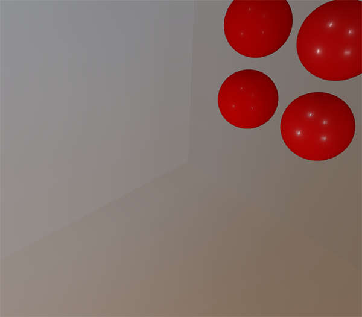

# Specular IBL

## Specular IBL(漫反射辐照度)

* 本章关心的重点


* 对于 Cook-Torrance 包括 ks 的镜面光照部分, 在整个半球积分里, 其值不恒定, 主要随入射光的方向和视线的方向而变化. Epic Games 提出对镜面部分预卷积的办法解决实时的问题. 使用 split sum approximation 妥协的方案.
* split sum approximation 主要将反射方程分解为两个单独的部分,让它们各自卷积,而后在PBR着色器中合并卷积的结果.该PBR着色器可实现基于光照的镜面间接光.和卷积 irradiance map 一样, split sum approximation 需要 HDR 环境映射作为其卷积的输入.


* 镜面部分不仅仅是依赖于 wi


* 分为两部分


* 第一个部分为 pre-filtered environment map, 是一个预计算的环境卷积映射, 但这次考虑了粗糙度,越粗糙,则环境映射卷积更多的散射样本向量,创建更模糊的反射. 我们在预过滤映射的不同mipmap层级上存储了序列模糊结果. 以下为5个不同粗糙度存储在它的5个mipmap等级上的结果.


* 我们使用 Cook-Torrance BRDF 的法线分布函数(NDF)生成采样的向量和他们散射的数量(sample vectors and their scattering amount). 由于我们卷积环境映射时不知道视线方向,这里 Epic Games 做了一个更进一步的假设, 假设视线方向等于输出的样本方向 wo. 变换代码如下:

```c++
vec3 N = normalize(w_o);
vec3 R = N;
vec3 V = R;
```

* 这样做的缺点是我们无法得到一个很好的 gazing specular reflections(凝视镜面反射)


* 我们可以根据输入的粗糙度,法线n,光线方向wi来预计算BRDF的响应. Epic Games 在2D查找纹理中(LUT)存储了预计算的 BRDF 响应,该响应在不同粗糙度的基础上响应每个法线和光线方向的组合,称之为 BRDF integration map, BRDF 积分映射. 2D查找纹理输出一个缩放(红色)和一个偏移值(绿色), 根据面的Fresnel响应给我们第二部分的镜面积分结果.


* 水平纹理坐标为BRDF的输入 n*wi, 垂直纹理坐标为输入的粗糙度, 生成该查找纹理,而后组合 BRDF 的积分映射和预过滤的环境映射, 我们可以得到镜面积分的结果.

```c++
float lod             = getMipLevelFromRoughness(roughness);
vec3 prefilteredColor = textureCubeLod(PrefilteredEnvMap, refVec, lod);
vec2 envBRDF          = texture2D(BRDFIntegrationMap, vec2(NdotV, roughness)).xy;
vec3 indirectSpecular = prefilteredColor * (F * envBRDF.x + envBRDF.y);
```

### 预过滤的 HDR 环境映射

* 主要考虑到不同 mipmap 的粗糙度映射

```c++

unsigned int prefilterMap;
glGenTextures(1, &prefilterMap);
glBindTexture(GL_TEXTURE_CUBE_MAP, prefilterMap);
for (unsigned int i = 0; i < 6; ++i)
{
    glTexImage2D(GL_TEXTURE_CUBE_MAP_POSITIVE_X + i, 0, GL_RGB16F, 128, 128, 0, GL_RGB, GL_FLOAT, nullptr);
}
glTexParameteri(GL_TEXTURE_CUBE_MAP, GL_TEXTURE_WRAP_S, GL_CLAMP_TO_EDGE);
glTexParameteri(GL_TEXTURE_CUBE_MAP, GL_TEXTURE_WRAP_T, GL_CLAMP_TO_EDGE);
glTexParameteri(GL_TEXTURE_CUBE_MAP, GL_TEXTURE_WRAP_R, GL_CLAMP_TO_EDGE);
glTexParameteri(GL_TEXTURE_CUBE_MAP, GL_TEXTURE_MIN_FILTER, GL_LINEAR_MIPMAP_LINEAR); 
glTexParameteri(GL_TEXTURE_CUBE_MAP, GL_TEXTURE_MAG_FILTER, GL_LINEAR);

glGenerateMipmap(GL_TEXTURE_CUBE_MAP);
```

* 基层 mipmap 大小 128x128 足以应付大多数情况
* 与 irradiance 不同,反射光线主要在反射向量r及其附近.


* Specular lobe 的形状随粗糙度和光线的入射方向而变化.
* 采用重要性抽样生成镜面反射的环境映射(importance sampling)

### Monte Carlo integration 和 importance sampling

* 蒙特卡罗积分,主要围绕统计学和概率论的结合进行.蒙特卡罗帮助我们离散地解决了计算总统的某些统计量或价值的问题,而不必考虑总体.
例如计算一个国家所有公民的身高,就不可能统计每个公民的身高再平均.一种方法是从总体中选择一个较小的完全随机（无偏）子集，测量其高度，并对结果取平均值。蒙特卡洛积分建立在大量定律的基础上，并采用相同的方法求解积分。 而不是求解所有可能（理论上无限）样本值的积分x.


* 为了求解积分，我们对总体a到b取N个随机样本，将它们相加，然后除以样本总数以求平均值。 pdf代表概率密度函数，该函数告诉我们特定样本在整个样本集中出现的概率。 例如，人口高度的pdf看起来像这样： 


* 在计算机图形学中，因为只要结果在视觉上可以接受，确切的解决方案就不太重要。正如我们很快就会看到的重要性抽样（使用偏倚的估算器）一样，生成的样本偏向特定的方向，在这种情况下，我们通过将每个样本乘以或除以其对应的pdf来解决这个问题。
* 蒙特卡洛积分在计算机图形学中非常普遍，因为它是一种以离散有效的方式近似连续积分的直观方法：取任意面积/体积进行采样（例如半球Ω
），产生N个面积/体积内的随机样本数量，并对每个样本对最终结果的贡献进行求和并加权
* 默认情况下，每个样本都是我们习惯的完全（伪）随机，但是通过利用半随机序列的某些属性，我们可以生成仍然是随机的但具有有趣属性的样本矢量。例如，我们可以对称为低差异序列的东西进行蒙特卡洛积分，该序列仍会生成随机样本，但每个样本的分布更均匀（图片由James Heald提供）


* 当使用低差异序列生成蒙特卡洛样本矢量时，该过程称为准蒙特卡洛积分。准蒙特卡罗方法具有更快的收敛速度，这使它们对于性能要求很高的应用很有趣。
* 通过将准蒙特卡洛采样与低差异序列相结合，并使用重要性采样对样本矢量进行偏置，可以得到较高的收敛速度。因为我们以更快的速度获得解决方案，所以我们将需要更少的样本以达到足够的近似值。 

### A low-discrepancy sequence

* Quasi-Monte Carlo 方法给出 random low-discrepancy sequence,而后进行 importance sampling,预计算出间接反射公式的镜面部分.
* 使用 Hammersley序列, Hammersley序列基于Van Der Corpus序列，该序列在其小数点附近镜像了一个十进制的二进制表示形式。
* 在着色器程序中非常有效地生成Van Der Corpus序列，我们将使用该程序在N个总样本上获取Hammersley序列样本i.

```c++

float RadicalInverse_VdC(uint bits) 
{
    bits = (bits << 16u) | (bits >> 16u);
    bits = ((bits & 0x55555555u) << 1u) | ((bits & 0xAAAAAAAAu) >> 1u);
    bits = ((bits & 0x33333333u) << 2u) | ((bits & 0xCCCCCCCCu) >> 2u);
    bits = ((bits & 0x0F0F0F0Fu) << 4u) | ((bits & 0xF0F0F0F0u) >> 4u);
    bits = ((bits & 0x00FF00FFu) << 8u) | ((bits & 0xFF00FF00u) >> 8u);
    return float(bits) * 2.3283064365386963e-10; // / 0x100000000
}
// ----------------------------------------------------------------------------
vec2 Hammersley(uint i, uint N)
{
    return vec2(float(i)/float(N), RadicalInverse_VdC(i));
}  
```

* 由于 OpenGL ES 2.0 和 WebGL 不一定支持位操作, 可以用 如下版本

```c++
float VanDerCorpus(uint n, uint base)
{
    float invBase = 1.0 / float(base);
    float denom   = 1.0;
    float result  = 0.0;

    for(uint i = 0u; i < 32u; ++i)
    {
        if(n > 0u)
        {
            denom   = mod(float(n), 2.0);
            result += denom * invBase;
            invBase = invBase / 2.0;
            n       = uint(float(n) / 2.0);
        }
    }

    return result;
}
// ----------------------------------------------------------------------------
vec2 HammersleyNoBitOps(uint i, uint N)
{
    return vec2(float(i)/float(N), VanDerCorpus(i, 2u));
}
```

### GGX Importance sampling

* 不是在积分半球Ω上均匀或随机地（蒙特卡罗）生成样本矢量，我们将根据表面的粗糙度生成偏向微表面中途矢量的一般反射方向的样本矢量。采样过程将与我们之前看到的过程相似：开始一个大循环，生成一个随机（低差异）序列值，采用该序列值在切线空间中生成样本矢量，变换到世界空间并进行采样 场景的辐亮度。 不同的是，我们现在使用低差异序列值作为输入来生成样本矢量

```c++
const uint SAMPLE_COUNT = 4096u;
for(uint i = 0u; i < SAMPLE_COUNT; ++i)
{
    vec2 Xi = Hammersley(i, SAMPLE_COUNT);   
```

* 要构建样本矢量，我们需要一些方法来将样本矢量定向和偏向某些表面粗糙度的specular lobe 我们可以按照理论章节中所述使用NDF，并将GGX NDF结合到Epic Games描述的球形样本矢量处理中

```c++
vec3 ImportanceSampleGGX(vec2 Xi, vec3 N, float roughness)
{
    float a = roughness*roughness;
	
    float phi = 2.0 * PI * Xi.x;
    float cosTheta = sqrt((1.0 - Xi.y) / (1.0 + (a*a - 1.0) * Xi.y));
    float sinTheta = sqrt(1.0 - cosTheta*cosTheta);
	
    // from spherical coordinates to cartesian coordinates
    vec3 H;
    H.x = cos(phi) * sinTheta;
    H.y = sin(phi) * sinTheta;
    H.z = cosTheta;
	
    // from tangent-space vector to world-space sample vector
    vec3 up        = abs(N.z) < 0.999 ? vec3(0.0, 0.0, 1.0) : vec3(1.0, 0.0, 0.0);
    vec3 tangent   = normalize(cross(up, N));
    vec3 bitangent = cross(N, tangent);
	
    vec3 sampleVec = tangent * H.x + bitangent * H.y + N * H.z;
    return normalize(sampleVec);
}  
```

* 基于一些输入粗糙度和低差异序列值Xi，这为我们提供了一个样本矢量，该矢量略微围绕预期的微表面的中间向量。 请注意，根据迪士尼最初的PBR研究，Epic Games使用平方粗糙度来获得更好的视觉效果。
* 定义了低差异哈默斯利序列和样本生成后，我们可以最终确定预滤波器卷积着色器

```c++
#version 330 core
out vec4 FragColor;
in vec3 localPos;

uniform samplerCube environmentMap;
uniform float roughness;

const float PI = 3.14159265359;

float RadicalInverse_VdC(uint bits);
vec2 Hammersley(uint i, uint N);
vec3 ImportanceSampleGGX(vec2 Xi, vec3 N, float roughness);
  
void main()
{		
    vec3 N = normalize(localPos);    
    vec3 R = N;
    vec3 V = R;

    const uint SAMPLE_COUNT = 1024u;
    float totalWeight = 0.0;   
    vec3 prefilteredColor = vec3(0.0);     
    for(uint i = 0u; i < SAMPLE_COUNT; ++i)
    {
        vec2 Xi = Hammersley(i, SAMPLE_COUNT);
        vec3 H  = ImportanceSampleGGX(Xi, N, roughness);
        vec3 L  = normalize(2.0 * dot(V, H) * H - V);

        float NdotL = max(dot(N, L), 0.0);
        if(NdotL > 0.0)
        {
            prefilteredColor += texture(environmentMap, L).rgb * NdotL;
            totalWeight      += NdotL;
        }
    }
    prefilteredColor = prefilteredColor / totalWeight;

    FragColor = vec4(prefilteredColor, 1.0);
}  
```

* 根据输入的粗糙度对环境进行预过滤，该粗糙度随预过滤器立方体贴图的每个mipmap级别（从0.0到1.0）而变化，并将结果存储在prefilteredColor中。 所得的prefilteredColor除以总样本权重，其中对最终结果影响较小的样本（对于较小的NdotL）对最终权重的贡献较小

### 捕获预过滤的 mipmap 等级

* 剩下要做的就是让OpenGL在多个mipmap级别上使用不同的粗糙度值预过滤环境贴图。 使用辐照度章节的原始设置实际上很容易做到

```c++
prefilterShader.use();
prefilterShader.setInt("environmentMap", 0);
prefilterShader.setMat4("projection", captureProjection);
glActiveTexture(GL_TEXTURE0);
glBindTexture(GL_TEXTURE_CUBE_MAP, envCubemap);

glBindFramebuffer(GL_FRAMEBUFFER, captureFBO);
unsigned int maxMipLevels = 5;
for (unsigned int mip = 0; mip < maxMipLevels; ++mip)
{
    // reisze framebuffer according to mip-level size.
    unsigned int mipWidth  = 128 * std::pow(0.5, mip);
    unsigned int mipHeight = 128 * std::pow(0.5, mip);
    glBindRenderbuffer(GL_RENDERBUFFER, captureRBO);
    glRenderbufferStorage(GL_RENDERBUFFER, GL_DEPTH_COMPONENT24, mipWidth, mipHeight);
    glViewport(0, 0, mipWidth, mipHeight);

    float roughness = (float)mip / (float)(maxMipLevels - 1);
    prefilterShader.setFloat("roughness", roughness);
    for (unsigned int i = 0; i < 6; ++i)
    {
        prefilterShader.setMat4("view", captureViews[i]);
        glFramebufferTexture2D(GL_FRAMEBUFFER, GL_COLOR_ATTACHMENT0, 
                               GL_TEXTURE_CUBE_MAP_POSITIVE_X + i, prefilterMap, mip);

        glClear(GL_COLOR_BUFFER_BIT | GL_DEPTH_BUFFER_BIT);
        renderCube();
    }
}
glBindFramebuffer(GL_FRAMEBUFFER, 0);   
```

* 将帧缓冲区的尺寸缩放到适当的mipmap比例，每个mip级别将尺寸缩小2个比例。此外，我们在glFramebufferTexture2D的 最后一个参数，并将我们要预过滤的粗糙度传递给预过滤器着色器。
* 这应该为我们提供了一个经过适当预过滤的环境贴图，当我们从中访问该贴图时，它会返回模糊的反射。 如果我们在skybox着色器中使用预过滤的环境立方体贴图，并在其第一个mip级别之上强制采样

```c++
vec3 envColor = textureLod(environmentMap, WorldPos, 1.2).rgb; 
```


* 尝试不同的Mipmap级别，以查看预过滤器贴图在增加的Mip级别上从清晰的反射逐渐变为模糊的反射。 

### Pre-filter convolution artifacts

#### Cubemap seams at high roughness

* 在具有粗糙表面的表面上对预过滤器贴图进行采样意味着在一些较低的Mip级别上对预过滤器贴图进行采样。 采样立方体贴图时，默认情况下，OpenGL不会在立方体贴图的各个面之间线性插值。 由于较低的Mip级别都具有较低的分辨率，并且预过滤器卷积被更大的样本lobe所卷积，缺乏立体面之间的过滤看起来更明显.



* OpenGL通过启用GL_TEXTURE_CUBE_MAP_SEAMLESS为我们提供了立体面之间过滤的选项：

```c++
glEnable(GL_TEXTURE_CUBE_MAP_SEAMLESS);  
```

#### 预过滤卷积的亮点(Bright dots in the pre-filter convolution)

* 由于高频细节和镜面反射中光强度的变化很大，对镜面反射进行卷积需要大量样本才能正确说明HDR环境反射的变化性质。 我们已经进行了大量的采样，但是在某些环境下，在某些较粗糙的mip级别上可能仍然不够用，在这种情况下，您将开始看到在明亮区域周围出现点状图案


* 根据积分的PDF和粗糙度采样相应mip级别的环境图来减少这种走样

```c++
float D   = DistributionGGX(NdotH, roughness);
float pdf = (D * NdotH / (4.0 * HdotV)) + 0.0001; 

float resolution = 512.0; // resolution of source cubemap (per face)
float saTexel  = 4.0 * PI / (6.0 * resolution * resolution);
float saSample = 1.0 / (float(SAMPLE_COUNT) * pdf + 0.0001);

float mipLevel = roughness == 0.0 ? 0.0 : 0.5 * log2(saSample / saTexel); 
```

* 记得开启三线性过滤

```c++
glBindTexture(GL_TEXTURE_CUBE_MAP, envCubemap);
glTexParameteri(GL_TEXTURE_CUBE_MAP, GL_TEXTURE_MIN_FILTER, GL_LINEAR_MIPMAP_LINEAR); 
```

* 由 OpenGL 生成 mipmap

```c++
// convert HDR equirectangular environment map to cubemap equivalent
[...]
// then generate mipmaps
glBindTexture(GL_TEXTURE_CUBE_MAP, envCubemap);
glGenerateMipmap(GL_TEXTURE_CUBE_MAP);
```

### 预计算 BRDF

* 计算下面的 BRDF 部分


* 在n*w0上,面粗糙度,F0上卷积 BRDF 方程, 在三个变量上卷积 BRDF 有点多, 但我们可以移除 F0 出 BRDF 公式.


* F 为 Fresnel 方程, 将 Fresnel 分母移动到 BRDF 下


* 最右边的F替换为 Fresnel-Schlick approximation


* 将幂次方替换为代号a


* 分解为两个积分


* 移出 F0, 替换回代号


* 我们可以在几个输入上卷积 BRDF 方程, 如 n和wo之间的角度,粗糙度. 我们在 2D 查找纹理上存储卷积后的结果. 该 2D 查找纹理称之为 BRDF integration map,我们之后用于 PBR 光照着色器得到最终的卷积的间接镜面结果.
* BRDF卷积着色器在2D平面上运行，直接使用其2D纹理坐标作为BRDF卷积的输入（NdotV和粗糙度）,卷积代码与pre-filter卷积在很大程度上相似，不同之处在于，它现在根据我们的BRDF的几何函数和Fresnel-Schlick的近似来处理样本矢量

```c++
vec2 IntegrateBRDF(float NdotV, float roughness)
{
    vec3 V;
    V.x = sqrt(1.0 - NdotV*NdotV);
    V.y = 0.0;
    V.z = NdotV;

    float A = 0.0;
    float B = 0.0;

    vec3 N = vec3(0.0, 0.0, 1.0);

    const uint SAMPLE_COUNT = 1024u;
    for(uint i = 0u; i < SAMPLE_COUNT; ++i)
    {
        vec2 Xi = Hammersley(i, SAMPLE_COUNT);
        vec3 H  = ImportanceSampleGGX(Xi, N, roughness);
        vec3 L  = normalize(2.0 * dot(V, H) * H - V);

        float NdotL = max(L.z, 0.0);
        float NdotH = max(H.z, 0.0);
        float VdotH = max(dot(V, H), 0.0);

        if(NdotL > 0.0)
        {
            float G = GeometrySmith(N, V, L, roughness);
            float G_Vis = (G * VdotH) / (NdotH * NdotV);
            float Fc = pow(1.0 - VdotH, 5.0);

            A += (1.0 - Fc) * G_Vis;
            B += Fc * G_Vis;
        }
    }
    A /= float(SAMPLE_COUNT);
    B /= float(SAMPLE_COUNT);
    return vec2(A, B);
}
// ----------------------------------------------------------------------------
void main() 
{
    vec2 integratedBRDF = IntegrateBRDF(TexCoords.x, TexCoords.y);
    FragColor = integratedBRDF;
}
```

* 我们的 BRDF 几何部分和之前的理论部分有点不同


* 由于 BRDF 卷积为镜面 IBL 积分的一部分, 我们使用 kIBL zuowei  Schlick-GGX 集合函数

```c++
float GeometrySchlickGGX(float NdotV, float roughness)
{
    float a = roughness;
    float k = (a * a) / 2.0;

    float nom   = NdotV;
    float denom = NdotV * (1.0 - k) + k;

    return nom / denom;
}
// ----------------------------------------------------------------------------
float GeometrySmith(vec3 N, vec3 V, vec3 L, float roughness)
{
    float NdotV = max(dot(N, V), 0.0);
    float NdotL = max(dot(N, L), 0.0);
    float ggx2 = GeometrySchlickGGX(NdotV, roughness);
    float ggx1 = GeometrySchlickGGX(NdotL, roughness);

    return ggx1 * ggx2;
}  
```

* 为了存储BRDF卷积结果，我们将生成512 x 512分辨率的2D纹理

```c++
unsigned int brdfLUTTexture;
glGenTextures(1, &brdfLUTTexture);

// pre-allocate enough memory for the LUT texture.
glBindTexture(GL_TEXTURE_2D, brdfLUTTexture);
glTexImage2D(GL_TEXTURE_2D, 0, GL_RG16F, 512, 512, 0, GL_RG, GL_FLOAT, 0);
glTexParameteri(GL_TEXTURE_2D, GL_TEXTURE_WRAP_S, GL_CLAMP_TO_EDGE);
glTexParameteri(GL_TEXTURE_2D, GL_TEXTURE_WRAP_T, GL_CLAMP_TO_EDGE);
glTexParameteri(GL_TEXTURE_2D, GL_TEXTURE_MIN_FILTER, GL_LINEAR);
glTexParameteri(GL_TEXTURE_2D, GL_TEXTURE_MAG_FILTER, GL_LINEAR); 
```

* 根据 Epic Games 推荐,我们使用一个 16 位的浮点格式, 记得设置 wrapping 模式为 GL_CLAMP_TO_EDGET 以保证边缘的采样锯齿.
* 现在我们重新使用相同的帧缓存对象在一个 NDC 屏幕空间四边形上运行着色器代码

```c++
glBindFramebuffer(GL_FRAMEBUFFER, captureFBO);
glBindRenderbuffer(GL_RENDERBUFFER, captureRBO);
glRenderbufferStorage(GL_RENDERBUFFER, GL_DEPTH_COMPONENT24, 512, 512);
glFramebufferTexture2D(GL_FRAMEBUFFER, GL_COLOR_ATTACHMENT0, GL_TEXTURE_2D, brdfLUTTexture, 0);

glViewport(0, 0, 512, 512);
brdfShader.use();
glClear(GL_COLOR_BUFFER_BIT | GL_DEPTH_BUFFER_BIT);
RenderQuad();

glBindFramebuffer(GL_FRAMEBUFFER, 0);  
```

* split sum 积分的卷积BRDF部分如下:


### Completing the IBL reflectance

```c++
uniform samplerCube prefilterMap;
uniform sampler2D   brdfLUT;
```

* 首先，我们通过使用反射的向量对pre-filter环境贴图进行采样来获得表面的间接镜面反射。 请注意，我们根据表面粗糙度对适当的Mip级别进行采样，从而使较粗糙的表面模糊了镜面反射：

```c++
void main()
{
    [...]
    vec3 R = reflect(-V, N);   

    const float MAX_REFLECTION_LOD = 4.0;
    vec3 prefilteredColor = textureLod(prefilterMap, R,  roughness * MAX_REFLECTION_LOD).rgb;    
    [...]
}
```

* 在预过滤器步骤中，我们最多仅将环境贴图卷积最多5个mip级别（0到4），此处将其表示为MAX_REFLECTION_LOD，以确保在没有（相关）数据的情况下不对mip级别进行采样。

* 在给定材料的粗糙度以及法线和视觉向量之间的角度的情况下，从BRDF查找纹理中采样

```c++
vec3 F        = FresnelSchlickRoughness(max(dot(N, V), 0.0), F0, roughness);
vec2 envBRDF  = texture(brdfLUT, vec2(max(dot(N, V), 0.0), roughness)).rg;
vec3 specular = prefilteredColor * (F * envBRDF.x + envBRDF.y);
```

* 从 BRDF 查找纹理中得到 F0的缩放与便宜,我们组合左边的pre-filter部分并重构近似的积分结果为镜面
* 将镜面 IBL 和 漫反射 IBL 结合起来得到完整的 PBR IBL 结果

```c++

vec3 F = FresnelSchlickRoughness(max(dot(N, V), 0.0), F0, roughness);

vec3 kS = F;
vec3 kD = 1.0 - kS;
kD *= 1.0 - metallic;	  
  
vec3 irradiance = texture(irradianceMap, N).rgb;
vec3 diffuse    = irradiance * albedo;
  
const float MAX_REFLECTION_LOD = 4.0;
vec3 prefilteredColor = textureLod(prefilterMap, R,  roughness * MAX_REFLECTION_LOD).rgb;   
vec2 envBRDF  = texture(brdfLUT, vec2(max(dot(N, V), 0.0), roughness)).rg;
vec3 specular = prefilteredColor * (F * envBRDF.x + envBRDF.y);
  
vec3 ambient = (kD * diffuse + specular) * ao; 
```


* 可以使用一些很酷的带纹理的 [PBR材质](http://freepbr.com/)


* 免费的 3D [PBR模型](http://artisaverb.info/PBT.html)


* 下面，您将看到几个不同的预先计算的HDR贴图，它们完全改变了照明动态，但是在外观上仍然正确，而不更改单个照明变量


* 通常只将一次环境图预先计算为辐照度和预过滤器图，然后将其存储在磁盘上（请注意，BRDF集成图不依赖于环境图，因此您只需要计算或加载一次）。这确实意味着您需要提出一种自定义图像格式来存储HDR立方体贴图，包括其mip级别。或者，您将其存储（并加载）为可用格式之一（例如支持存储Mip级别的.dds）
* 通过使用cmftStudio或IBLBaker等出色的工具为您生成这些预先计算的地图，您会感觉很好

### 进一步阅读

* [Real Shading in Unreal Engine 4](http://blog.selfshadow.com/publications/s2013-shading-course/karis/s2013_pbs_epic_notes_v2.pdf): explains Epic Games' split sum approximation. This is the article the IBL PBR code is based of.
* [Physically Based Shading and Image Based Lighting](http://www.trentreed.net/blog/physically-based-shading-and-image-based-lighting/): great blog post by Trent Reed about integrating specular IBL into a PBR pipeline in real time. 
* [Image Based Lighting](https://chetanjags.wordpress.com/2015/08/26/image-based-lighting/): very extensive write-up by Chetan Jags about specular-based image-based lighting and several of its caveats, including light probe interpolation.
* [Moving Frostbite to PBR](https://seblagarde.files.wordpress.com/2015/07/course_notes_moving_frostbite_to_pbr_v32.pdf): well written and in-depth overview of integrating PBR into a AAA game engine by Sébastien Lagarde and Charles de Rousiers.
* [Physically Based Rendering – Part Three](https://jmonkeyengine.github.io/wiki/jme3/advanced/pbr_part3.html): high level overview of IBL lighting and PBR by the JMonkeyEngine team.
* [Implementation Notes](https://placeholderart.wordpress.com/2015/07/28/implementation-notes-runtime-environment-map-filtering-for-image-based-lighting/): Runtime Environment Map Filtering for Image Based Lighting: extensive write-up by Padraic Hennessy about pre-filtering HDR environment maps and significantly optimizing the sample process.