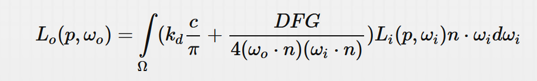
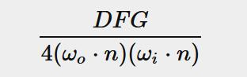
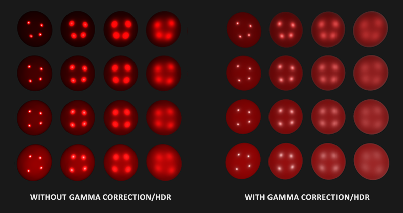
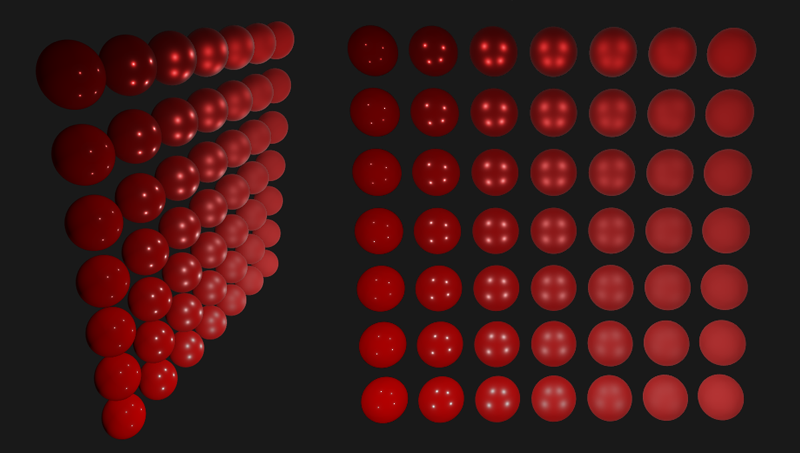

# 光照

* 实践部分，使用直接光源或为解析光源。可看成为点光源，方向光光源，聚光灯光源。



* 目前该公式仍未知是如何精确的表示辐照度(irradiance)，即 Li。辐射L，这里测量的是光源的辐射通量或光线能量，其限制于一个给定的球面角w，我们这里假设球面角w无限的小，以表示测量光源单个光线或某个方向向量下的辐射通量。
* 这里假设有点光源，所有方向辐射通量都一样(23.47, 21.31, 20.79)。其照射表面一点p，对于点p其上的半球，仅有光源到p之间连线的光线有入射辐射能量。


* 这里假设其辐射强度等于其辐射通量(23.47, 21.31, 20.79), 转换代码如下，有衰减，有点乘衰减

```glsl
vec3  lightColor  = vec3(23.47, 21.31, 20.79);
vec3  wi          = normalize(lightPos - fragPos);
float cosTheta    = max(dot(N, Wi), 0.0);
float attenuation = calculateAttenuation(fragPos, lightPos);
vec3  radiance    = lightColor * attenuation * cosTheta;
```

* 上面公式类似于我们之前的漫反射计算。注意的是上面公式假设的是点光源，如果光源有面积或体积，则点p则可能不仅一个光线方向上有入射光辐射能量。
* 对于方向光和聚焦光进行相应调整，比如衰减方式，光线方向等。
* 对于积分部分，由于每个光源仅有一条光线有辐射能量，这里可以简化处理。

## PBR 表面模型

* 片段着色器, 输入如下

```glsl
#version 330 core
out vec4 FragColor;
in vec2 TexCoords;
in vec3 WorldPos;
in vec3 Normal;
  
uniform vec3 camPos;
  
uniform vec3  albedo;
uniform float metallic;
uniform float roughness;
uniform float ao;
```

* 开头进行光线算法需要的计算

```c++
void main()
{
    vec3 N = normalize(Normal); 
    vec3 V = normalize(camPos - WorldPos);
    [...]
}
```

* 4个光源，BRDF计算等

```c++
vec3 Lo = vec3(0.0);
for(int i = 0; i < 4; ++i) 
{
    vec3 L = normalize(lightPositions[i] - WorldPos);
    vec3 H = normalize(V + L);
  
    float distance    = length(lightPositions[i] - WorldPos);
    float attenuation = 1.0 / (distance * distance);
    vec3 radiance     = lightColors[i] * attenuation; 
    [...]  
```

* 当我们在线性空间内计算光照时，这里使用距离的平方衰减辐射(更符合物理)。(着色器结束时进行伽玛修正)
* 对于每个光源，我们希望计算完整的 Cook-Torrance 镜面 BRDF 部分



* 首先计算镜面反射和漫反射之间的比率，使用 Fresnel 公式

```c++
vec3 fresnelSchlick(float cosTheta, vec3 F0)
{
    return F0 + (1.0 - F0) * pow(max(1.0 - cosTheta, 0.0), 5.0);
} 
```

* F0 为0度入射角的面反射。F0 其随材质变化，在金属上表示为颜色，可见材质数据库。对于 PBR 金属物质的工作流，我们简化该部分，介电表面使用 0.04 的 F0常量值，对于金属物质，我们通过 albedo 值设置 F0。代码如下

```c++
vec3 F0 = vec3(0.04); 
F0      = mix(F0, albedo, metallic);
vec3 F  = fresnelSchlick(max(dot(H, V), 0.0), F0);
```

* metallic 属性表示金属的程度
* 对于法线分布函数 D 和几何函数 G, 代码如下 

```c++
float DistributionGGX(vec3 N, vec3 H, float roughness)
{
    float a      = roughness*roughness;
    float a2     = a*a;
    float NdotH  = max(dot(N, H), 0.0);
    float NdotH2 = NdotH*NdotH;
	
    float num   = a2;
    float denom = (NdotH2 * (a2 - 1.0) + 1.0);
    denom = PI * denom * denom;
	
    return num / denom;
}

float GeometrySchlickGGX(float NdotV, float roughness)
{
    float r = (roughness + 1.0);
    float k = (r*r) / 8.0;

    float num   = NdotV;
    float denom = NdotV * (1.0 - k) + k;

    return num / denom;
}
float GeometrySmith(vec3 N, vec3 V, vec3 L, float roughness)
{
    float NdotV = max(dot(N, V), 0.0);
    float NdotL = max(dot(N, L), 0.0);
    float ggx2  = GeometrySchlickGGX(NdotV, roughness);
    float ggx1  = GeometrySchlickGGX(NdotL, roughness);

    return ggx1 * ggx2;
}
```

* 由 Disney 观察且被 Epic Game 所采用的部分，在几何和法线分布函数内将粗糙度值 roughness 平方后，光照看起来更正确。
* 下面计算出 NDF 和 G

```c++
float NDF = DistributionGGX(N, H, roughness);       
float G   = GeometrySmith(N, V, L, roughness); 
```

* Cook-Torrance BRDF 的计算如下

```c++
vec3 numerator    = NDF * G * F;
float denominator = 4.0 * max(dot(N, V), 0.0) * max(dot(N, L), 0.0);
vec3 specular     = numerator / max(denominator, 0.001); 
```

* 上面限制分母最小值为 0.001，避免其为 0.0
* 由于 Fresnel 值直接对应镜面反射 ks 的比例， 所以可以直接计算出漫反射的比率 kd, 同时根据金属化程度减少漫反射比例，这是由于金属没有折射

```c++
vec3 kS = F;
vec3 kD = vec3(1.0) - kS;
  
kD *= 1.0 - metallic;	
```

```c++
    const float PI = 3.14159265359;
  
    float NdotL = max(dot(N, L), 0.0);        
    Lo += (kD * albedo / PI + specular) * radiance * NdotL;
}
```

* Lo 为出射的辐射量。
* 添加环境光

```c++
vec3 ambient = vec3(0.03) * albedo * ao;
vec3 color   = ambient + Lo;  
```

## 线性和HDR渲染
* PBR 要求所有输入都是线性的。
* 伽玛修正之前将hdr(high dynamic range)值映射至ldr(low dynamic range)内

```c++
color = color / (color + vec3(1.0));
color = pow(color, vec3(1.0/2.2)); 
```

* 使用 Reinhard operator 调色该 HDR，以防止变化很大的辐射值。由于我们没有一个独立的帧缓存或后处理阶段，所以我们可以直接将该调色映射和伽玛修正步骤应用在片段着色器的尾部。 



## 完整直接光照 PBR 着色器

```c++

#version 330 core
out vec4 FragColor;
in vec2 TexCoords;
in vec3 WorldPos;
in vec3 Normal;

// material parameters
uniform vec3  albedo;
uniform float metallic;
uniform float roughness;
uniform float ao;

// lights
uniform vec3 lightPositions[4];
uniform vec3 lightColors[4];

uniform vec3 camPos;

const float PI = 3.14159265359;
  
float DistributionGGX(vec3 N, vec3 H, float roughness);
float GeometrySchlickGGX(float NdotV, float roughness);
float GeometrySmith(vec3 N, vec3 V, vec3 L, float roughness);
vec3 fresnelSchlick(float cosTheta, vec3 F0);

void main()
{		
    vec3 N = normalize(Normal);
    vec3 V = normalize(camPos - WorldPos);

    vec3 F0 = vec3(0.04); 
    F0 = mix(F0, albedo, metallic);
	           
    // reflectance equation
    vec3 Lo = vec3(0.0);
    for(int i = 0; i < 4; ++i) 
    {
        // calculate per-light radiance
        vec3 L = normalize(lightPositions[i] - WorldPos);
        vec3 H = normalize(V + L);
        float distance    = length(lightPositions[i] - WorldPos);
        float attenuation = 1.0 / (distance * distance);
        vec3 radiance     = lightColors[i] * attenuation;        
        
        // cook-torrance brdf
        float NDF = DistributionGGX(N, H, roughness);        
        float G   = GeometrySmith(N, V, L, roughness);      
        vec3 F    = fresnelSchlick(max(dot(H, V), 0.0), F0);       
        
        vec3 kS = F;
        vec3 kD = vec3(1.0) - kS;
        kD *= 1.0 - metallic;	  
        
        vec3 numerator    = NDF * G * F;
        float denominator = 4.0 * max(dot(N, V), 0.0) * max(dot(N, L), 0.0);
        vec3 specular     = numerator / max(denominator, 0.001);  
            
        // add to outgoing radiance Lo
        float NdotL = max(dot(N, L), 0.0);                
        Lo += (kD * albedo / PI + specular) * radiance * NdotL; 
    }   
  
    vec3 ambient = vec3(0.03) * albedo * ao;
    vec3 color = ambient + Lo;
	
    color = color / (color + vec3(1.0));
    color = pow(color, vec3(1.0/2.2));  
   
    FragColor = vec4(color, 1.0);
```

* 下图为不同粗糙度和金属性的结果



* 从底部到上面，金属性从0.0到1.0， 粗糙度从左到右， 0.0到1.0.
* [完整源码](https://learnopengl.com/code_viewer_gh.php?code=src/6.pbr/1.1.lighting/lighting.cpp)

## PBR纹理
* 使用纹理代替一直变量来设置面参数。这样可以逐片段控制面的材质属性

```c++
[...]
uniform sampler2D albedoMap;
uniform sampler2D normalMap;
uniform sampler2D metallicMap;
uniform sampler2D roughnessMap;
uniform sampler2D aoMap;
  
void main()
{
    vec3 albedo     = pow(texture(albedoMap, TexCoords).rgb, 2.2);
    vec3 normal     = getNormalFromNormalMap();
    float metallic  = texture(metallicMap, TexCoords).r;
    float roughness = texture(roughnessMap, TexCoords).r;
    float ao        = texture(aoMap, TexCoords).r;
    [...]
}
```
* 这里通常 albedo 美工编辑为非线性空间属性， 所以需要将其转换为线性空间。 同样 ambient occlusion map 也要转换至映射线性空间。金属性和粗糙度纹理则通常编辑为线性空间。
* 结果如下


* [完整源码](https://learnopengl.com/code_viewer_gh.php?code=src/6.pbr/1.2.lighting_textured/lighting_textured.cpp)
* [用到的纹理集](https://freepbr.com/materials/rusted-iron-pbr-metal-material-alt/)
* 直接光源中，通常金属表面比较暗，所以需要考虑 environment's specular ambient lighting(环境镜面反射光)
* 可以看出 PBR 的渲染效果更真实。