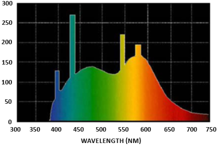
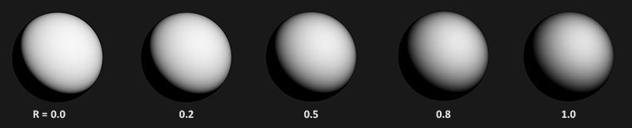

# PBR

## 理论

PBR (physically based rendering).

我们(尤其是美工) 可以基于物理参数编辑面的材质。基于物理参数编辑材质的一个好处是不用考虑光照条件就可以让这些材质看起来正确。                            。

基于物理渲染，而非物理渲染，其满足了三个条件:

* 基于微小平面模型
* 能量守恒
* 使用基于物理的BRDF

### 微平面模型
microfacet: 微平面，在微尺度上，任何平面都可以看成完美的反射镜面。


反射结果如下


给定一个粗糙度参数，统计学上近似模拟面的微面粗糙度。这里计算微平面和半角向量 h 对齐的比率。h 为光线方向 l 和视觉方向 v 之间的半角向量。越多的微平面与半角向量对齐，镜面反射更锐利更强。


粗糙度越大，反射的形状越大，亮度越低

### 能量守恒
* 遵守能量守恒，出射的能量不能大于入射的能量，越平滑的表面越亮。
* 光束不断碰撞失去能量。能量转换成热能


* 光继续随机散射，直至能量耗尽或者再次离开表面。从表面离开的光表现为散射颜色。做一个简化的假设，所有折射光在很小的撞击区域内就被吸收和散射，忽略了远距离离开表面的散射光线的影响。如果要考虑远距离离开表面的散射光线，该着色技术称之为次表面散射技术(subsurface scattering techniques)，可用于皮肤、大理石、蜡等物体的材质上。
* 与非金属表面(也称为电介质)，金属表面对光的反应不同。金属表面吸收所有的折射光，没有散射光。所以金属表面没有显示漫反射的颜色。由于金属与电介质之间明显的区别，所以PBR管道中对它们的处理方式有所不同。
* 作为折射光进入表面的能量为产生的能量。
* 镜面部分看成入射光能量被反射的部分，而后根据镜面光部分计算出折射光部分
```
float kS = calculateSpecularComponent(...); // 反射/specular fraction
float kD = 1.0 - kS;                        // 折射/diffuse  fraction
```

### 反射率方程
* 要对反射率方程有一个扎实的了解。


* 辐射度(Radiometry)是对电磁辐射的测量。使用辐射(radiance --- L),表示一个光线上的辐射强度。
* 辐射通量(Radiant flux)：单位瓦特，光源的传输能量。光源的发射能量看成所有波长的函数。390纳米到700纳米之间的波长为可见光部分。下图为白天每个波长的不同能量。

* 辐射通量通过波长测量作为输入有点不切实际，简化辐射通量的表达，编码为RGB的光颜色三元组。这种编码虽然会失去很多信息，但视觉方面的损失可以忽略不计。
* 球面角(Solid angle) --- 投影到单位球体上的面积。


* 辐射强度(Radiant intensity): 每球面角的辐射通量，或光源在单元球上投影面积的强度。


* 辐射公式


* 以光相对于表面法线的入射（或入射）角θ作为cosθ进行缩放

```
float cosTheta = dot(lightDir, N);  
```

* 假设球面角和面积无限小，可以使用radiance来测量单束光线照射的辐射通量。我们将球面角w转换成方向向量w, 面积A转换成点p。这样，我们就可以直接在着色器中使用 radiance，计算单个光线在每个片段的作用。
* 涉及到辐射时，我们关心所有入射到点p上的光，这是所有辐射的总和，即辐照度(irradiance)。下面的反射率方程：


* 注意 cosθ 表示根据光线入射光线方向与表面的夹角成比例缩放能量值, 在方程中表示为 n⋅ωi. 该方程主要计算某特定反射方向下得到的反射辐射值。
* 我们测量用到的入射辐照度为法线方向上半球所有入射光线方向的入射辐射能量的总和。


* 我们使用积分符号表示整个半球。积分用来求解一个函数的面积，可以用解析或者数值的方法计算，由于渲染和反射方程都没有解析解，因此这里采用离散积分进行数值求解。进行较小离散步长的数值计算并取其平均结果。这种方法为黎曼和 Riemann sum。

```

int steps = 100;
float sum = 0.0f;
vec3 P    = ...;
vec3 Wo   = ...;
vec3 N    = ...;
float dW  = 1.0f / steps;
for(int i = 0; i < steps; ++i) 
{
    vec3 Wi = getNextIncomingLightDir(i);
    sum += Fr(P, Wi, Wo) * L(P, Wi) * dot(N, Wi) * dW;
}
```
* 可以通过增加步数数量来提升计算的精度。
* 入射的光线可以为光源或周围的环境映射。
* Fr 函数为 BRDF/bidirectional reflective distribution function, 根据表面的材质缩放或权重入射的辐射。

### BRDF
* BRDF, 输入有入射光方向 wi, 出射光方向(视线方向) wo，面法线 n，表示微平面粗糙度的面参数 a。该函数表示每个入射光线 wi 对最终反射光线的贡献作用。如果一个面完全平滑(类似于镜面)，BRDF 通常返回 0.0，除了和反射光方向有相同角度的入射光线其会返回 1.0。
* 几乎所有的实时 PBR 渲染管线使用 Cook-Torrance BRDF.
* Cook-Torrance BRDF 包含散射和镜面部分


* kd 为输入光被折射的比例，ks 为输入光被反射的比例。flambert 为公式的散射部分， 其为常量因子。


* c 为反照率(albedo)或面颜色(可认为是漫反射面纹理), 这里使用 pi 单元化漫反射光。这是因为之前包含 BRDF 的积分由pi缩放(具体可见之后的 IBL 章节)
* 由 Epic Game 的经验可知，Lambertian 已经足以满足大多数实时渲染目的。
* BRDF 的镜面部分则较为高级，描述如下：


* D、F、G 分别为法线分布函数，Fresnel 公式和几何函数。
* D(Normal distribution function): 面上与半角向量对齐微平面的数量的近似，其受面的粗糙度的影响这是近似模拟微平面的主要函数。
* G(Geometry function): 描述微平面的自我阴影属性。这是因为当表面很粗糙时，其上的自我阴影会减少光的反射。
* F(Fresnel equation): 描述在不同面角度上表面反射的比例。
* 来自 Epic Games 的 Brian Karis 在这些近似函数的不同版本做了许多研究。 [链接](http://graphicrants.blogspot.nl/2013/08/specular-brdf-reference.html)
* 这里采用 Epic Games 的虚幻引擎4 的版本，D 用 Trowbridge-Reitz GGX 实现，F 用 Fresnel-Schlick approximation， G 用 Smith 的 Schlick-GGX 实现。

### Normal distribution function
* Trowbridge-Reitz GGX


* h 为半角向量，a 为表面粗糙度的一个测量，这里假设 h 为面法线与光线方向的半角向量，下面为不同粗糙度的结果。


* GLSL 代码实现如下

```
float DistributionGGX(vec3 N, vec3 H, float a)
{
    float a2     = a*a;
    float NdotH  = max(dot(N, H), 0.0);
    float NdotH2 = NdotH*NdotH;
	
    float nom    = a2;
    float denom  = (NdotH2 * (a2 - 1.0) + 1.0);
    denom        = PI * denom * denom;
	
    return nom / denom;
}
```

### Geometry function
* 几何函数使用粗糙度作为输入，其使用 GGX 和 Schlick-Beckmann 近似的组合即 Schlick-GGX:


* 其中k为α的重映射，基于几何函数是用于直接的光照，还是用于 IBL 光照。


* 引擎如何将粗糙度转换为 α 的方法可能各有不同。
* 为了几何近似，我们需要考虑视线方向(几何遮挡)和光线方向向量(几何阴影)，我们使用 Smith's method 考虑两者


* 效果如下，其中粗糙度 R 不同。



* 几何函数(geometry function)是一个[0.0, 1.0]之间的乘数，其 1.0 (或为白色)表示没有微面阴影， 0.0 (或为黑色)表示完全的微面阴影(microfacet shadowing)。
* GLSL 的实现如下

```
float GeometrySchlickGGX(float NdotV, float k)
{
    float nom   = NdotV;
    float denom = NdotV * (1.0 - k) + k;
	
    return nom / denom;
}
  
float GeometrySmith(vec3 N, vec3 V, vec3 L, float k)
{
    float NdotV = max(dot(N, V), 0.0);
    float NdotL = max(dot(N, L), 0.0);
    float ggx1 = GeometrySchlickGGX(NdotV, k);
    float ggx2 = GeometrySchlickGGX(NdotL, k);
	
    return ggx1 * ggx2;
}
```

### Fresnel equation
* 该公式描述反射的光与折射的光之间的比例关系，其随我们观看的角度而变化。
* 当我们直视物体时，其有基本的反射率，当从某个角度去看时，相对于基本反射率，其反射变得更加明显，尤其90度观看物体时。从理想的90度角度去看物体时，所有表面理论上都可以完全反射光线，这就是菲涅尔现象，可描述为菲涅尔方程。
* 菲涅尔方程是一个相当复杂的方程，但可以用 Fresnel-Schlick 近似法。


* F0 表示表面上基本的反射率，我们可以使用某种被称为折射率(indices of refraction)或IOR的东西计算F0. 当你看向一个球面时，越朝表面的掠射角看（视线半角角度达到90度），菲涅耳越强，因此反射越强。


* Fresnel-Schlick 逼近仅针对介电或废金属表面进行了定义，对于导体表面(金属)，则不能使用折射率计算出基本反射率，因此我们需要使用不同的菲涅尔方程。这里我们进一步逼近，我们预先计算法线入射角的F0，而后插值不同视线角度的Fresnel-Schlick逼近值，这样我们就可以用相同的方程用于金属和非金属。
* 表面的基本反射率可见 [数据库](https://refractiveindex.info/), 根据 Naty Hoffman 的课程笔记，常见值如下


* 从数据看出，对于所有介电表面，其反射率从不大于 0.17，对于导体，大都为 0.5 到 1.0 之间。通常，导体的基本反射率看起来为浅色部分，所以 F0 可表示为 RGB 三元组。不同波长在法线入射角上的反射率不同。
* 相对于介电表面，金属表面的镜面属性产生了所谓的金属工作流。金属工作流可以编辑材质关于matalness的额外参数，该参数可以描述表面是金属的还是非金属的表面。
* 理论上说， matalness 是二值的，要么是金属，要么是非金属。但是，大多数渲染管线允许配置表面的matalness为0.0到1.0之间的值，这是由于材质纹理的缺失。例如，金属表面的灰尘或沙砾，很难用二值的matalness 值进行渲染。
* 通过预先计算介电和导体的F0值，我们可以使用相同的 Fresnel-Schlick 逼近用于这两种类型的表面，但对于金属表面，我们还是需要着色一个颜色表示基本反射率。代码如下

```
vec3 F0 = vec3(0.04);
F0      = mix(F0, surfaceColor.rgb, metalness);
```

* 对于大多数的介电表面，我们定义一个近似的基本反射率。0.04 的基本反射率适用于大多数电介质，其不需要其他的参数就可以产生物理上合理的结果。根据表面的金属化程度，我们要么使用介电的基本反射率， 要么将F0编辑为表面颜色，这是因为金属表面吸收了所有折射光，不产生漫反射，我们可以直接使用表面颜色纹理作为基本反射率。代码如下:

```
vec3 fresnelSchlick(float cosTheta, vec3 F0)
{
    return F0 + (1.0 - F0) * pow(1.0 - cosTheta, 5.0);
}
```

* cosTheta 为表面法线 n 和半角向量 h 的点乘。

### Cook-Torrance 反射方程
* 带入BRDF， 最终的反射方程如下


* 由于 F 表示了光反射的比例，所以其隐式包含了 ks， 因此，公式可改为如下:


## 编辑 PBR 材质
* 通过纹理可以控制每个表面点如何对光做出反应，比如该点是金属的，粗糙的，还是光滑的，或表面如何相应不同长度的波长。
* 下面为PBR渲染用到的纹理列表，以及PBR渲染器渲染的结果


* Albedo --- 反照率纹理，用于设置每个纹素的表面颜色或者基本反射率(金属的话)，其和漫反射纹理类似，但不包含漫反射纹理所包含的表面阴影或缝隙阴影部分，反照率纹理仅包含表面的颜色(或折射吸收系数)
* Normal --- 法线映射纹理，可以给表面一些凹凸信息。
* Roughness --- 粗糙度映射纹理。有些PBR引擎使用 smoothness 映射纹理代替粗糙度映射纹理，因为对于有些美工而言更直观。这时使用 (1.0 - smoothness) 代替粗糙度。
* AO --- ambient occlusion 环境光遮挡或为 AO 映射纹理指定了表面和可能周围的额外阴影因子。比如砖块表面，反照率纹理不会再砖块的缝隙里设置阴影信息，但可以用AO来指定这些变暗的边缘，这是由于光线在这里更难逃脱。通常 AO 映射纹理手工生成，或者用三维建模软件预先计算。
* 美工可以逐像素设置这些物理值，无论环境或光照怎样设置， 这些物理属性都保持不变。可在多个PBR渲染引擎之间共享。

# 参考
* [Background: Physics and Math of Shading by Naty Hoffmann](http://blog.selfshadow.com/publications/s2013-shading-course/hoffman/s2013_pbs_physics_math_notes.pdf) 理论
* [Real shading in Unreal Engine 4](http://blog.selfshadow.com/publications/s2013-shading-course/karis/s2013_pbs_epic_notes_v2.pdf) 虚幻引擎的模型
* [[SH17C] Physically Based Shading, by knarkowicz](https://www.shadertoy.com/view/4sSfzK) demo
* [Marmoset: PBR Theory](https://www.marmoset.co/toolbag/learn/pbr-theory) 面向美工的介绍
* [Coding Labs: Physically based rendering](http://www.codinglabs.net/article_physically_based_rendering.aspx)  介绍渲染方程如何关联PBR
* [Coding Labs: Physically Based Rendering - Cook–Torrance](http://www.codinglabs.net/article_physically_based_rendering_cook_torrance.aspx) 介绍 Cook-Torrance BRDF.
* [Wolfire Games - Physically based rendering](http://blog.wolfire.com/2015/10/Physically-based-rendering) Lukas Orsvärn 介绍的 PBR .
* [[SH17C] Physically Based Shading](https://www.shadertoy.com/view/4sSfzK) shadertoy 例子