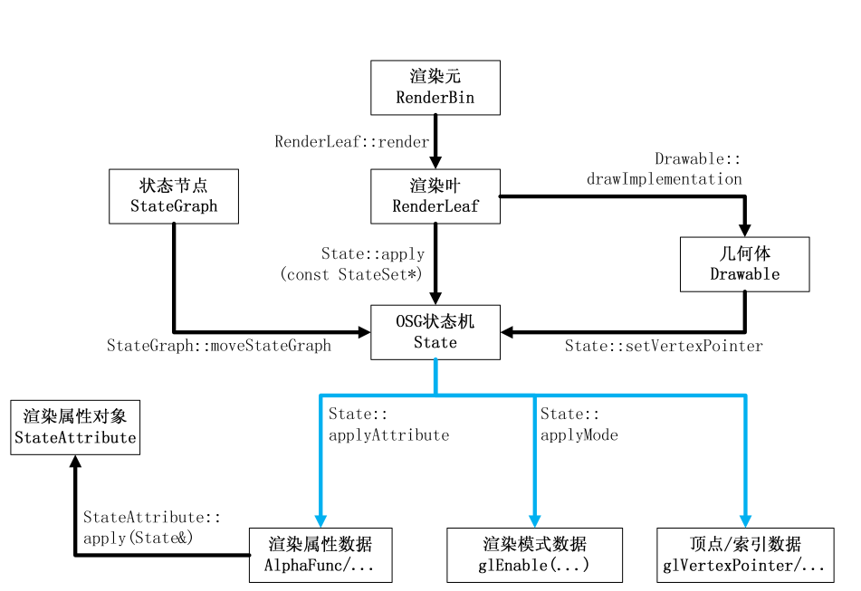

# 最长的一帧

## osgViewer/ViewerBase.cpp

  - ViewerBase::frame(dboule) 主要执行内容如下:
    1.  第一帧: viewerInit(), realize()
    2.  advance(double)
    3.  eventTraversal()
    4.  updateTraversal()
    5.  renderingTraversals()
  - viewerInit() 调用 osg::Viewer::View::init()
      - \_eventQueue 储存视景器的事件队列
      - 窗口事件使用 osgGA::GUIEventAdapter 派生并重写 handler() 函数(见例子
        osgkeyboardmouse)
      - osgGA::GUIEventAdapter::setEventType 设置事件类型为
        osgGA::GUIEventAdapter::FRAME, 每帧都调用
      - \_cameraManipulator 存储相机操作器
          - 可用 setCameraManipulator 来设置这个变量的内容
      - 将初始化事件和 Viewer 自身传递给 \_cameraManipulator 的 init 函数,
        该函数可以用于初始化工作. 重写
        osgGA::CameraManipulator::init 可以初始化自定义漫游器的功能.
  - realize() 完成窗口和场景的"设置"工作
      - getContexts(contexts) 使用 osg::GraphicsContext 对象.
      - osg::GraphicsContext 图形上下文
        ``` 
            osg::ref_ptr<osg::GraphicsContext::Traits> traits = new osg::GraphicsContext::Traits; 
            osg::ref_ptr<osg::Referenced> windata =   
                new osgViewer::GraphicsWindowWin32::WindowData(hWnd); 
            traits->x = 0; 
            traits->y = 0; 
            ... ...
            traits->inheritedWindowData = windata; 
            osg::GraphicsContext* gc = osg::GraphicsContext::createGraphicsContext(traits.get()); 
            Camera* camera = viewer.getCamera(); 
            camera->setGraphicsContext(gc); 
            ... ...
            viewer.setCamera(camera); 
        ```
          - osg::GraphicsContext::Traits 设置窗口属性.
          - 创建的 osg::GraphicsContext 赋予给相机
          - getContexts 获取主相机和从属相机的 GraphicsContexts 并保存至 vector
          - 参考例子 osgcamera
      - 在进入仿真循环之前,可以创建相机并设置GraphicsContext, 见 osgViewerMFC 和 osgcamera
        例子
      - 如果没有创建 Graphics Context, 程序会为你创建默认 Graphics Context
          - OSG\_CONFIG\_FILE 配置文件路径
          - OSG\_WINDOW: 窗口大小和尺寸, 使用 osgViewer::View::setUpViewInWindow
          - OSG\_SCREEN: 屏幕窗口, 创建相应数量的屏幕
          - osgViewer::View::setUpViewAcrossAllScreens 函数, 创建一个全屏显示的图形设备
  - osgViewer::View:<span id="-setUpViewInWindow"></span><span id="setUpViewInWindow" class="tag">setUpViewInWindow</span>
    五个参数, 窗口左上角x, y, 宽度 width, 高度 height, 屏幕数量 screenNum
      - 获取 osg::DisplaySettings 的指针. osg::DisplaySettings 保存了 OSG 目前用到的,
        与图形显示, 尤其是与立体显示有关的所有信息.
      - osg::DisplaySettings
          - \_displayType: 显示器类型. \_stereoMode: 立体显示模式. \_eyeSeparation:
            双眼的物理距离. \_screenWidth, \_screenHeight: 屏幕的实际宽度和高度(默认为0.325,
            0.26). \_screenDistance: 人眼到屏幕的距离, 默认为0.5.
          - \_splitStereoHorizontalEyeMapping: 左眼渲染左视口还是右视口.
          - \_splitStereoHorizontalSeparation: 左视口和右视口之间的距离.
          - \_splitStereoVerticalEyeEyeMapping: 左眼渲染顶视口还是底视口.
          - \_splitStereoVerticalSeparation: 顶视口和底视口之间的距离.
          - \_splitStereoAutoAdjustAspectRatio: 默认为 true,
            用于屏幕分割之后对其宽高比进行补偿.
          - \_maxNumOfGraphicsContexts: 用户程序中最多可用的 GraphicsContext 数量,
            默认为 32 个.
          - \_numMultiSamples: 多重采样的子像素样本数, 默认为 0. 可以打开.
          - \_minimumNumberStencilBits: 模板缓存的最小位数.
      - 从系统环境变量或命令行参数获取 DisplaySettings:
        DisplaySettings::readEnvironmentalVariables() /
        DisplaySettings::readCommandLine()
      - 如果要修改 DisplaySettings, 请务必在 viewer 的 realize() 方法调用之前修改.
      - osgViewer::View::setUpViewInWindow() 具体实现在
        SingleWindow::configure(), osgViewer/config/SingleWindow.cpp 内
      - 调用函数 ScreenIdentifier::readDISPLAY
          - 检查系统环境变量 DISPLAY, 调用 ScreenIdentifier::setScreenIdentifier
            函数, 将其中的内容按照"hostName:0.0"的格式解析为系统的主机名字(hostName),
            显示数(win32下必须为0)和屏幕数(0或其他数字).
      - osg::GraphicsContext::WindowingSystemInterface::getScreenResolution
        可以获取屏幕分辨率
      - 使用 osg::GraphicsContext::createGraphicsContext() 创建 gc
      - osg::Camera::setGraphicsContext 设置相机上下文
      - osgGA::GUIEventAdapter::setWindowRectangle 记录新建立的窗口设备的大小.
      - 主摄像机 \_camera 的透视投影参数, 并设置新的 Viewport 视口.
      - osg::Camera::setDrawBuffer 和
        osgCamera:<span id="-setReadBuffer"></span><span id="setReadBuffer" class="tag">setReadBuffer</span>
        执行 glDrawBuffer 和 glReadBuffer, 自动设置此摄像机想要绘制和读取的缓存.
      - 一些辅助函数: getScreenResolution, setScreenResolution,
        setScreenRefreshRate(屏幕刷新率) 等相关函数.
      - 执行 View::assignSceneDataToCameras, 包括如下工作:
          - 对于场景漫游器, 执行 setNode 函数和 home 函数. 注意, 如果我们使用
            setCameraManipulator 函数时, 也会自动执行同样的操作.
          - 将场景图赋予主摄像机 \_camera, 同时设置它对应的渲染器(Rnerder)的相关函数.
            同样将场景图形赋予所有的从摄像机 \_slaves,
            并设置每个从摄像机的渲染器.
  - 回到 realize() 函数
      - 对之前获得的所有 gc, 依次执行以下代码
            gc->realize();
            if(_realizeOperation.valid() && gc->valid())
            {
                gc->makeCurrent();
                (*_realizeOperation)(gc);
                gc->releaseContext();
            }
  - 对于 GraphicsContext, 通过 osg::GraphicsContext::createGraphicsContext()
    创建, 其内调用
    GraphicsContext::WindowingSystemInterface::createGraphicsContext()
    创建 gc. 这里 GraphicsContext::WindowingSystemInterface 为
    Win32WindowingSystemInterface, 创建的graphics context 为
    osgViewer::GraphicsWindowWin32


  - gc-\>realize() 实际调用的是 GraphicsWindowWin32::realize
  - 具体可见 GraphicsWindowWin32.cpp 源码
  - (\*\_realizeOperation)(gc), 实现用户自己的 realize 操作, 通过派生 osg::Operator
    类, 并调用 setRealizeOperation 方法实现. 见 osgcatch 例子
  - 再次遍历 GraphicsContext 设备. 对每个 gc, 判断其是否为 GraphicsWindow 对象, 执行
    GraphicsWindow::grabFocusIfPointerInWindow 函数(负责把鼠标焦点转到当前窗口).
  - 启动计时工作, osg::Timer::setStartTick().
  - Viewer:<span id="-setStartTick()"></span><span id="setStartTick()" class="tag">setStartTick()</span>
    找到当前视景器和所有 GraphicsContext 设备的事件队列 \_eventQueue, 并设定他们的启动时刻为当前时间.
  - ViewerBase:<span id="-setUpThreading"></span><span id="setUpThreading" class="tag">setUpThreading</span>
    设置线程.
      - osgViewer::ViewerBase::setUpThreading()
          - osg 的视景器有四种线程模型, 可以使用 setThreadingModel 进行设置.
              - SingleThreaded: 单线程模型, 不会创建任何新线程来完成场景的筛选和渲染.
                在单核以及配置较低的系统上运行稳定.
              - CullDrawThreadPerContext: 每个 GraphicsContext 创建一个图形线程,
                实现并行的渲染工作, 尝试把线程分别放在不同的CPU上运行. 每一帧结束后强制同步所有的线程.
                应用范围比较有限.
              - DrawThreadPerContext: 为每个 GraphicsContext 创建一个图形线程,
                并分配到不同的CPU上, 在当前帧的所有线程完成工作之前, 开始下一帧, 和上面不同.
              - CullThreadPerCameraDrawThreadPerContext: 为每个
                GraphicsContext 和每个摄像机创建线程, 这种模式同样不会等待前一次的渲染结束.
                四核甚至更高的配置时, 该线程模型将最大限度发挥多 CPU 的处理能力.
  - 更新(Update)和筛选(Cull)/绘制(Draw)工作是由 ViewerBase::renderingTraversals
    函数来完成的. 很多线程的调度和同步工作也是在这个函数中完成的.
  - Viewer::getScenes 函数获取当前视景器对应的 osgViewer::Scene 对象, 也就是场景.
    一个场景包括了唯一的场景图形根节点, 分页数据库(DatabasePager),
    分页图像库(ImagePager). Viewer 对象通常只包括一个 Scene 场景, 而
    CompositeViewer 则可能包含多个场景对象.
  - ViewerBase::setUpThreading 自动执行 ViewerBase::startThreading.
  - realize()
      - 编译上下文(Compile Contexts), 只需要在 realize() 之前调用如下代码
            osg::DisplaySettings::instance()->setCompileContextsHint(true);
      - 遍历所有可能的 GraphicsContext 设备, 针对它们分别再各自添加一个新的 GraphicsContext 设备,
        所用的函数为 GraphicsContext::getOrCreateCompileContext. 在这之后,
        分别执行了创建图形线程, 设置 CPU 依赖性, 以及启动图形线程的工作.
      - getOrCreateComplieContext 函数: 主要用于创建后台 Graphics Context. 这些新增的
        GraphicsContext 对象使用了 pBuffer 的特性,
        并使用对应对象相同的图形上下文(Traits::sharedContext).
        使用 Pixel BUffer 可以提高图形刷新的速度. 还可以为特定的 GraphicsContext
        设备添加特殊的处理动作.
          - 添加特殊处理动作: 使用 osg::GraphicsContext::getCompileContext
            获取后台图形上下文, 再使用 GraphicsContext::add 函数向其中追加
            osg::Operation 对象. 见例子 osgterrain.
      - 注意: 编译上下文可能在 Windows 上的实现有问题.

<!-- end list -->

  - advance 函数的工作内容
      - 获取上一次记录的参考时间(Reference Time)
      - 计算帧间时间
      - 记录已经经过的帧数
      - ViewerBase::getStats 获取 osg::Stats 对象, 进行帧状态的保存和显示.
      - Referenced::getDeleteHandler() 处理 osg::Referenced 对象被弃用之后的删除工作.
      - 主要变量为 osg::View::\_stats, osg::View::\_frameStamp
  - 记录工作
      - osg::FrameStamp 变量 \_frameStamp 处理总时间和总帧数.
      - osg::Stats 变量 \_stats 记录当前帧以及之前的24帧的每帧用时, 事件遍历用时, 更新遍历用时,
        渲染遍历用时. 可以设置自己的状态收集或者设置为空, 通过 osg::View::setStats
        实现.
      - osg::Referenced:<span id="-getDeleteHnadler()-&gt;flush()"></span><span id="getDeleteHnadler()-&gt;flush()" class="tag">getDeleteHnadler()-\>flush()</span>
        统一删除
      - osg::Referenced::getDeleteHnadler()-\>setFrameNumber(\_frameStamp-\>getFrameNumber())
      - DeleteHandler 的参数 \_numFramesToRetainObjects: 垃圾对象被收集后,
        再经过多少帧(默认为2), 方予以释放. 使用 setFrameNumber
        更新待删除句柄的帧数.
      - 目前 OSG 的删除不是用垃圾回收, 而是渲染之前添加 ref\_ptr 引用计数, 渲染之后 unref 引用计数,
        但这样渲染效率会降低 6%.
      - 如果要使用 DeleteHandler, 可以加入 \#undef
        OSGUTIL\_RENDERBACKEND\_USE\_REF\_PTR
  - osgViewer::Viewer 包括几个最主要的组件
      - 漫游器 \_cameraManipulator, 用于实现交互式的场景漫游
      - 事件处理器组 \_eventHandlers, 负责处理 Viewer 的事件队列 \_eventQueue,
        主要是键盘/鼠标等事件的处理.
      - 场景 \_scene, 包括 Viewer 所对应的场景图形根节点, 以及用于提高节点和图像数据速度的两个分页数据库.
      - 摄像机 \_camera 和 \_slaves, 前者为场景的主摄像机, 后者为从摄像机组.
        主相机不一定要用来显示场景,它更重要的作用是为 OSG
        世界矩阵的计算提供依据.
          - 视口(Viewport)
          - 图形上下文 (GraphicsContext),
            表示平台相关的图形显示窗口(Win32通过CreateWindowEx创建该窗口),
            或者表示离屏渲染的设备(PixelBufferWin32).
              - 具体代码可见 GraphicsWindowWin32 中的 handleNativeWindowingEvent
                函数.
      - 渲染器(GraphicsOperation, 更多时候是 osgViewer::Renderer), 这是 CULL 和
        DRAW 的关键
      - DisplaySettings 直接对摄像机的处理工作负责,
        大部分设置选项可以传递到摄像机对应的窗口特性(GraphicsContext::Traits)

## osgViewer::Viewer::eventTraversal

  - 摄像机与场景的关系


  - 执行用户设置的事件回调(EventCallback), 并为所有的用户交互和系统事件提供一个响应的机制.
  - \_eventHandlers 负责处理由图形窗口设备传递到事件队列 \_eventQueue 的各种事件.
  - 新的事件处理器通过 View::addEventHandler 添加, 除了 RecordCameraPathHandler 和
    StatsHandler 等常见的处理器工具之外, 其他的自定义事件处理器都派生自 osgGA::GUIEventHandler,
    并重写 handle 函数. 见 osgviewer, osgkeyboardmouse 等例子.
  - eventTraversal 主要任务: 每一帧过程中, 取出已经发生的所有事件, 丢弃对场景无益的(视口之外的鼠标点击和乱点)事件,
    依次将所有事件提交给各个事件处理器, 最后清空现有的事件队列, [等待下一帧的到来](等待下一帧的到来 "wikilink").
  - 记录事件遍历的时间
  - 记录起始时刻之后的工作
      - getEventQueue() 得到 osgGA::EventQueue, 里面包含了 Event 列表, 通常为 Event
        的派生类 GUIEventAdapter 事件的链表.
      - 取出事件队列的状态事件(EventQueue::getCurrentEventState), 为事件队列公用的"状态事件"
          - 如可以使用成员函数 GUIEventAdapter::getX 和 getY 获取当前的鼠标位置.
      - 取出主摄像机的viewport范围, 将该范围设置为事件队列的"响应范围"(EventQueue::setInputRange)
          - EventQueue::setInputRange 主要工作设置鼠标活动的最大和最小范围
          - EventQueue:<span id="-setUseFIxedMouseInputRange"></span><span id="setUseFIxedMouseInputRange" class="tag">setUseFIxedMouseInputRange</span>
            开启了鼠标范围的限定标志, 鼠标移动的范围自动限制在这个范围之内(默认关闭)
      - 计算主摄像机的 VPW 矩阵
            // 假设 VM 为视觉矩阵
            localCoord = worldCoord * VM;
          - 这里使用右乘.
          - 获取 VPW.
            ``` 
                    osg::Matrix masterCameraVPW = getCamera()->getViewMatrix() * getCamera()->getProjectionMatrix();
                    if (getCamera()->getViewport())
                    {
                        osg::Viewport* viewport = getCamera()->getViewport();
                        master_min_x = viewport->x();
                        master_min_y = viewport->y();
                        master_max_x = viewport->x()+viewport->width();
                        master_max_y = viewport->y()+viewport->height();
                        masterCameraVPW *= viewport->computeWindowMatrix();
                    }
            ```
  - 通过 Viewer::getContexts 函数找到 Viewer 中所有已有的 GraphicsWindow 图形窗口, 然后执行
    GraphicsWindowWin32::checkEvents 函数.
      - 通知 Windows 执行窗口的消息回调函数, 进而执行用户交互和系统消息的检查函数
        GraphicsWindowWin32::handleNativeWindowingEvent.
      - GraphicsWindowWin32::handleNativeWindowingEvent 的作用负责把 WM\_\*
        消息转化并传递给 osgGA::EventQueue 消息队列
      - OSG 仿真环境


  - 使用 EventQueue::takeEvents 函数, 把当前 GraphicsWindow 图形窗口对象 gw
    的事件队列保存到指定的变量 gw\_events 中.
        osgGA::EventQueue::Events gw_events;
        gw->getEventQueue()->takeEvents(gw_events);
  - 符合下列条件的摄像机, 为"焦点摄像机"(\_cameraWithFocus)
      - 鼠标移动时, 鼠标进入了摄像机的视口范围之内
      - 摄像机是对应该视口的, 允许接收事件(Camera::getAllowEventFocus),
        且"渲染目标实现方式"(Render Target Implementaton) 为
        Camera::FRAME\_BUFFER
  - 将焦点摄像机的坐标转换为主摄像机的二维坐标. 通过两者的 VPW 实现.
        osg::Viewport* viewport = getCameraWithFocus()->getViewport(); 
        osg::Matrix localCameraVPW = getCameraWithFocus()->getViewMatrix() *   
            getCameraWithFocus()->getProjectionMatrix(); 
        if (viewport) localCameraVPW *= viewport->computeWindowMatrix(); 
        osg::Matrix matrix( osg::Matrix::inverse(localCameraVPW) * masterCameraVPW ); 
        osg::Vec3d new_coord = osg::Vec3d(x,y,0.0) * matrix; 
        x = new_coord.x(); 
        y = new_coord.y(); 
        …… 
  - 上面的代码是将焦点相机的 x, y 转换成主相机的 x, y
  - 单一窗口的关闭工作
        bool wasThreading = areThreadsRunning(); 
        if (wasThreading) stopThreading(); 
        gw->close(); 
        if (wasThreading) startThreading(); 
      - 首先尝试终止所有的渲染线程(包括各个图形设备开启的线程和渲染器开启的线程), 关闭窗口后再打开所有的渲染线程.
      - 当我们试图在运行时开启一个新的 OSG 图形窗口时, 也必须使用相同的线程控制步骤. 关闭线程, 创建新渲染窗口, 开启线程.
  - 所有来自图形窗口和Viewer的事件都被添加到一个 std::list 链表中.
  - OSG 的退出事件
      - 退出键 Esc
      - ViewerBase::setQuitEventSetsDone 设置是否允许按下某个键之后直接退出.
      - ViewerBase::setKeyEventSetsDone 来设置自定义的退出键. 默认为
        GUIEventAdapter::Key\_Escape.
      - ViewerBase::setDone 函数帮助我们随时结束仿真程序. 这样就算屏蔽了退出键, 也可以通过该方法退出程序.
  - 遍历事件, 每个 GUIEventAdapter 事件 event 传递给每一个注册的 GUIEventHandler 事件处理器.
        for(EventHandlers::iterator hitr = _eventHandlers.begin(); 
                hitr != _eventHandlers.end(); 
                ++hitr) 
        { 
            (*hitr)->handleWithCheckAgainstIgnoreHandledEventsMask( *event, *this, 0, 0); 
        } 
      - osgGA::GUIEventHandler::handleWithCheckAgainstIgnoreHandledEventsMask()
          - 主要工作是执行 GUIEventHandlere::handle 函数.
          - handle 函数返回 true 时后续 handler 不会再进行处理.
          - 该函数不要去重写
      - GUIEventHandler::setIgnoreHandledEventsMask 函数,
        希望某个事件处理器暂时不要处理某一事件. 通过
        GUIEventAdapter::EventType 类型的参数实现.
  - 遍历事件, 每个 GUIEventAdapter 事件 event 再次传递给 \_cameraManipulator,
    所以在之前鼠标和按钮事件轻易不要返回 true, 避免影响到这些 manipulator.
  - 此时在 eventTraversal 内执行每个节点和Drawable的事件回调函数
      - 对于任意节点, Geode 叶节点以及任意 Drawable 几何体, 我们都可以使用 setEventCallback 和
        setUpdateCallback 函数设置它的事件回调和更新回调对象. 这些回调函数在 eventTraversal
        函数中处理
          - 节点的回调对象必须为 osg::NodeCallback 以及实现 NodeCallback::operator()
            函数, Drawable 对象的事件回调对象为 Drawable::EventCallback 以及
            EventCallback::event() 函数, Drawable 对象的更新回调对象为
            Drawable::UpdateCallback 以及 UpdateCallback::update 函数.
          - \_eventVisitor 负责管理事件回调的遍历工作. \_updateVisitor 负责更新遍历. 还可以使用
            ViewerBase::setEventVisitor 加载我们自定义的事件访问器
      - 对于接收到的所有窗口事件, 作如下处理:
          - 调用场景数据节点, 使用 \_eventVisitor 访问该节点, 处理里面所有节点的事件回调
          - 处理所有 slave 相机的事件回调
          - 处理相机和slave相机的自身事件回调
                osg::NodeVisitor::TraversalMode tm = _eventVisitor->getTraversalMode(); 
                _eventVisitor->setTraversalMode(osg::NodeVisitor::TRAVERSE_NONE); 
                if (_camera.valid() && _camera->getEventCallback()) _camera->accept(*_eventVisitor); 
                for(unsigned int i=0; i<getNumSlaves(); ++i) 
                { 
                    osg::Camera* camera = getSlave(i)._camera.get(); 
                    if (camera && camera->getEventCallback()) camera->accept(*_eventVisitor); 
                } 
                _eventVisitor->setTraversalMode(tm); 
              - 对于每个相机, 会获取相机的 stateset, 及该 stateset
                的事件回调方法(runEventCallbacks)
              - 获取每个相机的事件回调, 调用该回调处理
          - 遍历所有的 osgGA::EventHandler, 调用其 handle(osgGA::Event\* event,
            osg::Object\* object, osg::NodeVisitor\* nv) 方法
              - 这里 event 基本都有 GUIEventAdapter, nv 为 \_eventVisitor
              - handle 方法内调用 handle(const
                GUIEventAdapter&,GUIActionAdapter&), 其中 GUIActionAdapter
                通过 osgGA::EventVisitor::getActionAdapter 而来.
              - 所以对于 Viewer 的 EventHandler, 我们一般都是重写 handle(const
                GUIEventAdapter&,GUIActionAdapter&) 方法

## osgViewer::Viewer::updateTraversal()

  - 更新回调使用 \_updateVisitor 进行场景图形更新遍历. 通过 setUpdateCallback 设置更新回调.
  - 事件回调和更新回调的区别: 每个事件对于每个节点和相机都会调用事件回调一次, 更新回调只在每帧调用一次.
  - updateTraversal 的作用: 处理用户的更新回调对象, 更新摄像机的位置, 更新分页数据库 DatabasePager
    和图像库 ImagePager 的内容. 主要流程如下:
      - 获取函数的起始时刻
      - \_updateVisitor 访问场景图形的根节点并遍历其子节点. 实现各个节点和 Drawable 对象的更新回调.
      - DatabasePager::updateSceneGraph 以及 ImagePager::updateSceneGraph
        更新场景的分页数据库和分页图像库
      - 处理用户定义的更新工作队列 \_updateOperations.
      - 主摄像机 \_camera 以及从摄像机 \_slaves 的更新回调(注意别遍历它们的子节点)
      - 根据\_cameraManipulator 的位置姿态矩阵去更新主摄像机的 \_camera 的观察矩阵.
        MatrixManipulator::getInverseMatrix.
      - View::updateSlaves 更新所有 \_slaves 中所有摄像机的投影矩阵,
        观察矩阵以及场景筛选设置(CullSetting)
      - 获取函数的结束时刻, 将相关的时刻信息保存到记录器中.
  - 之前 ViewerBase::setRealizeOperation 进行自定义的场景预处理工作. 这里我们可以使用
    \_updateOperations 更新工作队列进行自定义的场景更新工作, 通过函数
    ViewerBase::addUpdateOperation 写入多组更新处理器 Operation 对象(或者使用对应的成员函数
    removeUpdateOperation 来移除), 因此可以实现的操作也更丰富.
      - 习惯上 Operation 对象可以用来处理与图形设备以及 OpenGL 底层 API 相关的工作,
        不过用户层级的工作在这里实现通常也没有问题
  - osgViewer::View::updateSlave()
      - 更新从属摄像机组 \_slaves:
          - 从属摄像机继承了主摄像机的投影矩阵, 观察矩阵和场景筛选设置. 但可以在 View::addSlave
            添加从属摄像机时, 设置投影矩阵与观察矩阵的偏置值, 还可以使用
            CullSettings::setInheritanceMask 设置 CullSettings 的继承掩码
          - osg::Camera 类继承自 osg::CullSettings 类, 有几种筛选:
              - 背面筛选: GL\_CULLFACE, osg::CullFace 可以开启该功能.
              - 视锥体筛选: view frustum culling, 场景中每个物体的包围盒与视锥进行比较.
              - 剪切平面筛选: clip plane, osg 可以用 osg::ClipPlane 实现.
              - 遮挡筛选: occlusion culling, 会增大计算的开销, 仅作为一个预处理步骤出现
          - OSG 支持的场景筛选方式, CullSettings::CullingModeValues 枚举值包括以下值:
              - NO\_CULLING: 不进行场景筛选工作
              - NEAR\_PLANE\_CULLING: 近平面筛选, 将超出近平面范围之外的对象剔除
              - FAR\_PLANE\_CULLING: 远平面筛选, 将超出平面范围之外的对象剔除
              - VIEW\_FRUSTUM\_CULLING: 视锥体筛选,
                保证场景中只有视锥体范围内的一小部分节点和Drawable是可见的,
                因而加速场景的绘制速度.
              - VIEW\_FRUSTUM\_SIDES\_CULLING: 视锥体侧面筛选,
                它不执行近平面/远平面的筛选工作,
                除此之外与VIEW\_FRUSTUM\_CULLING没有区别
              - SMALL\_FEATURE\_CULLING: 细节筛选, 筛选掉细微物体.
                CullSettings::setSmallFeatureCullingPixelsSize
                设置细微物体的阀值, 可以通过设置几何体对象的包围盒大小避免被裁剪掉.
              - SHADOW\_OCCLUSION\_CULLING: 遮挡筛选, 见例子 osgoccluder, 查看
                ConvexPlanarOccluder 和 OccluderNode 的用法
              - CLUSTER\_CULLING: 聚集筛选, 类似于背面筛选, 将多个对象组合起来并进行统一的背面筛选,
                OSG 可以使用筛选回调 ClusterCullingCallback 来实现节点的聚集筛选(对节点使用
                Node::setCullback). 对于地球地理信息的裁剪时很适用
              - DEFAULT\_CULLING: 默认情况打开视锥体侧面筛选, 细节筛选, 遮挡筛选和聚集筛选的选项
              - ENABLE\_ALL\_CULLING: 开启全部筛选方式.
          - CullSettings::setCullingMode 设置一种或多种筛选方式. 如暂时屏蔽一种筛选方式
                camera->setCullingMode(camera->getCullingMode() & 
                    ~osg::CullSettings::SMALL_FEATURE_CULLING); 
          - 有关各种筛选方式的详细算法，可以参考 CullingSet::isCulled
            函数，有关遮挡筛选和聚集筛选的算法请单独参阅
            OccluderNode，ConvexPlanarOccluder 和 ClusterCullingCallback
            等相关类的实现代码。

## 线程处理库 OpenThreads

  - OSG 将其纳入了自己的结构体系, 包含了几个主要的线程处理类
      - Thread 类: 线程实现类, 是一个面向对象的线程实现接口, 没定义一个Thread类, 相当于定义一个共享进程资源,
        但是可以独立调度的线程. 重写 run() 和 cancel() 这两个成员函数,
        即可实现线程运行时和取消时的操作; 通过调用 start() 和
        cancel(), 可以启动或中止已经定义的进程对象.
      - Mutex 类: 互斥体接口类. lock() 函数加锁, unlock() 函数解锁. 一个线程类中可以存在多个 Mutex
        成员, 用于在不同的地点或情形下为共享区域加锁.
      - Condition 类: 条件量接口类. 它依赖于某个 Mutex 互斥体, 互斥体加锁时阻塞所在的线程,
        解锁或者超过时限则释放此线程, 允许其继续运行.
      - Block 类: 阻塞器类. 可以阻塞线程的执行, 使用 block() 阻塞执行它的线程(注意,
        不一定是定义它的Thread线程, 而是当前执行了 block 函数的线程,
        包括系统主进程). 使用 release() 释放之前被阻塞的线程.
          - 下面代码首先阻塞的是主进程, 然后再次阻塞的是 TestThread 线程
                #include <OpenThreads/Thread>
                #include <OpenThreads/Condition>
                #include <OpenThreads/Mutex>
                #include <OpenThreads/ScopedLock>
                #include <OpenThreads/Block>
                #include <iostream>
                
                class TestThread : public OpenThreads::Thread
                {
                public:
                    TestThread() : _done(false), _count(0){ }
                    ~TestThread() {  cancel();  }
                
                    void block(){ _block.block(); }
                
                    virtual int cancel()
                    {
                        _block.release();
                        _done = true;
                        while (isRunning())
                        {
                            OpenThreads::Thread::YieldCurrentThread();
                        }
                        return 0;
                    }
                
                    virtual void run()
                    {
                        do 
                        {
                            std::cout << "(" << _count << ")";
                            ++_count;
                
                            if (_count == 10)
                            {
                                _block.release();
                                _block.reset();
                                _block.block();
                            }
                            microSleep(150000);
                
                        } while (!_done);
                    }
                
                protected:
                    bool                    _done;
                    unsigned long       _count;
                    OpenThreads::Block  _block;
                };
                
                int main()
                {
                    TestThread t;
                    t.start();
                    t.block();
                    std::cout << "(Main)" << std::endl;
                    getchar();
                    t.cancel();
                
                    return 0;
                }
      - BlockCount 类: 计数阻塞器类, 类似于阻塞器类, block() 阻塞线程, release() 释放线程.
        BlockCount 的构造函数还可以设置一个阻塞计数值, 计数的作用是每当阻塞器对象的 completed()
        函数被执行一次, 计数器就减一, 直至减到零就释放被阻塞的线程.
      - Barrier 类: 线程栅栏类. 它的构造函数与 BlockCount 类似, 可以设置一个整数值,
        该值理解为栅栏的"强度". 每个执行 Barrier::block()
        函数的线程都将被阻塞. 当被阻塞在栅栏处的线程达到指定的数目时,
        就好比栅栏无法支撑那么大的强度一样, 栅栏将被重开,
        所有的线程将被释放. 重要的是, 这些线程是几乎同时释放的, 也就保证了线程执行的同步性.
          - 注意 BlockCount 和 Barrier 的区别. 前者任意线程执行指定次数的 completed() 函数,
            即可释放被阻塞的线程, 后者必须阻塞指定个数的线程之后, 所有的线程才会同时被释放.
      - ScopedLock 模板: 与 Mutex 配合出现, 它的作用域之内将对共享资源进行加锁, 作用域之外自动解锁
            {
                OpenThreads::ScopedLock<OpenThreads::Mutex> lock(_mutex):
                // ... ...
            }
            // ... ...

## osgDB::DatabasePager::updateSceneGraph()

  - 工作内容为更新分页数据库的内容, 它的内容简单到只包含两个执行函数的内容
      - DatabasePager:<span id="-removeExpiredSubgraphs"></span><span id="removeExpiredSubgraphs" class="tag">removeExpiredSubgraphs</span>
        去除已经过期的场景子树
      - DatabasePager:<span id="-addLoadedDataToSceneGraph"></span><span id="addLoadedDataToSceneGraph" class="tag">addLoadedDataToSceneGraph</span>
        向场景图形中添加新载入的数据.
  - osgDB::DatabasePager 类执行的工作: 每一帧的更新遍历执行到 updateSceneGraph 函数时,
    都会自动将"一段时间内始终不在当前页面上"的场景子树去除, 并将"新载入到当前页面"的场景子树加入渲染,
    这里的"页面"是指用户的视野范围.
  - osgDB::DatabasePager 中内置了专用于相关工作处理的 DatabaseThread 线程.

<!-- end list -->

  - osgDB::DatabasePager::DatabaseThread::run()
      - 主要的工作:
        1.  删除过期的场景数据, 过期对象的统一删除工作在这里完成,
            而其他地方的更新遍历则负责将检索到的过期对象送入相应的过期对象列表.
        2.  获取新的数据加载请求: 请求加载的数据可能是新的数据信息, 也可能是已有的场景数据(曾经从"当前页面"中去除,
            更新又回到"当前页面"中); 可能是本地的数据文件, 也可能来自网络,
            并需要把下载的数据缓存在本地磁盘上.
            这些都需要在线程中一一加以判断.
        3.  编译加载的数据: 对数据进行编译以提升效率. 例如为几何数据创建显示列表(Display List),
            将纹理对象提前加载到纹理内存.
        4.  将加载的数据合并至场景图形, 将读入的数据先保存在一个列表中,
            并且由仿真循环负责获取和执行合并新节点的操作.(不能直接合并,因为我们不知道此时渲染器在做些什么)
      - 数据流程图, 第一部分为数据的检索和输入, 中间的部分为数据存储的内存空间, 最后一部分为存储数据的输出


  - 长时间离开"当前页面"的对象(线程外) ---\> 弃用对象列表 \_childrenToDeleteList ---\>
    释放对象以降低系统开销(线程内)
  - 新的对象, 或者进入"当前页面"的对象(线程外) ---\> 数据请求列表 \_requestList ---\>
    尝试加载或重新加载对象(线程内)
  - 加载后, 需要提前编译的对象(线程内) ---\> 等待编译列表 \_dataToCompileList ---\>
    执行对象的预编译工作(线程内)
  - 编译完成, 或者不需要提前编译的对象(线程内) ---\> 等待合并列表 \_dataToMergeList ---\>
    将对象合并到场景图形(线程外)

<!-- end list -->

  - DatabasePager 类所定义的各种数据结构:
      - DatabasePager::DatabaseThread 类: 分页数据库的核心处理线程, 负责实现场景元素的定期清理,
        加载以及合并工作. 由于一直检查各个数据列表的循环状态太过耗费系统资源, 因此平常状态下应当被阻塞,
        需要时再予以唤醒.
      - DatabasePager::DatabaseRequest 结构体: 保存用户的单个数据请求, 包括数据文件名, 请求时间,
        数据加载后存入的节点, 以及要进行合并的父节点等. \_dataToCompileMap 编译映射表,
        保存图形设备ID与编译对象(几何体显示列表, 纹理等)的映射关系.
      - DatabasePager::RequestQueue 结构体: 负责保存和管理一个"数据请求列表"
        \_requestList, 也就是 DatabaseRequest 对象组成的列表. 同时需要对列表中的元素按请求时间排序.
        \_dataToCompleList 和 \_dataToMergeList 都是 RequestQueue 类型的对象,
        只是这两个列表都完成了加载, 只是准备进行编译或合并.
      - DatabasePager::ReadQueue, 这个结构体继承自 RequestQueue,
        不过还增加了一个"弃用对象列表"
        \_childrenToDeleteList, 即 osg::Object 对象组成的列表,
        这个结构体可以向列表追加数据请求和弃用对象之外,
        还包括一个 updateBlock 函数, 负责阻塞或者放行 DatabaseThread 线程. 放行根据是:
        列表中是否存在新的数据请求或弃用对象需要处理,
        以及用户是否通过函数设置暂时不要启用线程(DatabasePager::setDatabasePagerThreadPause).
  - DatabasePager 默认创建两个数据处理线程, 均保存在线程列表 \_databaseThreads 中,
    这两个线程分别负责处理来自本地文件的数据队列 \_fileRequestQueue 和来自
    HTTP 站点的网络数据队列 \_httpRequestQueue(这两个队列均为 ReadQueue 对象).
      - 来自网络的数据也可以被缓存到本地, 设置系统变量 OSG\_FILE\_CACHE 为本地路径.

## osgDB::DatabasePager::DatabaseThread::run()

  - 循环开始时, 阻塞数据处理线程. 直到 updateBlock 函数在外部执行才会放行.
  - 执行 updateBlock 函数的几种情形:
      - ReadQueue 对象中的"数据请求列表" \_requestList 被修改, 例如新的数据加载请求被传入, 请求被取出,
        列表被重置
      - ReadQueue 对象中的"弃用对象列表" \_childrenToDeleteList 被修改, 例如新的过期对象被送入,
        对象被删除, 列表被重置
      - 执行 DatabasePager::setDatabasePagerThreadPause 函数, 当线程被重新启动时,
        会自动检查线程是否应当被唤醒.
  - 执行过期数据的删除工作, 取出 \_childrenToDeleteList 中的所有对象, 并安全地将它们析构.
  - 使用 DatabasePager::ReadQueue::takeFirst 函数, 从当前线程对应的 ReadQueue
    对象(\_fileRequestQueue 或 \_httpRequestQueue)
    的队列中取出并清除第一个数据加载请求(DatabaseRequest),
    756行.
  - OSG 2.6 的版本会自动判断数据加载请求是否过期, 即请求从外部程序发出的时间是否为当前帧或者上一帧, 如果这个
    DatabaseRequest 请求是很多帧之前发出的, 就不再处理它.
      - 更新版本的 OSG 对此已经有了改动, 不再严格地按照"发出时间是否为当前帧或者上一帧"的条件来进行处理.
  - 判断请求加载的文件是否来自 HTTP 网络
      - 如果设置了系统变量 OSG\_FILE\_CACHE, "本地文件处理线程"将尝试建立同名的文件缓存路径,
        并将请求转交给"网络文件处理线程"的 \_httpRequestQueue 进行处理.
  - 使用 DatabaseThread::dpReadRefNodeFile 加载文件. 我们假定 OSG 的 readNodeFile
    函数是线程安全的, 因此 dpReadRefNodeFile 与 osgDB::readNodeFile 没有太大差异.
  - 加载完毕后, 网络数据还将使用 osgDB::writeNodeFile 缓存到本地文件.
  - 获取 DatabaseRequest::\_groupForAddingLoadedSubgraph 的值, 对于已经加载的模型而言,
    这就是把它合并到当前场景时它的父节点
  - 合并到父节点的工作:
    1.  获取从该父节点到场景根节点的一条路径, 可看成场景遍历是, 从根节点一直到新加载节点之前的遍历路径
            osg::NodePath nodePath; 
            osg::NodePathList nodePathList = groupForAddingLoadedSubgraph->getParentalNodePaths(); 
            if (!nodePathList.empty()) nodePath = nodePathList.front(); 
            nodePath.push_back(groupForAddingLoadedSubgraph.get()); 
    2.  创建场景对象的预编译访问器: DatabasePager::FindCompileableGLObjectsVisitor,
        这个访问器的主要工作是找到场景树中所有的 StateSet 渲染属性集以及 Drawable 几何体对象,
        并将它们记录到之前所述的编译映射表
        DatabaseRequest::\_dataToCompileMap 中. 这样我们就可以在需要的时候调用映射表中的内容,
        来执行显示列表创建和纹理绑定这两项重要的 OpenGL 预处理工作.
    3.  将第一步得到的节点路径压入到访问器中, 这样相当于从场景的根节点开始执行遍历,
        这样可以测试新节点合并到场景树之后场景可能产生的变化.
        函数 NodeVisitor::pushOntoNodePath.
            for(osg::NodePath::iterator nitr = nodePath.begin(); nitr != nodePath.end(); ++nitr) 
                frov.pushOntoNodePath(*nitr); 
    4.  一切顺利的话,
        所有需要预编译的对象(StateSet与Drawable)都已经记录到"图形设备-编译对象"的映射表\_dataToCompileMap中.
        OSG 将需要编译的对象复制到每个GraphicsContext 图形设备的对应映射像中.
    5.  系统会自动为每个对象创建 k-Dop Tree 包围体(前提是开启了文件加载时的 KdTree 设置, 见例子
        osgkdtree), 可以为场景的射线交集检测提供一种更加精确的测试工具
    6.  等待预编译的数据加载请求(DatabaseRequest)送入待编译列表 \_dataToCompileList(或者待合并列表
        \_dataToMergeList, 如果不需要预编译的话)
  - [接下来的工作](接下来的工作 "wikilink")
      - 从待编译列表 \_dataToCompileList 中筛选并清除已经过期的数据请求,
        即那些早在当前帧或上一帧之前就已经发出的请求
      - 遍历所有的图形窗口设备, 检查它们是否注册了线程(除了 SingleThreaded 单线程模型之外,
        其他几种线程模型均会为每个图形设备创建一个线程), 如果线程有效的话,
        就向其中加入一个 DatabasePager::CompileOperation 对象,
        否则就用下面的代码处理渲染状态集和几何体对象的编译工作
            gc->makeCurrent();
            _pager->compileAllGLObjects(*(gc->getState()));
            gc->releaseContext();
          - DatabasePager::compileAllGLObjects 函数的工作: 取出映射表
            \_dataToCompileMap 中的所有 StateSet 和 Drawable 对象, 并依次执行
            StateSet::compileGLObjects 和 Drawable::compileGLObjects 函数
          - DatabasePager::CompileOperation 类, 继承自 osg::Operation, 并重写了
            operator() 操作符, 以完成指定的图形操作.

<!-- end list -->

  - osgDB::DatabasePager::updateSceneGraph
      - DatabasePager:<span id="-removeExpiredSubgraphs"></span><span id="removeExpiredSubgraphs" class="tag">removeExpiredSubgraphs</span>
        用于去除已经过期的场景子树.
          - 首先遍历 DatabasePager::\_pagedLODList 这个成员变量, 并执行其中每个 PagedLOD
            对象的 removeExpiredChildren 函数, 取得其中已经过期的子节点并记录到一个列表里.
          - 将这些过期节点标记为"可删除", 并传递给
            \_fileRequestQueue-\>\_childrenToDeleteList 成员,
            也就是前文所述的"待删除列表", 同时唤醒 DatabaseThread
            线程.
          - 将过期节点从 \_pagedLODList 中删除.
          - 执行 SharedStateManager::prune 函数, 这里的
            osgDB::SharedStateManager 指的是一个渲染状态共享管理器,
            它负责记录分页数据库中各个节点的渲染属性(StateAttribute),
            并判断节点之间是否共享了同一个渲染属性, 从而节省加载和预编译的时间. prune 函数的工作是从
            SharedStateManager 中剔除那些没有被共享的渲染属性
          - 默认 SharedStateManager 是关闭的, 如果想要启用, 调用如下函数
                osgDB::Registry::instance()->getOrCreateSharedStateManager(); 
  - osgDB::DatabasePager:<span id="-addLoadedDataToSceneGraph"></span><span id="addLoadedDataToSceneGraph" class="tag">addLoadedDataToSceneGraph</span>
    用于向场景图中添加新载入的数据
      - 取得"待合并列表" \_dataToMergeList, 并遍历其中每一个 DatabaseRequest 对象.
          - 遍历过程中, 首先执行 SharedStateManager::share 函数, 将新加载节点
            \_loadedModel 的渲染属性保存到 SharedStateManager 管理器中.
          - 执行 DatabasePager::registerPagedLODs, 在加载的节点及其子树中搜索 PagedLOD
            节点, 并添加到刚刚提到的 \_pagedLODList 列表中.
          - 判断 DatabaseRequest::\_groupForAddingLoadedSubgraph
            对象(也就是新加载节点在场景中的父节点)是否合法, 并将
            DatabaseRequest::\_loadedModel 添加为它的子节点
  - 什么情形下我们才会用到 DatabasePager, 当我们使用 osg::PagedLOD 和 osg::ProxyNode
    节点的时候
      - osg::ProxyNode --- 代理节点. 使用代理节点可以指向某个已经存在的模型文件, 并在需要的时候加载它.
          - 我们希望在场景方针循环开始之后才加载某个模型文件, 可以使用 ProxyNode 指定要加载的文件名,
            并在场景筛选(Cull)的过程中加载模型, 加载后的新节点将作为 ProxyNode
            节点的子节点.
                osg::ProxyNode* proxyNode = new osg:: ProxyNode; 
                proxyNode->setFileName(0, “nodefile.osg”); 
          - ProxyNode::setLoadingExternalReferenceMode 来设置加载的时机,
            例如首先设置为不自动加载(NO\_AUTOMATIC\_LOADING),
            在适当的时候再设置立即加载(LOAD\_IMMEDIATELY)
      - osg:<span id="-PagedLOD"></span><span id="PagedLOD" class="tag">PagedLOD</span>
        继承自 osg::LOD, 它的工作同样是按照用户的可视范围, 将多个子节点作为同一场景的多个细节层次,
        即在视点靠近物体时呈现较多的物理细节, 而在远离时仅仅呈现一个简化的模型,
        从而降低了运算和绘制的负担.
          - PagedLOD 节点, 运用了分页数据库的功能, 将多个模型数据分批加载到场景图形中(作为 PagedLOD
            的子节点), 并根据用户当前的可视范围, 将那些一段时间内均无法被看到的 PagedLOD
            子节点剔除出场景图形, 以节约系统资源.
          - 举例：以四级Node节点及其子树来表达某个场景在不同视距下的细节层次，这些场景模型已经保存为诸如
            "node\_1.osg" 的文件形式
            ``` 
                osg::PagedLOD* pagedLOD = new osg::PagedLOD;
                pagedLOD->setFileName(0, "node_1.osg");
                pagedLOD->setRange(0, minRange1, maxRange1);
                pagedLOD->setFileName(1, "node_2.osg");
                pagedLOD->setRange(1, minRange2, maxRange2);
                ... ...
            ```
          - DatabasePager::setExpiryDelay 用于决定视野外对象的过期时间,
            PagedLOD::setPriorityOffset设置子节点的优先级. setCenter 来设置中心点等等


  - 主要流程介绍


  - osg::PagedLOD 节点或者 osg::ProxyNode 节点使用 setFileName 函数,
    请求运行时加载模型文件为子节点.
  - 在场景的筛选(Cull)过程中, OSG将自动取出 PagedLOD 和 ProxyNode 中保存的文件名数据, 并使用
    DatabasePager::requestNodeFile
    函数将其保存到"数据请求列表"中(RequestQueue::\_requestList).
  - DatabasePager 内置了两个数据处理线程(DatabaseThread), 分别用于处理本地文件和HTTP数据,
    线程的主要工作是删除"已弃用队列"(RequestQueue::\_childrenToDeleteList)中的对象,
    并从"数据请求列表"中获取新的请求.
  - 线程中如果取得新的数据请求, 则尝试加载新的模型, 判断是否需要预编译模型,
    并送入"等待编译列表"(\_dataToCompileList).
    预编译的含义是执行显示列表的创建, 纹理绑定, GLSL 数据绑定等
    OpenGL 动作, 通常情况下预编译模型可以避免它在显示时出现帧延时.
  - 对于编译完成或者无需编译的数据请求, 首先创建其 KDTree 包围体(用于 K-Dop Tree 碰撞检测计算),
    然后送入"等待合并列表"(\_dataToMergeList), 线程让出控制权.
  - 场景的每次更新遍历均会执行 updateSceneGraph 函数,
    于其中将一段时间内没有进入用户视野的节点送入"已弃用队列"(这一工作只限于
    PagedLOD 节点的子节点), 并将"等待合并列表"中的新数据使用 addChild 送入当前的场景图形.

<!-- end list -->

  - osgViewer::Viewer::updateTraversal()
      - 阅读 ImagePager 的相关内容, 该类的工作性质与 DatabasePager 没什么大的区别,
        主要负责纹理图片文件的运行时加载工作.
      - OSG 2.6 的版本中, 只有 osg::ImageSequence 可以使用图片数据库来执行工作, 通过调用
        ImageSequence::addImageFile 函数, 指定运行时加载的图片文件名称. 文件将逐步被加载并送入这个
        ImageSequence 对象中. ImageSequence 类的主要功能是使用自身包含的 Image 图像对象序列,
        实现一种动画纹理的效果.
      - ImagePager 内置了一个处理线程(ImagePager::ImageThread),
        其中随时读取"图片加载请求"(ImagePager::ImageRequest)的内容,
        并根据其中的文件名使用 osgDB::readImageFile 加载数据(osg::Image对象),
        加载之后的图片数据将被加入到申请它的 ImageSequence 对象中.
      - ImagePager 本身暂时不具备"分页"的功能. 即不会负责将长时间不用的图片删除.

## 渲染机制相关

  - OSG 的渲染过程可以分为三个阶段:
      - 用户(APP)阶段: 更新用户数据, 负责场景对象的运动和管理等等
      - 筛选(CULL)阶段: 负责对场景中的对象进行筛选裁剪, 略过那些不会被用户所见(因而不必渲染)的物体,
        并根据渲染状态的相似性对即将进入渲染管线的对象排序(从而避免OpenGL状态量的频繁切换)
      - 绘制(DRAW)阶段: 执行各种OpenGL操作, 将数据送入OpenGL渲染管线及显示系统处理
  - 多个图形设备(渲染窗口)时, 需要分别为每个窗口的每个摄像机执行相应的筛选和绘制工作，不过用户(APP)工作可以被多个图形设备共享。
  - 我们可以允许上一帧的绘制没有结束以前, 开始下一帧的用户数据更新工作
  - 允许不同的CPU来执行不同图形设备的筛选和绘制工作, 从而提高整体渲染的效率

<!-- end list -->

  - frame() 函数的基本内容
        advance(simulationTime); // 记录场景的帧数，帧速率信息
        eventTraversal(); // 处理场景的交互事件及回调
        updateTraversal(); // 处理场景的更新回调，以及分页数据的更新
        renderingTraversal(); // 场景的渲染遍历工作
  - osgViewer::ViewerBase::startThreading() 的工作
      - startThreading 函数的工作
          - 执行 ViewerBase::releaseContext, 首先释放渲染上下文
          - 如果用户没有设置线程模型, 则使用 ViewerBase::suggestBestThreadingModel
            自动进行判断(这部分工作现在已经转移至 ViewerBase::setUpThreading()
            函数里)
          - Viewer::getContexts 获取当前所有的图形设备(GraphicsContext)
          - Viewer::getCameras 获取当前所有的摄像机(主摄像机和所有从摄像机)
      - suggestBestThreadingModel 的判断原则
          - 环境变量 OSG\_THREADING是否为: "SingleThreaded",
            "CullDrawThreadPerContext", "DrawThreadPerContext",
            "CullThreadPerCameraDrawThreadPerContext"
          - 如果当前不存在图形设备或者摄像机, 则采用 SingleThreaded 模型
          - 如果只存在一个图形窗口, 则采用 SingleThreaded 模型(单核)或 DrawThreadPerContext
            模型(多核)
          - 如果系统 CPU 数超过当前图形设备或者摄像机数总和, 采用
            CullThreadPerCameraDrawThreadPerContext 模型
          - 以上均不符合时, 采用 DrawThreadPerContext 模型.
      - 一般来说推荐 CullDrawThreadPerContext, DrawThreadPerContext, 不推荐
        CullThreadPerCameraDrawThreadPerContext
  - 单线程模式没有额外的工作要做。直接 frame() 函数内的下一个步骤 renderingTraversals()

## osgViewer:: ViewerBase::renderingTraversals()

  - 单线程模型
      - 单线程模型用不上的一些变量:
          - ViewerBase:<span id="-_startRenderingBarrier"></span><span id="_startRenderingBarrier" class="tag">\_startRenderingBarrier</span>
            渲染启动的一个栅栏标志, 用于同步开始所有的图形设备的线程操作
          - ViewerBase:<span id="-_endRenderingDispatchBarrier"></span><span id="_endRenderingDispatchBarrier" class="tag">\_endRenderingDispatchBarrier</span>
            渲染结束的一个栅栏标志, 用于同步结束所有的图形设备的线程操作
          - ViewerBase:<span id="-_endDynamicDrawBlock"></span><span id="_endDynamicDrawBlock" class="tag">\_endDynamicDrawBlock</span>
            用于同步结束所有的动态对象绘制操作, 这里的动态对象是指 Object::setDataVariance 被设置为
            DYNAMIC 的场景对象
      - 单线程模型下 renderingTraversals() 的执行步骤
        1.  ViewerBase::checkWindowStatus 检查是否存在有效的图形设备, 不存在的话使用
            ViewerBase::stopThreading 停止线程运行
        2.  记录渲染遍历开始的时间
        3.  遍历视景器对应的所有 Scene 场景(Viewer单视景器只存在一个场景),
            记录分页数据库的更新启动帧(使用DatabasePager::signalBeginFrame,
            这将决定 DatabasePager 中的数据请求是否过期), 并计算场景节点的围绕球
        4.  获取当前所有的图形设备(GraphicsContext)和摄像机
        5.  \[重要步骤\]遍历所有摄像机的渲染器(Renderer), 执行Renderer::cull场景筛选的操作
        6.  \[重要步骤\]遍历所有的图形设备, 设置渲染上下文(使用
            ViewerBase::makeCurrent)并执行GraphicsContext::runOperations,
            实现场景绘制的操作
        7.  再次遍历所有的图形设备, 执行双缓存交换操作(GraphicsContext::swapBuffers)
        8.  遍历视景器中的场景, 告知分页数据库更新已经结束(DatabasePager::signalEndFrame,
            目前这个函数没有作用)
        9.  释放当前的渲染上下文(ViewerBase::releaseContext)
        10. 记录渲染遍历结束的时间, 并保存到这个记录器当中(ViewerBase::getStats)

### osgViewer::Renderer::cull()

  - osgViewer::Renderer 为摄像机渲染场景的工作提供了一个公有接口.
  - 当我们向视景器(Viewer)添加一个新的摄像机(Camera)时, 一个与摄像机相关联的渲染器(Renderer)也会被自动创建.
    而当我们准备渲染场景时, 与特定图形设备(GraphicsContext)相关联的摄像机也会自动调用其渲染器的响应函数,
    执行场景筛选和绘制等工作.
  - 获取相机附带渲染器
        osgViewer::Renderer* renderer = dynamic_cast<osgViewer::Renderer*>(camera->getRenderer()); 
      - osg::Camera::getRenderer() 返回的是 osg::GraphicsOperation 的指针。
  - 场景视图类, osgUtil::SceneView, 2.x版本之后退居幕后, 由 osgViewer::Renderer 负责调用
  - 每个渲染器创建两个 osgUtil::SceneView 对象(Renderer::\_sceneView\[2\]),
    从而实现渲染后台双缓存的支持, 注 SingleThreaded 和
    CullDrawThreadPerContext 环境下只使用到第一个场景视图.
  - Renderer::cull() 的主要工作:
    1.  从 \_availabelQueue 队列中获取一个可用的场景视图(SceneView), 这个队列中通常会保存有两个
        SceneView 对象
    2.  Renderer::updateSceneView 函数, 更新这个场景视图的全局渲染状态(根据场景主摄像机的 StateSet
        渲染状态集, 更新成员变量 SceneView::\_globalStateSet), osgUtil::SceneView
        的状态(osg::State), osgUtil::SceneView
        的显示设置(osg::DisplaySettings)
    3.  更新场景视图(SceneView)的融合距离(Fusion Distance)和筛选设置(CullSettings).
        融合距离表示双眼所在平面到实现汇聚点的距离, 可以通过 View::setFusionDistance
        函数传递给SceneView, 通常应用于立体显示的场合
    4.  执行 SceneView::cull 函数, 这才是真正的场景筛选(裁剪)工作的所在
    5.  记录场景筛选所耗费的时间, 并保存到统计器(osg::Stats) 中
    6.  将这个渲染视图添加到绘制队列 \_drawQueue 中. 这个队列中保存的对象将在场景绘制时用到
  - osg:<span id="-State"></span><span id="State" class="tag">State</span>
    OpenGL 状态机在OSG中的具体实现, 封装了几乎所有的 OpenGL 状态量, 属性参数, 以及顶点数组的设置值.
      - 允许用户直接查询各种 OpenGL 状态的当前值(直接执行 State::captureCurrentState, 而不必再使用
        glGet\* 系列函数)

### osg::GraphicsContext::runOperations()

  - 该函数的执行过程
    1.  获取场景中所有注册的摄像机, 对它们进行排序, 排序的原则根据摄像机的渲染顺序而定, 可以通过
        Camera::setRenderOrder 进行设置. 设置为 PRE\_RENDER 级别的摄像机排序在最前,
        POST\_RENDER 级别的摄像机排序在最后. 同一级别的摄像机根据 setRenderOrder
        函数中传入的整数设置先后顺序, 排序数较小的摄像机在前.
    2.  依次遍历排序过的各个摄像机, 执行器渲染器的 Renderer 的 operator() 操作. 该操作有个参数为当前的
        GraphicsContext. 该操作执行了场景在该图形设备中的绘制工作。
    3.  遍历 GraphicsContext::\_operations 队列中的各个 Operation 对象, 执行其
        operator() 操作. 我们可以重写自己的 Operation 派生对象, 并通过
        GraphicsContext::add 将其添加到图形设备的执行队列中, 从而实现自己定义的 OpenGL 绘图功能.
        这里不用考虑 makeCurrent() 的问题, 执行 runOperations 之前已经执行了.
          - 这里会调用 Renderer 的 operator() 方法， osgViewer::Renderer 的
            operator() 的工作仅仅是判断是否使用图形线程来执行场景的筛选,
            对于单线程模型(SingleThreaded)来说, 它转向
            Renderer::draw 函数, 因为场景筛选的工作已经由前面的代码完成了,
            对于线程模型(CullDrawThreadPerContext)来说, 它将转向
            Renderer::cull\_draw 函数, 对于另外两种线程模型而言, DrawThreadPerContext
            同样使用 Renderer::cull和Renderer::draw来执行场景筛选和绘制的工作.
            而CullThreadPerCameraDrawThreadPerContext
            则为每个摄像机创建线程来完成筛选工作,
            场景的绘制仍然由下文的 Renderer::draw 来完成

### osgViewer::Renderer::draw()

  - 该函数的基本执行流程:
    1.  从绘制队列 \_drawQueue 中取出一个场景图形(SceneView)对象.
    2.  执行 Renderer::compile().
    3.  执行 Renderer::initialize(osg::State\*), 初始化 Renderer 绘制所需的基本变量,
        这里仅仅设置 osgViewer::OpenGLQuerySupport 变量
    4.  执行 SceneView::getDynamicObjectCount 函数判断场景视图中动态对象(设置为 DYNAMIC)
        的个数, 并执行其回调类(此回调类派生自线程阻塞器BlockCount, 此处为
        State::getDynamicObjectRenderingCompletedCallback)的 completed
        函数.
          - completed 函数的作用: 将阻塞器的引用计数减一, 减到零时自动释放所阻塞的线程. 对于单线程模型来说,
            这一步骤基本没有用处. 对于多线程工作而言,
            其保证动态(DYNAMIC)对象的更改不会影响到渲染管线而实现的.
            在 OSG 内, 只有设置为 setDataVariance(DYNAMIC) 的对象才可以在仿真循环中被随时更改.
    5.  执行 OpenGLQuerySupport::checkQuery 函数, 判断是否可以使用 OpenGL 查询对象(query
        objects).
    6.  执行 OpenGLQuerySupport::beginQuery 函数, 创建或者获取一个查询对象, 其工作主要是获取并统计
        GPU 计算的时间
    7.  \[重要步骤\]执行 SceneView::draw 函数, 场景的绘制工作最后也是在 osgUtil::SceneView
        函数中完成的.
    8.  将已经结束绘制的场景视图对象再次追加到 \_availableQueue 队列中, 这样可以保证该队列始终保存有两个
        SceneView 对象, 以正确实现场景的筛选和渲染工作.
    9.  \[新版已删除\]执行 Renderer::flushAndCompile 函数, 它的作用是执行场景中所有过期对象的删除工作.
        单线程模型下将直接执行 osg::flushDeletedGLObjects 函数, 多线程模型下,
        由于每个图形设备(GraphicsContext)都分配了一个操作线程,
        因此将向线程追加一个新的
        osg::FlushDeletedGLObjectsOperation 操作, 它所调用的函数实质上与单线程模式下相同.
        FlushDeletedGLObjectsOperation 继承自 Operation 类.
          - flushDeletedGLObjects 函数现在在 SceneView::draw() 内调用，
          - 需要删除的对象包括过期的显示列表, 纹理, 着色器等, 具体的方法可以参考 releaseGLObjects 函数,
            它在多个类当中都有实现.
          - flushAndCompile 还负责分页数据库的预编译工作(即
            DatabasePager::compileGLObjects 函数的内容), 该函数的主要工作:
              - 从 DatabasePager 的"待编译列表"中取出一个数据, 从它的 DataToCompileMap
                映射表中取出待编译的几何体(Drawable)队列和渲染状态(DtateSet)队列.
              - 对于 Drawable 对象, 执行 Drawable::compileGLObjects,
                创建几何体的显示列表(使用我们熟悉的 glNewList), 对于
                StateSet 对象, 执行 StateSet::compileGLObjects,
                进而执行各种渲染属性的预编译命令(例如 Texture
                对象要使用 glTexImage2D 等函数执行纹理数据的加载, 而 Program 对象要执行
                GLSL 代码的载入和编译), 这些现在在 GLObjectsVisitor::apply() 内实现。
              - 从"待编译列表"中剔除已经编译的数据, 注意每一帧的过程中没有必要编译所有的对象, 使用
                DatabasePager::setMaximumNumOfObjectsToCompilePerFrame
                可以设置每一帧从"待编译列表"中取出多少数据执行编译工作, 默认值为4
    10. 执行 OpenGLQuerySupport::endQuery, 结束查询对象的工作
    11. 计算场景绘制所需的时间, 并传递给记录器(ViewerBase::getStats).
  - 流程介绍


  - OSG 视景器 (SceneView) 的摄像机(包括主摄像机 \_camera 和从摄像机 \_slaves)
    均包括了与其对应的渲染器(Renderer)和图形设备(GraphicsContext)
  - 使用 setSceneData 将场景图形的根节点关联到视景器时, 这个根节点实质上被添加为此 Viewer
    对象中每个主/从摄像机的子节点(使用
    View::assignSceneDataToCameras 函数), 因而我们可以通过改变摄像机的观察矩阵来改变我们观察整个场景的视角
  - 场景的筛选(CULL)和绘制(DRAW)工作实质上都是有内部类 osgUtil::SceneView 来完成的, 但是 OSG
    也为场景渲染的工作提供了良好的公用接口, 即"渲染器". 渲染器 osgViewer::Renderer
    负责将场景绘制所需的各种数据(OpenGL状态值, 显示设置, 筛选设置等)传递给 SceneView 对象,
    并调用 SceneView::cull 和 SceneView::draw 函数, 以完成场景的筛选和绘制工作.
  - 摄像机所对应的图形设备(GraphicsContext)同样也可能负责调用 SceneView::draw 函数,
    这与我们选择的线程模型有关, 多线程模型为每一个图形设备创建一个专门的工作线程(使用
    GraphicsContext::createGraphicsThread 函数), 并在其中处理与场景绘制相关的诸多工作, 因此
    GraphicsContext 类在某种意义上也可以视作 SceneView 的一个公有实现接口(不过它更重要的意义在于,
    它是OSG与特定操作系统平台API的接口)

## osgUtil::SceneView::cull()

  - OSG 渲染后台的主体是场景视图(SceneView), 它实现了"树状结构"的管理方式, 以及多个专用于渲染工作的内部类
  - OSG 渲染后台的几个"重要角色"
      - osgUtil:<span id="-CullViisitor"></span><span id="CullViisitor" class="tag">CullViisitor</span>
        "筛选访问器", 对每一个遇到的节点执行场景筛选的工作, 判断它是否会超出视截锥体范围, 过于渺小,
        或者被遮挡节点(OccluderNode)挡住, 从而将无助益于场景浏览的物体筛选并剔除,
        降低场景绘制的资源消耗.
      - osg:<span id="-RenderInfo"></span><span id="RenderInfo" class="tag">RenderInfo</span>
        "渲染信息"管理器, 负责保存和管理与场景绘制息息相关的几个重要数据. 当前场景的视景器, 当前场景对应的所有摄像机, 当前所有
        OpenGL 渲染状态和顶点数据. 用于在场景筛选和渲染时为OSG的工作提供重要依据
      - osgUtil:<span id="-StateGraph"></span><span id="StateGraph" class="tag">StateGraph</span>
        "状态节点", 类似场景树的组节点(Group), 将 StateGraph 理解为 OSG 渲染后台的组节点.
        以节点的渲染状态集(StateSet)为依据, 状态节点采用映射表 std::map
        来组织它的子节点, 同一层次的子节点如果渲染状态相同, 则合并到同一个"状态节点"中.
      - osgUtil:<span id="-RenderLeaf"></span><span id="RenderLeaf" class="tag">RenderLeaf</span>
        "渲染叶", 我们可以把 RenderLeaf 理解为 OSG 渲染后台状态树的叶节点. 其绝非等同于场景树的 Geode
        节点, "渲染叶"的工作主要是记录场景树中存在的各种 Drawable 对象(以及与之相关的投影矩阵,
        模型视点矩阵等信息).
        每个"状态节点(osgUtil::StateGraph)"中都包含了一个渲染叶的列表(StateGraph::\_leaves),
        不过只有最末端的"状态节点"会负责记录场景中的"渲染叶".
      - osgUtil:<span id="-RenderStage"></span><span id="RenderStage" class="tag">RenderStage</span>
        "渲染台". OSG 的渲染后台除了使用"状态树"来组织和优化节点的渲染状态之外, 还有另外一种用于场景实际渲染的组织结构,
        我们称之为"渲染树", "渲染树"的根节点就是"渲染台"
          - "摄像机渲染顺序"的功能, 通过 Camera::setRenderOrder 设置, PRE\_RENDER
            的摄像机在主相机之前执行渲染，可实现"纹理烘培(Render To Texture)"的功能,
            见例子 osgprerender。POST\_RENDER 的摄像机在主相机之后进行渲染, 可实现诸如
            HUD 的效果。
          - slave cameras 主要是为了实现同一场景的分窗口以及分屏幕显示。(见例子 osgcamera)
          - 对于 HUD显示, 简单鹰眼图等功能，则向场景图添加新的摄像机节点, 并设置与主摄像机不同的观察矩阵和投影矩阵。
      - osgUtil:<span id="-RenderBin"></span><span id="RenderBin" class="tag">RenderBin</span>
        "渲染元", OSG
        渲染树的分支节点，渲染树按照遍历的顺序，把"状态节点"和"渲染叶"记录到作为根节点的"渲染台(RenderStage)"当中(std::vector成员变量
        RenderBin::\_stateGraphList, RenderBin::\_renderLeafList),
        然后就可以执行场景的绘制工作. 注意的是 RenderStage 派生自 RenderBin.
          - osg::StateSet::setRenderBinDetail 设置渲染顺序
              - 第一个参数为整数，小于0的渲染状态集将排列在前, 大于0的渲染状态集则排列在后.
              - 第二个字符串参数: "RenderBin" 表示在渲染树中新建分支进行渲染, "DepthSortedBin"
                表示新建分支, 并且所有要渲染的数据按照深度值降序进行排序.
              - 注意当字符串参数不为 "RenderBin" 或 "DepthSortedBin" 时, 本函数的设置无效.
```
                    // 默认渲染方式，渲染顺序为0，此时状态节点直接置入"渲染台"
                    stateSet->setRenderBinDetails(0, "");
                    // 渲染顺序 -1(先渲染)， 渲染树新建一个"渲染元"节点
                    stateSet->setRenderBinDetails(-1, "RenderBin");
                    // 渲染顺序 10， 渲染树新建一个"渲染元"节点, 并按深度值降序排序各元素.
                    stateSet->setRenderBinDetails(10, "DepthSortedBin");
```
          - osg::StateSet::setRenderingHint() 设置渲染的顺序, 参数可为枚举值
            OPAQUE_BIN 或 TRANSPARENT_BIN
```
                state->setRenderingHint(OPAQUE_BIN);
                // 等价于
                state->setRenderBinDetails(0, "RenderBin")
                
                state->setRenderingHint(TRANSPARENT_BIN);
                // 等价于
                state->setRenderBinDetails(0, "DepthSortedBin")
```				
  - 举例


  - "ss"加上数字代号来标识这些 StateSet 对象, "-" 表示空字串, "R" 表示 "RenderBin", "D" 表示 "DepthSortedBin"
```
        ss03->setRenderBinDetails(0, "");  // 这是默认的设置.
        ss11->setRenderBinDetails(0, ""); 
        ss13->setRenderBinDetails(-1, "RenderBin"); 
        ss14->setRenderBinDetails(1, "RenderBin"); 
        ss15->setRenderBinDetails(10, "DepthSortedBin"); 
        ss16->setRenderBinDetails(10, "DepthSortedBin"); 
```
  - OSG中所有的 drawable 几何体对象都会自动关联一个 StateSet 对象, 无论用户是否设置了.
  - OSG 生成相应的"状态树", 由"状态节点"(StateGraph)和"渲染叶"(RenderLeaf)所组成


  - 状态根节点 \_rootState 和局部状态节点 \_localState 由状态树自动生成, \_localState
    保护和维护一些渲染后台自动创建的渲染属性. 全局状态节点 \_globalStateSet
    的取值来自于主相机的 StateSet.
  - 一个或多个渲染叶必然被一个状态树末端的节点(StateGraph)所拥有.
  - 后台生成对应的"渲染树", 由一个 RenderStage 对象和多个 RenderBin 对象组成.
  - 如不使用 setRenderBinDetails 设置 StateSet 的渲染细节,
    则所有状态树中的末端节点都会按照遍历顺序保存到渲染树根节点(渲染台)中,
    否则如下图


  - 根据渲染顺序的不同,渲染树生出了三个分支.
  - 上面未设置渲染细节的状态节点直接由根节点(渲染台, RenderStage)负责维护.
  - 一个渲染元中可以有一个或多个状态节点(或渲染叶), 一个状态节点(或渲染叶)只能置入一个渲染元中.
  - 如果改变 s03 的渲染顺序,则结果如下
        ss03->setRenderBinDetails(1, "RenderBin");


  - 由上两个渲染状态(StateSet)的渲染序号相同时,它们不一定放入同一个"渲染元"中.
  - 见例子 osghangglide.

<!-- end list -->

  - 归纳总结:
      - osgUtil:<span id="-StateGraph"></span><span id="StateGraph" class="tag">StateGraph</span>
        状态节点, 负责管理场景树中的一个渲染状态(StateSet)对象, 末端的 StateGraph
        节点还负责维护一个"渲染叶"(RenderLeaf)的列表.
      - osgUtil:<span id="-RenderLeaf"></span><span id="RenderLeaf" class="tag">RenderLeaf</span>
        状态树的叶节点(渲染叶), 负责管理和绘制场景树末端的一个几何体(Drawable)对象.
      - osgUtil:<span id="-RenderStage"></span><span id="RenderStage" class="tag">RenderStage</span>
        渲染树的根节点(渲染台), 负责管理默认渲染顺序的所有末端 StateGraph 节点(附带"渲染叶"),
        并保存了"前序渲染"(pre-render)和"后续渲染"(post-render)的渲染台指针的列表.
      - osgUtil:<span id="-RenderBin"></span><span id="RenderBin" class="tag">RenderBin</span>
        渲染树的分支节点(渲染元), 负责管理自定义渲染顺序的末端 StateGraph
        节点(附带"渲染叶"),渲染树的根节点和分支节点最多只能有"RenderBin"
        和 "DepthSortedBin"两类子节点, 但可以根据不同的渲染序号衍生出多个子节点,
        它们在渲染时将按照顺序号升序的次序执行绘制.

### osgUtil::SceneView::cull() 的工作

  - 初始化 SceneView 的成员变量:
      - 渲染信息(\_renderInfo): 设置 osg::State
      - 筛选访问器(\_cullVisitor): CullVisitor::create()
      - 状态树根节点(\_stateGraph): osgUtil::StateGraph
      - 渲染树根节点(\_renderStage): osgUtil::RenderStage
      - 局部渲染状态(\_localStateSet, 见 SceneView::updateUniforms, 一些内设的
        osg::Uniform 着色器变量 osg\_FrameNumber, osg\_FrameTime,
        osg\_DeltaFrameTime, osg\_SimulationTime, osg\_ViewMatrix,
        osg\_ViewMatrixInverse, 这些一致变量可在GLSL程序里获取).
  - 设置立体显示的选项, osg::DisplaySettings::LEFT\_EYE/RIGHT\_EYE, SceneView
    的一些成员 computeLeftEyeProjection, computeLeftEyeView,
    computeRightEyeProjection, computeRightEyeView 等.
  - \[核心函数\]执行 SceneView::cullStage 函数
  - 执行 CullVisitor::clampProjectionMatrix, 根据远/近平面的取值, 重新设定场景视图的投影矩阵.
    由于远/近平面是由筛选访问器计算出来的,如果想设置自己的处理, 可以使用
    setClampProjectionMatrixCallback 函数来设置 SceneView 的投影矩阵计算回调,
    自己编写相关的处理函数.

### osgUtil::SceneView::cullState

  - 该函数的主要工作:
      - 统计场景中的遮挡节点(OccluderNode), 使用 CollectOccluderVisitor
        访问器遍历场景中的所有节点。
            for(unsigned int i = 0; i < _camera->getNumChildren(); ++i)
                _camera->getChild(i)->accept(*_collectOccludersVisitor);
          - \_camera 为 SceneView 的主摄像机， setSceneData()
            函数会自动将场景根节点设置为各个主/从摄像机的子节点。
      - 设置筛选访问器(CullVisitor)所需的数据, 这些数据有筛选设置(CullSettings),
        状态树根节点(StateGraph),
        渲染树根节点(RenderStage)，渲染信息(RenderInfo)。
      - 将"全局状态节点"和"局部状态节点"追加到状态树中。通过函数 CullVisitor::pushStateSet 和
        CullVisitor::popStateSet.
      - 筛选访问器遍历场景中的节点，筛选裁剪掉用户无法看到的对象。
            for(unsigned int childNo = 0; childNo < _camera->getNumChildren(); ++childNo)
                _camera->getChild(childNo)->accept(*cullVisitor);
      - 执行 RenderStage::sort 和 StateGraph::prune 函数,
        对筛选后的渲染树内容进行排序和精简(构建过程可能会剔除某些空节点)
      - 计算出场景中所有动态对象(DYNAMIC)的数量，并将其保存到 SceneView 的成员变量
        \_dynamicObjectCount 中。

### osgUtil::CullVisitor::pushStateSet()

  - pushStateSet() 和 popStateSet() 完成状态树和渲染树的构建. CullVisitor::apply
    则根据不同的节点类型, 在不同的时机调用这两个函数.
  - pushStateSet() 的主要工作(传出 StateSet\* ss 参数):
      - 状态树的构建. 判断传入的渲染状态 ss
        是否已经存在于某个状态节点中，如果存在则将状态树的当前位置移动至该节点上，或者新建一个包含了
        ss 的状态节点
        ``` 
            _currentStateGraph = _currentStateGraph->find_or_insert(ss);
        ```
      - 渲染树的构建
          - 创建新的渲染树节点的三个条件
              - 渲染状态没有采用覆盖渲染细节的方式(OVERRID\_RENDERBIN\_DETAILS), 由
                setRenderBinMode 函数设置.
              - setRenderBinDetail 设置渲染细节
              - 渲染细节的字符串名称不为空("RenderBin"或"DepthSortedBin")
          - 满足上述条件后会转到指定的节点或新建一个渲染元(RenderBin::find\_or\_insert),
            并使用堆栈记录上一次在渲染树中的位置.
                _renderBinStack.push_back(_currentRenderBin);
                _currentRenderBin = _currentRenderBin->find_or_insert(ss->getBinNumber(), ss->getBinName());
          - 渲染树的构建过程中只生成空的渲染元(RenderBin)节点,向其中插入状态节点和渲染叶的任务将在后面的工作中完成.
  - popStateSet 的工作
    1.  从堆栈中取出上一次渲染树中所处的渲染元节点, 并跳转到该位置.
            _currentRenderBin = _renderBinStack.back();
            _renderBinStack.pop_back();
    2.  状态树从当前位置跳转到其父节点
            _currentStateGraph = _currentStateGraph->_parent;
  - 在筛选(CULL)过程中,我们判断某个节点(及其子树)应当被剔除掉时,只要跳过 pushStateSet 和 popStateSet
    的步骤,直接返回,就不会在渲染时留下节点的任何蛛丝马迹.

### osgUtil::CullVisitor::apply(Node&)

  - NodeVisitor 的工作如下


#### osgUtil::CullVisitor::apply(Transform&)

  - 工作流程如下:
      - isCulled() 判断某个节点是否应该被剔除
          - 最终执行 CullingSet::isCulled() 函数, 进行视锥体,细节筛选,遮挡筛选的工作.
          - Node::setCullingActive 设置某个节点始终不会被剔除
      - pushCurrentMask() 函数, 记录当前视锥体筛选计算的结果(视锥体的哪几个面与节点的包围盒有交集),
        并将这个结果压入堆栈,以便为下一次的计算提供方便. 具体可见代码
        osg::Polytope::contains 系列函数
      - 获取节点 StateSet, 如果存在则调用 pushStateSet, 进入相应状态树和渲染树的相应节点处.
      - 计算 Transform 节点的位置姿态矩阵.
          - 通过 CullStack::createOrReuseMatrix 提供矩阵变换节点的存储矩阵.
          - 使用 CullStack::pushModelViewMatrix
            将计算得到的世界矩阵(Transform::computeLocalToWorldMatrix)压入堆栈,供后面的场景绘制和相应的用户回调使用.
      - 执行 CullVisitor::handle\_cull\_callbacks\_and\_traverse 函数,
        处理用户自定义的 Node::CullCallback, 通过 traverse 将 visitor
        对象传递给所有的子节点.
      - 后面的操作都是前几步的"逆操作", "弹出"模型视图矩阵(popModelViewMatrix),
        渲染状态(popStateSet)和筛选结果掩码(popCurrentMask)

#### osgUtil::CullVisitor::apply(Geode&)

  - 工作流程如下:
      - isCulled(), 实现叶节点的筛选
      - pushStateSet(), 根据 Geode 的 StateSet 构建状态树和渲染树
      - handle\_cull\_callbacks\_and\_traverse(), 处理筛选回调并传递到子节点
      - 遍历 geode 内的所有 Drawable, 执行 Drawable 的筛选, 以及 Drawable 自定义的 Cull
        callback, 这里 osg 使用 isCulled() 和
        CullVisitor::updateCalculatedNearFar() 函数执行 Drawable 的筛选工作.
      - pushStateSet(), 根据 Drawable 的 StateSet 构建状态树和渲染树
      - CullVisitor::addDrawableAndDepth(), 将几何体对象及其深度值置入状态树和渲染树, 所有
        drawable 对象添加到当前状态节点 \_currentStateGraph(StateGraph::addLeaf) 和
        当前渲染元 \_currentRenderBin(RenderBin::addStateGraph) 上,
        为状态树和渲染树添加了实质性的可绘制内容.
      - 执行多次 popStateSet, 将 \_currentStateGraph 和 \_currentRenderBin
        跳回到原先的位置.

#### osgUtil::CullVisitor::apply(Camera&)

  - 当场景树中出现一个摄像机节点时, 它以下的场景子树将按照这个摄像机的筛选,视口,观察矩阵,投影矩阵设置进行显示.
    我们也可以使用此摄像机指向另一个图形设备(窗口)
  - 工作流程:
      - 加载该相机的筛选设置(setCullSetting 设置的内容), 并保存之前的设置
      - 加载当前相机 Camera 的遍历掩码(setTraversalMask), 这里的遍历掩码是用户通过
        CullSettings::setCullMask 函数设置的. 节点掩码 (setNodeMask)
        与遍历掩码"与"操作之后为0的节点不会在当前相机中显示.
      - 得到摄像机的视口,投影矩阵,模型视图矩阵,依次压入堆栈中(pushViewport, pushProjectionMatrix,
        pushModelViewMatrix)
      - 针对采用 PRE\_RENDER 和 POST\_RENDER 方式的摄像机新建一个"渲染台"(RenderStage),
        并使用相机的相关参数来初始化该渲染台.
          - Camera 节点的子树将全部追加到新建的"渲染台"当中. 使用 addPreRenderStage 或
            addPostRenderStage 函数将新建的渲染台追加到当前 RenderStage 对象的相应列表中.
          - 对于 NESTED\_RENDER 的相机 Camera(默认设置), 不存在前序渲染/后序渲染这一说法, 直接执行
            handle\_cull\_callbacks\_and\_traverse 函数, 继续向子节点遍历.
      - 从堆栈中依次弹出模型视图矩阵,投影矩阵,相机视口的临时计算量, 恢复遍历掩码和筛选设置. 回到上级相机的控制当中,
        继续场景图形的遍历工作

### osgUtil::RenderStage::sort()

  - 在状态树和渲染树构建完毕之后, 依次执行 RenderStage::sort 和 StateGraph::prune,
    完成对渲染树中数据的排序和优化.
  - RenderStage::sort 依次执行前序渲染台(RenderStage::\_preRenderList), 当前渲染台,
    后序渲染台(RenderStage::\_postRenderList)
  - 渲染树及其各个分支中数据的排序工作事实上是通过 RenderBin::sortImplementation() 函数实现的.
    根节点渲染台调用 RenderBin::setSortCallback 可以实现自定义的渲染树排序动作.
  - 排序的对象为渲染树中各个渲染元(RenderBin)中保存的状态节点(StateGraph)或渲染叶(RenderLeaf),
    渲染元之间不需要进行排序.
  - OSG 事实上仅针对 "DepthSortedBin" 渲染元中的各个渲染叶(RenderLeaf)进行排序, 排序函数为
    RenderBin::sortBackToFront, 按照深度值降序的原则使用 std::sort 执行所有元素的排序动作.
    这里的深度值是在 CullVisitor::apply(Geode&)函数中计算出来.
  - 排序方法除了 SORT\_BY\_STATE(不进行排序) 和 SORT\_BACK\_TO\_FRONT 之外,
    RenderBin::setSortMode 还可以指定另外两种排序方式:
      - SORT\_BY\_STATE\_THEN\_FRONT\_TO\_BACK:
        获取当前渲染元所保存的所有头状态节点(StateGraph),
        将每个节点中所有的渲染叶对象按深度升序排序,然后将各个状态节点按最小深度值升序排序(保存有深度值最小的渲染叶的节点排在最前)
      - SORT\_FRONT\_TO\_BACK: 采用深度值升序的原则执行所有元素的排序
  - StateGraph::prune() 函数的主要工作是查找状态树(StateGraph)中有没有无效的状态节点, 如有则将它们删除.

### osgUtil::SceneView::cullStage()

  - 场景筛选的最后一步是统计动态对象(DYNAMIC)的数量, 保存在 SceneView::\_dynamicObjectCount 中,
    供线程同步时使用.
  - 负责统计的函数为 RenderBin::computeNumberOfDynamicRenderLeaves, 负责统计所有
    RenderLeaf::\_dynamic 设置为 true 的渲染叶的数目.

## osgUtil::SceneView::draw()

  - 进行场景的绘制工作
  - 第一个工作为初始化 osg::State 类的 GL 库函数地址, State::initializeExtensionProcs
  - 查看用户是否设置了场景视图初始化访问器(SceneView::setInitVisitor), 如设置, 则 draw
    函数第一次执行时使用该访问器遍历场景树.
  - 从场景和内存中删除所有已经标记为要删除的节点或 Drawable 对象, flushDeletedGLObjects() 函数,
    由于可能多个线程同时申请使用 flushDeletedGLObjects 删除对象, 通过变量
    SceneView::\_requiresFlush 来控制.
  - 场景绘制的核心工作:
      - 设置渲染台(RenderStage)的读/写缓存(GL\_NONE, GL\_FRONT\_LEFT,
        GL\_FRONT\_RIGHT, GL\_BACK\_LEFT, GL\_BACK\_RIGHT, GL\_FRONT,
        GL\_BACK, GL\_LEFT, GL\_RIGHT, GL\_FRONT\_AND\_BACK, GL\_AUX
        辅助缓存). 通过 setDrawBuffer 和 setReadBuffer 函数来设置.
      - 确保颜色掩码的每个颜色通道都是被激活的(osg::ColorMask)
      - 执行"前序渲染"渲染台的绘制(RenderStage::drawPreRenderStages)
      - 执行当前渲染台(即渲染树的根节点)的绘制(RenderStage::draw)
  - 恢复所有的 OpenGL 状态(State::popAllStateSets()), 判断是否在绘制过程中出现 OpenGL
    绘制命令错误, 并将错误信息打印出来.

### osgUtil::RenderStage::draw()

  - 执行流程:
      - 执行相机的初始化回调(Camera::setInitialDrawCallback)
      - 运行相机的设置(RenderStage::runCameraSetUp)
      - 检查当前的图形设备指针(GraphicsContext),
        判断正在运行的图形设备与渲染台所记录的当前设备(RenderStage::\_graphicsContext)是否一致,
        如果不同则转换到该设备上, 避免指定渲染上下文时出错.
      - 执行相机的绘制前回调(Camera::setPreDrawCallback)
      - 实际的绘制工作. 多线程模式中,
        向图形设备线程(GraphicsContext::getGraphicsThread)添加一个新的Operation对象
        DrawInnerOperation, 在绘制结束后才能执行线程的其他Operation对象.
      - 对于单线程模式, 直接执行 RenderStage::drawInner() 函数.
      - 如果设置了相机的RTT方式,则执行 RenderStage::copyTexture 函数.
      - 执行相机的绘制后回调(Camera::setPostDrawCallback)
      - 对于单线程, 使用 glFlush() 刷新所有 OpenGL 管道中的命令.
        并释放当前渲染上下文(GraphicsContext::releaseContext)
      - 执行"后序渲染"渲染台的绘制(RenderStage::drawPostRenderStages)
      - 执行相机的绘制结束回调(Camera::setFinalDrawCallback)
          - 可以选择在某个回调中执行 OpenGL 函数(初始化与结束回调时不能执行)或自定义代码.
      - 设置渲染目标和绑定纹理
            osg::Texture2D* texture = new osg::Texture2D;
            camera->setRenderTargetImplementation(osg::Camera::FRAME_BUFFER);
            camera->attach(osg::Camera::COLOR_BUFFER, texture);
      - Camera::Attachment 结构体保存绑定到相机的实际纹理或图片.
        RenderStage::runCameraSetUp 则反复遍历名为 Camera::BufferAttachmentMap
        的映射表, 检索并设置那些与颜色缓存(COLOR\_BUFFER), 深度缓存(DEPTH\_BUFFER)等等相对应的
        Attachment 对象.
      - RenderStage:<span id="-copyTexture"></span><span id="copyTexture" class="tag">copyTexture</span>
        负责针对 FRAME\_BUFFER 渲染目标, 拷贝场景图像到 Attachment 对象中.

### osgUtil::RenderStage::drawInner()

  - FBO 对象的初始化
      - FBOExtensions::isSupported 和
        FrameBufferObject::hasMultipleRenderingTargets 函数来判断显示是否支持 FBO
        以及 MRT(多重渲染目标) 扩展, 并使用 FrameBufferObject::apply 来调用实际的 FBO
        执行函数. OpenGL 为多重渲染目标的支持提供了多大十六个颜色缓存, OSG 中表示为
        Camera::COLOR\_BUFFERi, i 的取值范围为 0 到 15.
  - 如果没有启用 FBO 支持或者没有使用 MRT, 作为渲染树根节点的渲染台(RenderStage)负责使用 glDrawBuffer
    和 glReadBuffer
    分别设置绘制缓存和读取缓存(对于用户来说,通过Camera的setDrawBuffer和setReadBuffer实现).
    如两个缓存均为 GL\_BACK 时, 场景的绘制将在后台缓存完成, 用 SwapBuffer 动作交换前后双缓存的数据,
    该特性为场景摄像机默认设置(指定
    GraphicsContext::Traits::doubleBuffer),
  - RenderBin::draw 函数. 负责从根节点开始遍历渲染树,
    并执行各个渲染叶(RenderLeaf)以及上层状态节点(StateGraph)所包含的内容.
      - 完成场景的实际绘制工作之后, OSG 将检测并显示出场景绘制当中遇到的错误, 如"Warning: detected
        OpenGL error... after RenderBin::draw()" 的字样, 通常是显卡对 OpenGL
        高版本的某些函数或枚举值不支持而造成的
  - FBO 有关的操作, 包括使用 glBlitFramebufferEXT 进行解算, 将结果复制到关联的纹理以及图像对象中, 并结束
    FBO 的调用.
  - Camera 设置渲染顺序为 PRE\_RENDER 可以保证该相机在主场景之前执行绘制(创建了一个"前序渲染台"),存入
    RenderStage::\_preRenderList 列表, 从而实现"渲染到纹理"的效果, 见 osgprerender 例子

#### osgUtil::RenderBin::drawImplementation()

  - RenderBin::draw 函数的工作就是调用 RenderBin::drawImplementation 函数.
    用户可以用自定义的绘制回调(RenderBin::setDrawCallback) 代替
    drawImplementation 来完成这一绘制工作.
  - osg::State 的几点重要功能:
      - 保存 OpenGL 的所有状态, 模式, 属性参数, 顶点和索引数据
      - 提供对 OpenGL 状态堆栈的处理机制, 对即将进入渲染管线的数据进行优化
          - 对于 OpenGL 渲染状态堆栈的处理， 实际上就是对于 OSG 状态树 (StateGraph) 的遍历处理。
          - OpenGL 各种 Mode 的开关(glEnable/glDisable)实际上是通过
            State::applyMode 函数完成。
          - 各种顶点(位置,法线,颜色等)数组和索引数组的设置(对应于OpenGL的glVertexPointer,glNormalPointer等),
            通过State的setVertexPointer等函数实现的.
          - State类的 applyAttribute 函数, 会调用不同渲染属性的
            StateAttribute::apply(State&) 函数.
      - 允许用户直接查询各种 OpenGL 状态的当前值
  - osg::State 是 OSG 与 OpenGL 的主要接口; 场景状态树的遍历者和整合者, 也是各种渲染状态以及顶点值的处理途径.
  - 渲染树的叶节点 RenderLeaf 将 Geometry 对象的顶点坐标和索引信息数据传递给 State 对象
  - Drawable 对象通过 Drawable::draw 函数进行绘制, Getmetry 在绘制过程中, 将自己记录的数据信息传递给
    State 对象, 由 State 对象完成顶点的载入和处理.
  - 渲染树的作用, 抽取每个渲染树节点(RenderBin)中的渲染叶(RenderLeaf)对象, 由 osg::State
    整合这些渲染叶在状态树中继承的全部渲染状态, 并将几何体数据传递给 OpenGL 管线, 完成绘制的工作.



  - Drawable 几何体对象的具体实现位于 drawImplementation 函数(事实上是通过 draw 函数间接调用);
    而渲染属性的具体实现函数为 StateAttribute::apply(State&), 所有的渲染属性都重写了该函数,
    以实现自己的功能.
  - OSG 的渲染流程:
      - 渲染树的作用是遍历各个渲染元(RenderBin),
        并按照指定的顺序执行其中各个渲染叶的渲染函数(RenderLeaf::render)
      - 状态树保存了从根节点到当前渲染叶的路径,
        遍历这条路径并收集所有的渲染属性数据(StateGraph/moveStateGraph),即可获得当前渲染叶渲染所需的所有OpenGL状态数据
      - 渲染叶的渲染函数向osg::State传递渲染状态数据,由渲染属性类StateAttribute本身完成参数在OpenGL的注册和加载工作.同时渲染叶调用几何体(Drawable)的绘制函数,加载顶点和索引数据.
  - OSG场景绘制的执行流程如下:
      - 判断当前 RenderBin 在渲染树中的位置, 并在此位置临时插入一个新的渲染状态
        RenderBin::\_stateset. 对于透明渲染元(TRANSPARENT\_BIN), 此渲染状态会自动设置一个
        alpha 属性(osg::AlphaFunc), 以便自动剔除绘制结果中颜色 Alpha 分量为 0 的像素.
      - 遍历所有的子渲染元(RenderBin::\_bins), 其中渲染顺序号小于 0 的渲染元将在这里执行它们的
        RenderBin::draw 函数, 由于 draw 函数内部调用了 drawImplementation,
        所以产生了递归调用, 回到第一步, 直至渲染树遍历至末端节点,
        StateSet::setRenderBinDetails 函数可设置渲染顺序号.
      - 遍历当前 RenderBin 所保存的所有渲染叶(RenderBin::\_renderLeafList), 执行
        RenderLeaf::render 函数, 实现场景的绘制.
        通常只有被设置为"DepthSortedBin"的渲染元会选择保存渲染叶而非状态节点(StateGraph).
      - 遍历当前 RenderBin 所保存的所有状态节点(RenderBin::\_stateGraphList), 获取其中保存的
        RenderLeaf 对象(StateGraph::\_leaves), 并执行其 render 函数
      - 遍历所有的子渲染元(RenderBin::\_bins),
        其中渲染顺序号大于0的渲染元此时才执行它们的RenderBin::draw函数.
  - 由此可见, 由于递归, 渲染由下往上渲染.
    首先被绘制的是顺序小于0的末端RenderBin节点,其次则依次是顺序号等于0的末端节点,大于0的末端节点,小于0的倒数第二级节点......,而作为渲染树根节点的RenderStage中保存的数据将最后被渲染.
  - 渲染树中的同一层顺序号小于0(或大于0)的渲染元不止一个,则会按照顺序号从小到大的顺序依次被渲染.
  - 渲染树同一层不可能存在渲染顺序号相同的渲染元, 因为 setRenderBinDetails 设置相同数字参量的 StateSet
    对象被构建成状态节点(StateGraph)之后,将插入到同一个 RenderBin 中.

#### osgUtil::RenderLeaf::render()

  - RenderLeaf 是 OSG 渲染后台中几何体(Drawable)对象的唯一管理者. render 函数主要负责获取之前保存的
    Drawable 指针, 投影矩阵, 模型视图矩阵,
    深度值等信息(CullVisitor::addDrawableAndDepth函数完成传递这些信息).
    将这些信息传递给 State 类, 并执行 Drawable::draw 函数
  - 工作流程如下:
      - State::applyProjectionMatrix 传递投影矩阵
      - State::applyModelViewMatrix 传递模型视图矩阵
      - 如果正在渲染的渲染叶和之前处理的渲染叶父节点不同, 则遍历状态树中相应的路径, 更新 State
        状态机中保存的渲染状态数据(std::map类型, 分别名为
        \_modeMap 和 \_attributeMap), 更新状态的函数为
        StateGraph::moveStateGraph, 其清除上一次使用的各种渲染状态, 再沿着状态树中的路径,
        依次添加当前渲染叶所需要的数据, 最后执行函数 State::apply(const
        State\*), 由 OSG 状态机处理并执行相应的 OpenGL 指令.
      - 如果当前渲染叶和上一次处理的渲染叶有相同的父节点(StateGraph对象), 则不改变传入 State 状态机的状态数据,
        直接执行 State::apply 函数.
      - 执行渲染叶所保存的 Drawable 对象的 draw 函数, 完成几何体的绘制. 此时
        Geometry(实际上是Drawable::drawImplementation)向 State
        传递顶点和索引数据, 而后又 State 完成几何数据的绘制.

### osg::State::apply(const StateSet\*)

  - 该函数的工作流程:
      - State::applyModelList 函数, 接受渲染状态中的模式数据(StateSet::setMode 设置的数据),
        通过 applyMode 函数设置, 实际的执行代码如下:
            if (enabled) glEnable(mode); 
            else glDisable(mode);
      - State::applyAttributeList 函数, 接受渲染状态中的属性数据(StateAttribute
        的派生类对象, 使用 StateSet::setAttribute 设置), 并通过
        applyAttribute 函数予以执行, 实际的执行代码
            attribute->apply(*this);
          - attribute 为 StateAttribute 对象, this 为 State 类对象.
          - 如果想要自己写一个新的渲染属性类(如同时完成雾效和图像融合的工作),只要将虚函数StateAttribute::apply(State&)重写就可以实现它与OSG渲染后台的接口.
          - State 类会保存两个映射表 \_modeMap 和 \_attributeMap 用于上面的工作
      - 以类似的方式处理纹理相关的渲染树性和模式. 之所以纹理相关的属性需要分开设置, 是因为需要设置多个纹理单元的属性,
        每个纹理单元的属性有不同.
      - State::applyUniformList 将着色器所使用的 Uniform
        变量传递下去(事实上是传递给OSG内部的GLSL预编译器
        Program::PreContextProgram 处理了), 这是实现 GLSL 与 OSG 系统交互的重要途径.


  - OSG 渲染后台与用户层的接口是摄像机类(Camera), 场景中至少有一个主摄像机 Main Camera,
    其关联了一个图形设备(GraphicsContext), 以及一个渲染器(Renderer),
    我们可以在场景树中(或者其他的View中,对于复合视景器而言)添加更多的摄像机.这些摄像机可以关联相同的或者其它的图形设备,但都会配有单独的渲染器,用于保存该摄像机的筛选设置,显示器设置等信息.
  - 场景筛选和绘制的工作由渲染器完成,而图形设备 GraphicsContext 则负责根据不同时机的选择, 调用渲染器的相关函数.
    例如单线程模式中, ViewerBase::renderingTraversals 函数依次执行
    Renderer::cull 和 Renderer::draw 函数(后者通过
    GraphicsContext::runOperations 调用).
  - OSG 渲染后台的调度中心是场景视图(SceneView), 它负责保存和执行筛选访问器(CullVisitor).
    CullVisitor 负责遍历并裁剪场景, 同时在遍历过程中构建对于场景绘制至关重要的渲染树和状态树.生成的状态树以
    StateGraph 为根节点和各级子节点(其中保存场景树的渲染状态 StateSet 数据), 以 RenderLeaf
    为末端节点的内容(其中保存场景树的几何体Drawable对象);渲染树则以 RednerStage
    为根节点, RenderBin 为各级子节点, 根据渲染顺序和方法的设定,
    状态树中的节点和渲染叶(RenderLeaf)被记录到RenderStage和各级RenderBin中,SceneView负责保存和维护状态树和渲染树.
  - 绘制场景时,渲染树中的各级节点将取出保存的渲染叶数据,传递给OSG状态机(State),后者是OpenGL状态机制的封装和实现,也是场景绘制的核心元件.状态机取得渲染叶中的几何数据后,再向根部遍历状态树,取得该几何体绘制相关的所有渲染状态设置,并亲自或交出StateAttribute派生类完成渲染状态的实际设定,以及场景元素的实际绘制工作.

### osgViewer::ViewerBase::startThreading()

  - 线程模型的选择可以个概括为一个决定谁来调用 SceneView::cull, 谁来调用 Scene::draw 的过程
  - startThreading 函数开始后的工作:
      - 执行 ViewerBase::releaseContext, 首先释放渲染上下4文
      - 如果用户没有设置线程模型,则使用 ViewerBase::suggestBestThreadingModel 自动进行判断
      - 使用 Viewer::getContexts 函数获取当前所有的图形设备(GraphicsContext)
      - 使用 Viewer::getCameras 函数获取当前所有的摄像机(所有的主摄像机和所有Slave相机)
  - ViewerBase:<span id="-_startRenderingBarrier"></span><span id="_startRenderingBarrier" class="tag">\_startRenderingBarrier</span>
    渲染启动的一个栅栏标志, 用于同步开始所有的图形设备的线程操作.
  - ViewerBase:<span id="-_endRenderingDispatchBarier"></span><span id="_endRenderingDispatchBarier" class="tag">\_endRenderingDispatchBarier</span>
    渲染启动的一个栅栏标志, 用于同步结束所有的图形设备的线程操作.
  - ViewerBase:<span id="-_endDynamicDrawBlock"></span><span id="_endDynamicDrawBlock" class="tag">\_endDynamicDrawBlock</span>
    用于同步结束所有的动态对象绘制操作,即那些 Object::setDataVariance 设置为 DYNAMIC 的场景对象.
  - OpenThreads::Barrier 栅栏关于 Block(阻塞器) 的介绍:
      - BlockCount 类: 计数阻塞器类，block() 阻塞线程， release() 释放线程. BlockCount
        的构造函数可以设置一个阻塞计数值，每当阻塞器对象的 completed()
        函数执行一次，计数器就减一，直至减到零就释放被阻塞的线程。
      - Barrier 类: 线程栅栏类, 构造函数与 BlockCount 类似, 可以设置一个整数值,
        我们把这个整数值理解成栅栏的"强度". 每个执行了
        Barrier::block() 函数的线程都将被阻塞; 当被阻塞在栅栏处的线程达到指定的数目时, 栅栏将被冲开,
        所有的线程将被释放. 重要的是, 这些线程是几乎同时释放的,也就保证了线程执行的同步性.
  - \_startRenderingBarrier 和 \_endRenderingDispatchBarrier 变量虽然是
    osg::BarrierOperation 类型, 其实均派生自 OpenThreads::Barrier 类;
    \_endDynamicDrawBlock 是 osg::EndOfDynamicDrawBlock 类型, 亦即 BlockCount
    的派生成员.
  - osg::BarrierOperation 类在定义时会传入两个参数, 整数型参数定义了这个栅栏可阻塞的线程数,
    或者它的强度(达到这一数值将自动释放所有线程),
    另一个则定义是否需要在阻塞前执行固定的操作(通常是不用的,
    即 BarrierOperation::NO\_OPERATION).
  - osg::EndOfDynamicDrawBlock 在定义时会传入一个参数, 表示阻塞的最大计数值, 当阻塞器对象的
    completed() 函数执行次数达到这一数值时, 才会释放被阻塞的线程.
  - 针对不同的线程模型, 使用 switch-case 条件语句给出了不同的预设参数, 如渲染开始栅栏
    \_startRenderingBarrier 的最大强度 numThreadsOnStartBarrier, 渲染结束栅栏
    \_endRenderingDispatchBarrier 的最大强度 numThreadsOfEndBarrier.
    对于单线程模型之外的模型, 其他三种线程模型的设置如下:
      - CullDrawThreadPerContext:
        每个图形设备(GraphicsContext)创建一个线程(GraphicsContext::createGraphicsThread),
        每一帧结束前都会强制同步所有的线程, 设置如下:
            numThreadsOnStartBarrier = contexts.size() + 1;
            numThreadsOnEndBarrier = contexts.size() + 1;
      - DrawThreadPerContext: 系统将为每个图形设备创建一个线程. 并且在当前帧的所有线程完成工作之前,
        开始下一帧. 栅栏的设置为:
            numThreadsOnStartBarrier = 1;
            numThreadsOnEndBarrier = 1;
      - CullThreadPerCameraDrawThreadPerContext:
        系统将为每个图形设备和每个摄像机创建线程(Camera::createCameraThread).
        并且在当前帧的所有线程完成工作之前,开始下一帧.栅栏的设置为:
            numThreadsOnStartBarrier = contexts.size() + 1;
            numThreadsOnEndBarrier = 1;
  - 以 CullDrawThreadPerContext 为例, 如果为各个图形设备启动了共 n 个图形线程,
    "渲染启动栅栏"和"渲染结束栅栏"的强度均为 n+1, 如果每个线程完成工作后均以
    block() 函数将自己阻塞.则在主线程中在执行一次 block(), 则会成功冲开栅栏, 释放所有被阻塞的线程.

#### osgViewer::ViewerBase::renderingTraversals()

  - 首次同步各个图形线程
        if(_startRenderingBarrier.valid()) _startRenderingBarrier->block();
      - 表示主进程阻塞, 后面的代码都不会执行, 蹙非栅栏被冲开.
      - 冲开条件就是所有图形设备(GraphicsContext)的线程都执行了
        \_startRenderingBarrier-\>block().
  - 后面同样有类似代码
        if(_endRenderingBarrier.valid()) _endRenderingBarrier->block();
  - 两端代码之间的内容是单线程模式下的部分, 按顺序执行各个图形设备的筛选和绘制工作, 概括起来就是
        if (!renderer->getGraphicsThreadDoesCull() && !(camera->getCameraThread())) 
                    renderer->cull(); 
        if (!(gc->getGraphicsThread()) && gc->valid()) 
        { 
                    makeCurrent(gc); 
                    gc->runOperations(); 
        } 
  - 由于 CullDrawThreadPerContext 以及 DrawThreadPerContext 方式下,
    gc-\>getGraphicsThread() 为真, 因此不再执行 GraphicsContext::runOperations,
    也就是不再从主进程的 renderingTraversals 函数中执行场景绘制; 而在更加高效也更加复杂的
    CullThreadPerCameraDrawThreadPerContext 方式下, 不但场景绘制不再由主进程完成, 由于
    "camera-\>getCameraThread()" 条件也为真, 因此筛选工作也由摄像机线程完成.
  - 在"渲染开始栅栏"和"渲染结束栅栏"的同步代码之间, 有这样一行代码:
        if(_endDynamicDrawBlock.valid()) _endDynamicDrawBlock->block();
      - 由于 \_endDynamicDrawBlock 是一个计数阻塞器, 因此当且仅当我们执行了指定次数的 completed
        函数之后, 主进程才会被释放, 后面的代码才会被继续执行.
      - completed 函数的执行位置. 首先是 ViewerBase::startThreading 函数:
            if(_threadingModel == DrawThreadPerContext || _threadingModel == CullThreadPerCameraDrawThreadPerContext) 
            { 
                ... ...
                _endDynamicDrawBlock = new osg::EndOfDynamicDrawBlock(numViewerDoubleBufferedRenderingOperation); 
                ... ...
            }
            if(numThreadsOnStartBarrier > 1) 
            {
                _startRenderingBarrier = new osg::BarrierOperation(numThreadsOnStartBarrier, osg::BarrierOperation::NO_OPERATION); 
            }
            if(numThreadsOnEndBarrier > 1)
            {
                _endRenderingDispatchBarrier = new osg::BarrierOperation(numThreadsOnEndBarrier, osg::BarrierOperation::NO_OPERATION); 
            }
            ... ...
            for(citr = contexts.begin(); citr != contexts.end(); ++citr, ++processNum) 
            {
                ... ...
                osg::GraphicsContext* gc = (*citr); 
                gc->getState()->setDynamicObjectRenderingCompletedCallback(
                    _endDynamicDrawBlock.get()); 
                ... ... 
            }
  - \_endDynamicDrawBlock 只有在 DrawThreadPerContext 和
    CullThreadPerCameraDrawThreadPerContext 两种模式下才会被初始化. 只有这两种模式下才会被初始化,
    因为只有这两种模式下才会出现上一帧渲染未结束而下一帧开始的情况.
  - 如果一个对象需要在运行时修改,则会被设为动态对象
        object->setDataVariance(DYNAMIC);
      - 此时需要考虑到正在渲染的数据是否会被新一帧的用户回调给修改了. 单线程和 CullDrawThreadPerContext
        模型不会出现渲染过程与用户更新过程交叠的情形, 因此不会出现这种情况.
  - \_endDynamicDrawBlock 就是避免 DYNAMIC 对象的运行时更改影响后台渲染的工具.
    在初始化时我们需要设置它的最大计数值,当 completed
    函数的执行次数达到这一数值时, 将释放被阻塞的线程, 也就是我们的主进程.
    改最大计数值正是场景中摄像机渲染器(Renderer)的个数. 具体可见
    RenderLeaf::render 函数
        if(_dynamic)
            state.decrementDynamicObjectCount();
  - State::decrementDynamicObjectCount 函数的内容为:
        {
            --_dynamicObjectCount;
            if(_dynamicObjectCount == 0 && _completeDynamicObjectRenderingCallback.valid())
                _complteDynamicObjectRenderingCallback->completed(this);
        }
  - State::\_dynamicObjectCount 通过
    RenderStage::computeNumberOfDynamicRenderLeaves 计算而来.
  - 每个设置为"动态"的渲染叶都会在渲染结束时执行动态对象计数的"减一"操作. 每当 OSG 状态机 State
    的动态对象计数为0时,相应的动态对象渲染回调(这个参数实际上就指向
    \_endDynamicDrawBlock) 将执行 completed 操作.
    由于每个摄像机的渲染器都会根据自己的实际情况重新刷新状态机
    State 的内容, 并因而在全部动态对象的渲染结束时执行一次 completed 函数. 因此, 最终所有 n
    个摄像机的内容都渲染完毕时, compled 函数也将被执行 n 次,
    并进而解开了计数阻塞器的阻塞, 释放主进程, 使之继续后面的代码, 开始下一帧的运行.
  - 因此, 设置场景中的节点,几何体或者渲染状态为 DYNAMIC 对象时, 将保证这些对象的渲染结束之前, 不会开始下一帧的用户更新工作.

### osg::OperationThread::run()

  - GraphicsContext::createGraphicsThread 创建线程时, 得到的是一个
    osg::GraphicsThread 线程对象, Camera::createCameraThread 创建线程时,得到的是
    osg::OperationThread 对象, 它是 GraphicsThread 的父类.
      - 图形设备所用的 GraphicsThread 线程只是在每次运行时（即 GraphicsThread::run
        函数）保证设备的渲染上下文 RC 设置正确，即，在恰当的时机使用
        GraphicsContext::makeCurrent 和 releaseContext 函数操作 RC 设备，并在 RC
        设备正确关联之后执行 OperationThread::run 函数。
  - OperationThread::run() 函数的工作流程:
      - 取得任务队列(OperationQueue),这里使用 Mutex 互斥锁, 避免用户追加任务时与线程的执行产生冲突.
      - 获取任务队列中的一个任务(OperationQueue::getNextOperation). 这个函数看似简单, 只要从
        std::list 列表中取出一个 osg::Operation 对象就可以了. 但是其中还有一些注意事项:
          - 首先, 如果人物列表时空的, 渲染线程将选择暂时阻塞自己(使用block函数), 直到有新的 Operation
            操作加入到队列中位置.
          - 其次, 我们有一个任务列表迭代器 \_currentOperationIterator,
            如果这个迭代器已经到达列表的末尾,
            则自动将其转至列表首部, 这样就可以在线程中循环执行任务列表中的内容.
          - 当迭代器取得了一个 Operation 操作任务, 那么我们需要判断这个任务是否将反复被执行, 如果
            Operation::getKeep 为 true, 则任务允许反复执行(如场景筛选和绘制的任务), 否则
            任务将被随即从列表中移除, 我们也不会再取得这个 Operation 对象.
      - 由此可见, Operation 对象在线程中的应用时机就在此处. 线程运行中将执行 Operation::operator()
        操作, 并将当前的 GC 设备或者摄像机作为传入参数传入.

### osgViewer::ViewerBase::startThreading()

  - 向任务列表传入新的 Operation 任务的函数为 OperationThread::add, 如果需要的话, 我们也可以向 GC
    线程或者摄像机线程传递自己定义的任务, 只是对于并不熟悉线程编程的开发者而言, 这一操作极具危险性.
  - DatabasePager::CompileOperation 操作任务, 它是在数据分页线程的执行过程中, 从
    DatabaseThread::run 传递给对应的 GC 线程的. 它的执行函数 operator() 的内容也很简单, 无非是执行
    DatabasePager::compileAllGLObjects 函数, 对当前 GC 设备中待编译的对象执行预编译(使用
    compileGLObjects 函数)
      - 该 CompileOperation 的 getKeep 属性为 false, 执行完一次后, 它将被剔除出 GC
        线程的人物列表.
  - GC 线程的主要工作任务设置都是在 startThreading 这个函数中完成的. 这个 startThreading 将在
    Viewer::realize 函数中执行, 因此我们尽量不要再执行 realize 之后再做多余的工作, 因为此时渲染线程已经启动了.
  - 在 startThreading 函数中, 根据线程模型的不同, 以下几种任务对象将可能被添加到 GC 线程或者摄像机线程中:
      - osg:<span id="-BarrierOperation"></span><span id="BarrierOperation" class="tag">BarrierOperation</span>
        即前文中的 \_startRenderingBarrier 和 \_endRenderingDispatchBarrier.
        它们同时也可以作为任务对象被添加到线程中, 使得线程的同步控制变得十分方便; 只要任务队列执行到启动栅栏或者结束栅栏,
        就自动使用 block 阻塞线程, 直到栅栏被冲开(也就是全部线程都被阻塞的那一刻), 才会继续执行后面的任务.
      - osg:<span id="-RunOperations"></span><span id="RunOperations" class="tag">RunOperations</span>
        这个任务将负责执行 GraphicsContext::runOperation 函数, runOperations
        函数将通过执行渲染器的 Renderer::operator() 操作,
        完成场景的绘制(或者筛选加上绘制,
        Renderer::cull\_draw) 工作.
      - osg::SwapBuffersOperation, 执行双缓存交换的动作, 以实现场景的平滑浏览, 相关函数为
        GraphicsContext::swapBuffersImplementation.
      - osgViewer:<span id="-Renderer"></span><span id="Renderer" class="tag">Renderer</span>
        根据相应的设置直接执行场景的绘制(Renderer::draw)或者筛选加绘制(Renderer::cull\_draw)操作.
  - CullDrawThreadPerContext 模式的渲染开始栅栏和结束栅栏的强度都设置为 contexts() + 1, 即 GC
    线程的数目加一. 任务列表中任务的顺序为:
      - \_startRenderingBarrier 任务(startThreading 函数). 由于 getKeep() 设置为
        true, 这个任务不会从列表中删除.
      - osg::RunOperations 任务, 它将同时负责场景的筛选和绘制(即最终执行 Renderer::cull\_draw
        函数). 该任务不会从列表中删除.
      - swapReadyBarrier 任务, 它实际上是一个 BarrierOperation 栅栏对象, 强度等于 GC
        线程的数目. 作用为在交换双缓存之前对所有 GC 线程执行一次同步. 该任务不会从列表中删除.
      - swapOp 任务, 这是一个 SwapBuffersOperation 对象, 用于执行绘制后的双缓存交换操作.
        该任务不会从列表中删除.
      - \_endRenderingDispatchBarrier 任务, 这是渲染结束栅栏的位置. 该任务不会从列表中删除.
  - 可见 CullDrawThreadPerContext 模式, 将三次对各个 GC 线程进行同步, 分别是场景筛选和绘制开始之前,
    场景筛选和绘制完毕后, 以及双缓存交换完毕后.
  - 下图三个GC线程分别绘制三个不同的图形设备


  - 图中用到的同步栅栏, 分别是 \_startRenderingBarrier, swapReadyBarrier,
    \_endRenderingDispatchBarrier

<!-- end list -->

  - DrawThreadPerContext 模式是一种默认的线程模式. 如果 ViewerBase 类的成员函数
    suggestBestThreadingModel 没有找到适合当前计算机系统的线程模式的话，
    将自动采用这一模式来完成渲染的工作。DrawThreadPerContext
    模式没有设置渲染启动栅栏 \_startRenderingBarrier 和结束栅栏
    \_endRenderingDispatchBarrier。因此这一渲染模式下将不会在每一帧对场景的筛选和绘制工作进行同步，且用户的更新动作将有可能在某些线程的渲染动作还未结束时即开始运行。
  - DrawThreadPerContext 模式下会根据场景中摄像机的数量设置 \_endDynamicDrawBlock
    变量的值，该阻塞器用于在每个渲染器都渲染完毕之前阻塞主进程的运行，以免用户对数据的更新动作和动态对象的渲染动作产生冲突。
  - DrawThreadPerContext 需要执行的人物列表如下:
      - osg::RunOperations 任务, 它将负责场景的绘制(即最终执行 Renderer::draw 函数)。
        该任务不会从列表中删除
      - swapReadyBarrier 任务， 它实质上是一个 BarrierOperation 栅栏对象，强度等于 GC
        线程的数目。它的作用是在交换双缓存之前对所有 GC 线程执行一次同步。该任务不会从列表中删除。
      - swapOp 任务，它是一个 SwapBuffersOperation
        对象，用于执行绘制后的双缓存交换操作。该任务不会从列表中删除。
  - 和单线程模式一样，场景筛选的工作是由 ViewBase::renderingTraversals 函数完成的。
        if(!renderer->getGraphicsThreadDoesCull() && !(camera->getCameraThread())
            renderer->cull();
      - Renderer::getGraphicsThreadDoesCull 函数只有在
        CullDrawThreadPerContext 或者单线程模式下为 true，摄像机线程 getCameraThread()
        只有在最后一种多线程模式中(CullThreadPerCameraDrawThread)才会被创建。因此此处
        Renderer::cull 函数将被执行。
  - DrawThreadPerContext 每一帧仅执行一次场景的筛选工作，绘制工作则交给 GC 线程来完成。
      - Renderer::cull 最后将向绘制队列 \_drawQueue
        中添加一个已经完成筛选的场景试图对象(SceneView),
        而 Renderer::draw 函数一开始就尝试从这个队列中取出一个数据(takeFront函数),
        并清空它在队列中的位置。因此，如果新的线程绘制工作提前到来的话，由于场景筛选的函数还没有把
        SceneView 传入到 \_drawQueue 队列中， 因此这次多余的绘制动作将自动宣告结束。
  - 运行如下， 主进程中某个线程的筛选一旦结束， 该线程所控制的绘制就会马上开始，由于 swapReadyBarrier
    交换缓存栅栏的存在， 各个图形设备的交换缓存工作依然是统一执行的。


  - 由于 DrawThreadPerContext
    模式不存在渲染启动和结束栅栏，因此主进程执行完场景的筛选之后就可以继续执行，进而开始新一帧的用户数据更新工作。而此时
    GC 线程的绘制工作很有可能还没有完成，如果此时场景中需要绘制的数据有了变化，将会造成无法预料的事情发生。
  - 有动态对象阻塞器 \_endDynamicDrawBlock 这个保护伞解决上面的问题。

<!-- end list -->

  - 如场景中的对象可变，使用 setDataVariance(Object::DYNAMIC) 设置该对象。
  - CullThreadPerCameraDrawThreadPerContext 模式是 OSG 目前采用的四种线程模型的最后一种，
    也是实现效率最高的。
      - CullThreadPerCameraDrawThreadPerContext
        建立了多个摄像机线程，用户场景的筛选；同时建立了多个
        GC 线程，用于场景的绘制。该模式也提供了动态对象阻塞器
        \_endDynamicDrawBlock，以免用户的更新动作影响到场景的渲染工作。
  - CullThreadPerCameraDrawThreadPerContext 模式 GC 线程的任务列表:
      - osg::RunOperations 任务负责场景的绘制。
      - swapReadyBarrier 任务的作用是在交换双缓存之前对所有 GC 线程执行一次同步。
      - swapOp 任务用于执行绘制后的双缓存交换操作。
  - CullThreadPerCameraDrawThreadPerContext 模式相机线程的任务列表:
      - \_startRenderingBarrier:
        渲染启动栅栏，这里的作用为"筛选启动栅栏"。其强度是场景摄像机的数目加一。因此在
        renderingTraversals 函数中将会通过阻塞主线程，对场景的筛选线程(即各个摄像机)执行一次同步。
      - osgViewer::Renderer, 转而执行 Renderer::operator()(osg::Object\*
        object)函数，并在其中执行 Renderer::cull() 函数，完成场景的筛选。
  - 三个GC线程和三个摄像机线程的粒子，注意这里摄像机线程的筛选工作与GC设备线程中的绘制工作同样是首尾相连的，即，摄像机线程的筛选一旦结束，GC线程的绘制就会马上开始


  - 简单地介绍一下 OSG 分配 CPU 的策略。对于各个 GC 线程（除了单线程之外的三种模式），将使用
    OpenThreads::Thread::setProcessorAffinity 函数平均地安排到每个CPU
    上；如果还有摄像机线程的话，则按照与 GC 线程相同的做法，安置到最后一个 GC
    线程之后的 CPU 上。


