# 第5章 着色基础
## 1 Gooch 着色模型
* Gooch 着色模型： 法线与光线方向越趋于一致，色调越暖，否则色调越冷

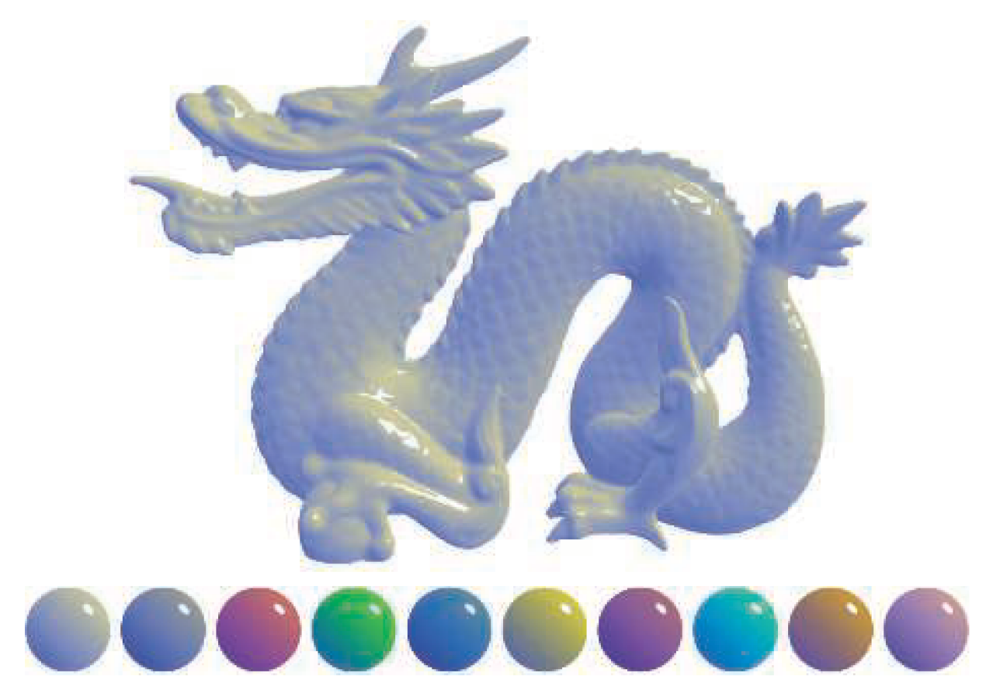

图1 带高亮效果的Gooth着色模型
* 主要公式如下

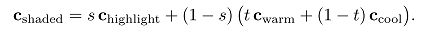

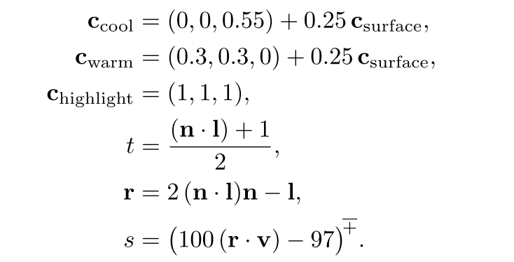

    x 带加减符号类似 opengl 的 clamp(0.0, 1.0)， 将x的值裁剪至0.0到1.0之间的范围。
    r 向量计算出太阳光方向在表面上反射的向量

## 2 光源
* 光照公式分为有光照和无光照部分

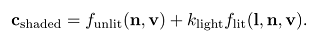

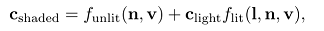

    最后一个公式是通用的公式

* 下面的公式是基于物理的, 公式中的 + 号表示小于 0 的值被裁剪掉

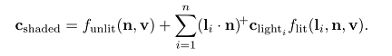

* 上面公式中光照函数最简单的形式如下, 可称之为郎伯(Lambert Light Model)光照模型

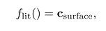

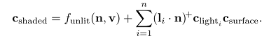

### 2.1 点光源
* 一些参数计算如下：

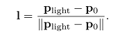

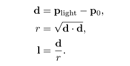
    
    * l 为光的方向
    * r 还可用于衰减光照的强度
* 光强和距离的关系

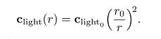

    * r0 表示该处的光强为 clight0, 取得一个参考值

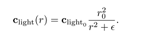

    * 增加一个参数表示光源大小

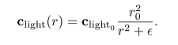

    * CryEngine 的做法

* 由于光源太远，计算光照效果会消耗性能，因此使用窗口函数限定计算的范围,下面公式是虚幻引擎的做法

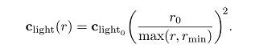

* 和距离有关的公司可以简化为下面的公式

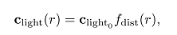

* Just Cause 2 使用的公式如下

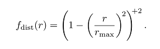

### 2.2 聚光灯

* 聚光灯公式，方向向量也参与了计算

* 聚光灯的内角和外角， 半影角(penumbra angle)和阴影角(umbra angle)

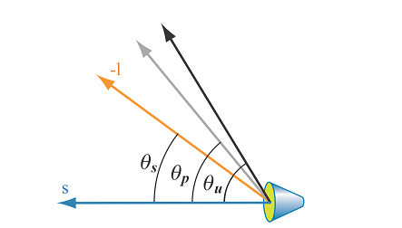

* 聚光灯方向函数的两种实现，分别用于 Frostbite 游戏引擎和 three.js 浏览器图形库

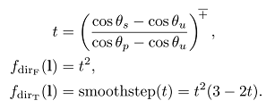

* 下图展示了效果，分别为方向光，点光源，聚光灯

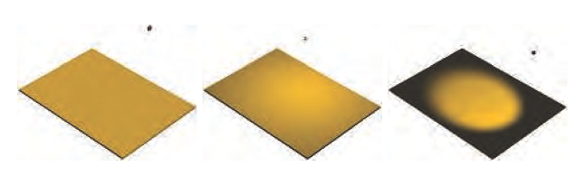

## 3 着色模型
* 着色模型的计算频率，和位于管道中的 stage 有关
    - Vertex shader --- 逐顶点计算
    - Hull shader --- 逐 surface patch 计算
    - Domain shader --- 逐 post-tessellation 顶点计算
    - Geometry shader --- 逐几何图元计算
    - Pixel shader --- 逐像素计算
* 通常着色模型的高亮部分是非线性的，因此最好不要在顶点阶段进行计算
* 在片元着色器中计算该片元的观察方向(物体到相机的方向)，使用插值后的物体位置进行计算。也就是说不要在顶点着色器中计算观察方向。
* 着色模型计算使用统一的坐标系。如果场景有多个光源，使用世界坐标系，否则使用相机坐标系
* 如果要实现类似鳞片面状的效果，可以使用几何着色器和顶点着色器，近年来顶点着色器用的更多，使用第一个顶点的属性作为整个面的属性，并禁止插值操作。
* 扩展 Gooch 模型(多光源)

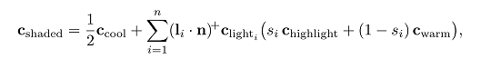

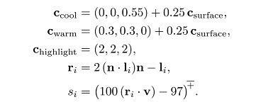

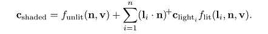

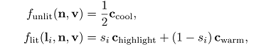

* 美工一般不直接操作着色器，而是操作材质。材质数据包括材质模板(material template)和材质实例(material instance). UE 的材质系统可以继承与派生。
* 着色器的一致变量可以在运行时设置，也可以在编译时设置。
* 材质系统对着色器功能的划分
    * 几何操作：刚体变换，顶点混合(vertex blending)，变形，tessellation，实例化，裁剪。(都是和网格有关的操作)
    * 片段操作：片段丢弃和片段混合
    * 设计一个着色模型，而后使用不同的着色参数
    * 材质的特色功能各自独立
    * 光照计算。
* 在源码层次上实现上面所有的组合划分，使用字符串连接和替换功能实现，或者使用 #if, #include, #define 宏实现。
* 通过条件预处理在编译时选择不同的代码，或者使用分支控制运行不同选项的代码，注意分支选择会产生大量的寄存器，引起性能下降。
* 大量着色器的解决策略
    - 代码重用：在共享文件内编写函数，用#include包含。
    - 减除不必要的功能： 、通过预处理器和分支控制实现
    - 功能的不同部分定义为节点，作为输入输出连接器组合起来，可用文本或可视化编辑器实现。
    - 常见着色器模型参数的计算和着色器模型的计算分离开来。
* 《WebGL Insight》介绍了不同引擎如何控制它们的着色器管线。
* 优化： 找出不同更新频率的变量，并将这些变量按照更新频率分组。再合适的时候按组更新这些变量。

# 4 失真和反失真
* 从采样的信号重构称之为过滤(filtering)
* Nyquist rate/Nyquist limit： 要重构原先的信号，采样频率要大于被采样信号频率的两倍。
* 过滤
    - box filter: 最近邻居
    - tent filter: 线性插值
    - low pass filter: 低通道过滤，移除高频部分。  理想的低通道过滤器为 sinc filter

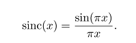

* 重采样，重构得到连续信号后，重采样以匹配另一个大小。
* 信号重采样的间隔更小(放大操作)，信号重采样的间隔更大(缩小操作)。
    - 放大操作：在重构的信号上直接采样
    - 缩小操作：移除掉更多高频部分

* 基于屏幕的反失真(Screen-Based Antialiasing): 在管线的输出样本上进行反失真操作。

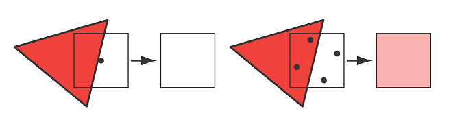

上图中，左图每个屏幕栅格只有一个样本，则该栅格要么是红色，要么是白色。右图每个栅格使用四个样本，则有多个结果。

* 反锯齿策略：使用一个采样模式，而后对样本进行权重求和操作，最后计算出最终的像素颜色值。

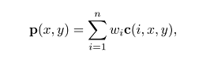

* 一些概念
    - supersampling(oversampling)：每个像素采样总的样本数量大于一个。
    - full-scene antialiasing(FSAA),也称之为 supersampling antialiasing(SSAA): 以更高的分辨率渲染场景，而后使用相邻采样创建一张图像。
* NVIDIA 的 dynamic super resolution 是 supersampling 更精巧的形式。使用一个更高的分辨率渲染场景，而后使用一个 13-sample Gaussian filter 生成显示的图像。
* 使用 accumulation buffer 实现 supersampling, 沿着x,y轴移动0.5个像素生成四张图象。OpenGL 3.0 支持该功能。在片段着色器中，通过使用更高精度的颜色格式用于输出 buffer，实现 accumulation buffer.

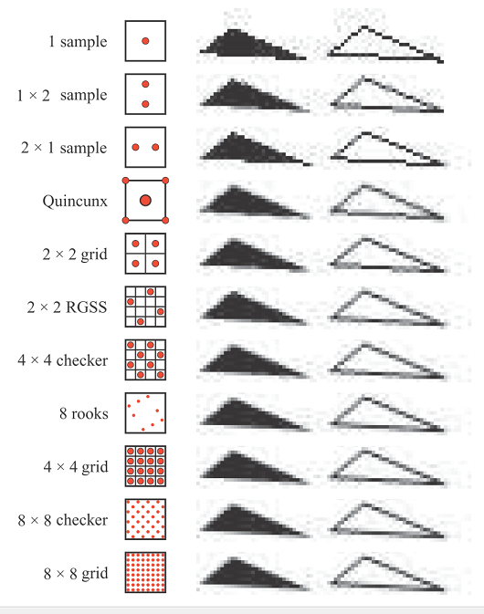

上图展示不同的像素采样方案。Quincunx 共享角落的样本，同时中心的样本权重为0.5. 2x2 rotated grid 在近水平的边上表现比 straight 2x2 grid 更好。 8 rooks 也表现比 4x4 grid 好， 虽然使用更少的样本。

* Multisampling antialiasing(MSAA)：每个像素只着色一次。如果MSAA所有位置上的样本都被片段所覆盖，则这些样本的着色使用像素的中心位置的内容去计算。否则计算样本所在位置的像素内容。MSAA 最重要的一点是样本会共享计算的结果。例如下图，三个红色覆盖的样本，共享像素中间位置计算的结果. 四个样本里存储的是索引值。NVIDIA 2006年引入了 coverage sampling antialiasing(CSAA)， AMD 则使用了 enhanced quality antialiasing(EQAA), 这些技术在更高的采样率下仅存储片段的覆盖率。

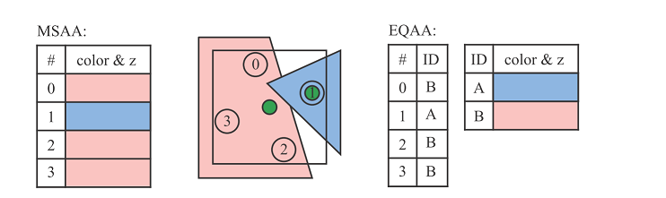

* 在 multiple-sample buffer 内渲染完所有的几何体后，执行 resolve 操作，其平均所有的样本颜色，生成像素最终的颜色。
* * custom filter antialiasing(CFAA): 能够使用 narrow 和 wide tent filter 
* 近水平，近垂直，45度斜线都是容易产生锯齿的地方。
* Rotated grid supersampling(RGSS) 使用一个旋转的四边形模式. 处理近水平或近垂直的边效果较好。
* N-rooks 采样， NXN个子网格， 每行每列最多一个样本。 其模式很重要， 如下图左图效果就很差。所以设置采样模式时避免将两个样本靠在一起

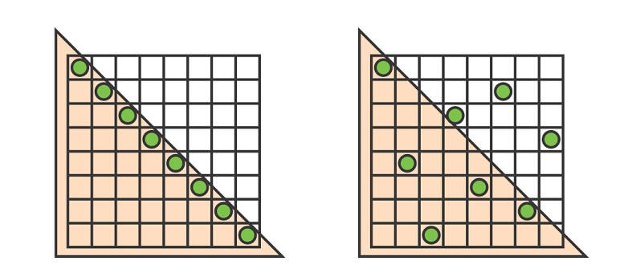

* 如果场景有一些微小的物体，使用常量间隔采样容易产生莫尔条纹和其他干涉图案。
* 每个像素使用随机的采样方式可以有效地减少失真。
* FLIPQUAD模式最初是为移动图形开发的，结合了Quincunx和RGSS。 它的优点是成本仅为每个像素两个样本，并且质量类似于RGSS（每个像素四个样本）。 此采样模式如下图所示

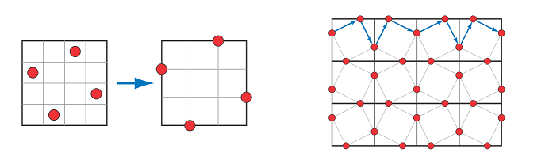

* morphological antialiasing(MLAA): 形态抗锯齿。“形态”表示和结构或形状有关的内容。在后期处理中执行。依赖于其他缓冲区(深度和法线）。subpixel antialiasing(SRAA)仅适用于几何边缘处的抗锯齿。 geometry buffer antialiasing(GBAA),distance-to-edge antialiasing (DEAA) 计算三角形边缘位于何处的附加信息，例如边缘距离像素中心多远.
* 使用颜色缓冲区的方案，directionally localized antialiasing(DLAA): 接近垂直的边水平模糊，接近水平的边与其邻居垂直模糊。

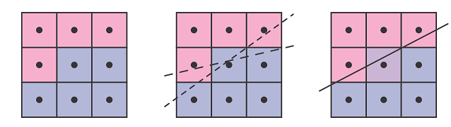

    上图演示了MLAA， 左图为失真图像，中间的图演示通过相邻像素得到可能的边。使用猜测得到的最好的边混合相邻像素计算出自身像素的颜色值。

* 基于图像的抗锯齿，比基于样本的抗锯齿计算的结果更好。对于基于样本的技术，如果使用四个样本，则最多五种可能性，分别为没有样本，一个样本，两个样本，三个样本，四个样本。基于图像的样本技术也有缺点，例如尖角会变得圆润，文字质量受到影响，还有小于一个像素的物体可能产生间隙，例如电线。此外执行时间和场景内容有关，场景内容复杂则执行时间更长。例如一个草场的抗锯齿是天空的三倍。

## 5 透明，Alpha, 合成
* 半透明物体的渲染，主要分为两类，分别为基于光学物理的效果和基于视觉的效果。本章节主要讲述基于视觉的效果。
* Screen-door transparent: 使用像素对齐的棋盘填充图案实现。交错填充像素。该方法缺点是不能同时有多个透明物体在不透明物体之上。例如红色透明物体和绿色透明物体在蓝色不透明物体之上只能看到两种颜色。同时只能使用 50% 的棋盘模式。该方法的优点是可以任意顺序绘制物体。
* 像素的 alpha 值还可以表示覆盖率。