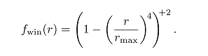

# 第5章 着色基础
## Gooch 着色模型
* Gooch 着色模型： 法线与光线方向越趋于一致，色调越暖，否则色调越冷

图1 带高亮效果的Gooth着色模型
* 主要公式如下

    x 带加减符号类似 opengl 的 clamp(0.0, 1.0)， 将x的值裁剪至0.0到1.0之间的范围。
    r 向量计算出太阳光方向在表面上反射的向量

## 光源
* 光照公式分为有光照和无光照部分

    最后一个公式是通用的公式

* 下面的公式是基于物理的, 公式中的 + 号表示小于 0 的值被裁剪掉

* 上面公式中光照函数最简单的形式如下, 可称之为郎伯(Lambert Light Model)光照模型

## 点光源
* 一些参数计算如下：

    
    * l 为光的方向
    * r 还可用于衰减光照的强度
* 光强和距离的关系

    * r0 表示该处的光强为 clight0, 取得一个参考值

    * 增加一个参数表示光源大小

    * CryEngine 的做法

* 由于光源太远，计算光照效果会消耗性能，因此使用窗口函数限定计算的范围,下面公式是虚幻引擎的做法

* 和距离有关的公司可以简化为下面的公式

* Just Cause 2 使用的公式如下

* 聚光灯公式，方向向量也参与了计算

* 聚光灯的内角和外角， 半影角(penumbra angle)和阴影角(umbra angle)

