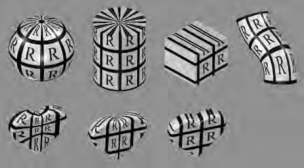

# 第6章 纹理
* 给表面贴纹理可以使用两张纹理，第一张纹理改变表面的颜色，第二章纹理改变表面的粗糙度. 例如使用不同的粗糙度表现墙壁上的砖块和砖块之间的砂浆部分。使用 bump mapping 生成墙壁的凹凸不平效果。使用 Parallax mapping 使用一张纹理变形平坦的表面，parallax occlusion mapping 在一张高度场纹理上发射射线以提升真实度。Displacement mapping 通过修改三角形高度来移动表面。

上图中使用了纹理和bump map

## 1. 纹理管线

* 当纹理的颜色位于 sRGB 空间，在用与着色公式的过程中，应将其转换至线性空间。
* 常见的纹理投影有球形，圆柱形，平面投影。

    上图分别演示球形，圆柱形，平面，自然投影，底下一行则分别演示球形，圆柱形和平面投影。

* 纹理投影可以使用其他的输入，例如表面的法线可用于选择六个平面投影方向中的一个作为表面的纹理投影。通常在建模阶段使用投影函数设置顶点的投影结果，不过有时也根据需要在顶点和片段着色器中使用投影函数设置纹理坐标。
* 球面投影与环境映射方案(environment mapping scheme)使用的投影相同，可见(10.4.1节)。圆柱投影的水平纹理坐标u和球面投影相同，纵向纹理坐标v则圆柱轴方向上的距离。平面投影则使用正交投影将图像投影至表面上，可用于贴花。
* 美工通常将模型分解为接近平面的部分，或展开网格，或生成一组接近最佳的平面投影集解决纹理投影的变形问题，感兴趣的话可见Hormann的SIGGARAPH的课程笔记[774]
* 三维纹理使用(u,v,w)三元组坐标。当使用4元组坐标时，可以将q作为齐次坐标的第四个值，实现类似于将灯上的装饰图案投影到舞台或者其他物体表面上时的效果。
* 同时还有cube map和一维纹理，一维纹理可以确定一个地形中不同高度下的颜色，如山脚为绿色，山顶为白色。同时线条也可以使用纹理，将雨水渲染成带半透明图形的线条。
* Corresponder functions 将纹理坐标转换至纹理空间的位置。通常使用 API 函数实现该功能。如 GLSL 的 texture 函数。另一种类型的 corresponder 则为一个矩阵变换，在顶点或片段着色器中使用，允许表面上的纹理执行平移，旋转，缩放，切变，投影操作。注意的是变换矩阵的顺序应当和想要的顺序相反。
* 纹理坐标位于[0,1]之外的处理: wrap,repeat,tile; mirror; clamp; boarder.
* 隐式的 corresponder function, [0, 1] 映射至一张图像上。

## 2 图像贴图(Image Texturing)
* DirectX 纹理左上角(0, 0), 右下角(1, 1)。 OpenGL 纹理左下角(0, 0), 右上角(1, 1). DX10 和 DX9之前的浮点坐标计算不一样，通过裁剪掉小数部分得到浮点像素位置的像素值，即像素中心的位置为 (0.5, 0.5)
* dependent texture read --- 纹理坐标通过计算而来，纹理的坐标值依赖于之前纹理的值。
* 现代 GPU 可以处理任意大小的非2幂(non-power-of-two NPOT)纹理, 图形加速器有不同纹理大小的上限，DX12 允许最多处理 16384^2 个纹理。
* 只要着色器的纹理输入和其颜色输出为线性关系，这个过滤各自的纹理值等同于过滤最终的颜色值。但有些纹理的输入和着色器的输出不存在线性关系，如法线和粗糙度, 这里就不能直接过滤输入的纹理值。
* 放大的过滤有最近邻居和双线性插值过滤，还可以在着色器中实现对 4x4 或 5x5 的纹素数组进行三次方卷积过滤(cubic convolution)
* 为了解决纹理放大的模糊问题，我们使用更详细的纹理解决该问题，例如手机上的划痕，地形上的灌木丛之类的细节.
* 许多更高阶的过滤器可以表示为重复的线性插值。由于双三次过滤代价较高，可以使用平滑曲线在一组 2x2 纹素之间进行插值。两个常用曲线如下：

对于 smoothstep 曲线，其位于0和1处的一阶导数均为0，对于 quintic 曲线来说， 在此之外， 位于0和1处的二阶导数也为0. 将纹理坐标的小数部分用曲线重新生成,而后和整数部分一起重新使用双线性插值进行计算。

* 纹理的信号频率不要大于采样频率的一半。假设图像由交替的黑线和白线组成，每个一个纹素宽。则波长为2个纹素长，所以频率为0.5，为了能正确在屏幕上显示纹理，每个纹素至少覆盖一个像素，即每个像素至多有一个纹素。
* 对于 sRGB 纹理，应将 sRGB 转换为线性空间，在该空间内执行所有 mipmap 过滤，然后将最终结果转换回 sRGB 颜色空间进行存储。
* LOD 和 LOD bias 控制纹理 mipmap 的访问。
* mipmap 的主要问题是模糊过度(overblurring)， 尤其是当u方向和v方向的LOD差别很大时。
* 使用 summed-area table(SAT) 技术解决过度模糊问题。创建和纹理一样大小的数组，但每个元素的大小要大于颜色的存储精度大小，例如 16 位存储 RGB 的每个通道。每个元素存储从纹理原点位置到达该纹理位置处的矩形内所有纹素颜色值的总和。根据当前像素覆盖纹理的矩形大小，计算平均纹理值。

* SAT 在纹理的对角线上还是会有过度模糊的现象。
* 无约束各向异性过滤(Unconstrained Anisotropic Filtering)，可以进一步改善纹理过滤，对于屏幕上渲染的某像素，将其反向投影至纹理，得到纹理上的一个四边形，获取纹理中的几个正方形近似模拟该四边形，使用四边形的较短边获取mipmap的LOD级别，使用四边形的较长边创建一条平行于较长边且穿过四边形中间的各向异性线。当各向异性的大小在1：1和2:1之间时，沿着这条线采集两个样本，见下图，其他更高的各向异性比率时，则需要沿轴获取更多的样本, 这种方法可以在任意方向上运行，没有SAT的方向限制。

* Cube Map 使用三维纹理坐标，其中绝对值最大的坐标用于选择六个面中的其中一个面，而后另外两个纹理坐标除以该最大坐标的绝对值，并通过加1后除以2得到[0.0, 1.0] 之间的纹理坐标值。
* Texture atlas(纹理图集): 将多个图像放入一个较大的纹理中。注意其内的子纹理大小任意。注意mipmap的生成和访问问题。可能会包含单独不想关的图像mipmap生成问题, 可以通过将每个子纹理放入大型纹理图集之前分别为它们生成 mipmap 层次结构，且子纹理使用二次幂分辨率.
* Texture Arrays(纹理数组)，所有子纹理具有相同的尺寸，格式，mipmap层次结构和MSAA设置。没有 mipmapping 和 wrapping 模式的问题。
* Bindless texure(无绑定纹理)，之前的绑定纹理，绑定的纹理单元数量有上限。无绑定的纹理，使用一个64位的指针(pointer)关联一个纹理，或者称之为(handle)。可以多种方式访问该 handle，如 uniform 变量， varying data, 或者来自其他纹理，来自一个着色器存储缓存对象(shader storage buffer object, SSBO), 应用需要确保纹理位于GPU端内。无绑定纹理避免了任何驱动器内的绑定代价，使得渲染速度更快。
* S3 Texture Compression(S3TC) --- DX 选择的纹理压缩标准，称之为 DXTC， DX10 内称之为BC(Block Compression). 该标准也是 OpenGL 中实施中的标准。该纹理压缩的特点：大小固定，每个编码的部分之间独立，易于解码，不同压缩部分解码相互独立，不互相依赖。
* DXTC/BC 压缩方案有七个变体，BC1/DXT1、BC2/DXT3、BC3/DXT5、BC4、BC5、BC6H、BC7，这些方案在 4x4 的 texel 块上完成编码。对于每个编码块，存储两个参考值(如两个参考颜色值)，则4x4块中16个纹理像素每一个都保存一个插值因子，即在两个参考值中的某个插值结果作为该纹素的结果。注意变种名称中的 DXT 表示用于 DirectX 9 中。 
    - BC1 有两个 16 位的参考 RGB 颜色值(5位红色，6位绿色，5位蓝色)，每个纹素用2位的插值因子选择其中一个参考值或者两个参考值的中间值。 
    - BC2 的编码类似于 BC1, 但每个纹素额外4位用于量化(quantized-raw)的alpha值。
    - BC3编码类似于BC1，但 alpha 数据使用2个 8位的参考值编码，每个纹素使用3位的插值因子，即每个纹素可以选择其中一个alpha值，或者六个中间值的一个。
    - BC4 使用单个通道编码 BC3 中的 alpha 
    - BC5 使用两个通道。
    - BC6H 用于 HDR(high dynamic range) 纹理，每个 R，G,B通道有16位浮点数，使用16个字节，结果为 8bpt。
    - BC7 每块包含一到三行。仍属于 LDR 纹理。
* OpenGL 中， BC6H 和 BC7 分别为 BPTC_FLOAT 和 BPTC, 上述的压缩方案都属于有损压缩。OpenGL ES 使用 Ericsson texture compression(ETC, 爱立信纹理压缩)。 4x4 的纹素块编码为 64 位。每个 2x4块(或4x2块，取决于提供最佳质量的块)存储基色。每块从一个小的静态查找表中选择四个一组的常量，块中的每个纹理像素可以选择添加其中一个值改变其亮度。
* OpenGL ES 3.0 包含 ETC2，添加了更多的模式。 EAC(Ericsson alpha compression)使用一个分量(如alpha值)压缩图像。所有的ETC1, ECT2, EAC 都是 OpenGL 4.0 core profile, OpenGL3.0, Vulkan, Metal 的一部分。
* 压缩法线贴图，假设 z 分量为正。 z 分量等于 1.0 减去 x分量和y分量的平方和后的平方根。而且还可以把 x和y分量存储在BC5/3Dc-格式的纹理进一步压缩空间。如果硬件不支持BC5/3Dc或EAC格式，则使用 DXT5 格式，将x,y分量存储在绿色和alpha分量内，这是由于这两个分量存储精度最高。
* PVRTC 为在PowerVR的硬件上使用的纹理压缩格式，用于 iPhone, iPad. 每个纹理像素提供2位和4位的方案，并压缩 4x4 纹理像素的块，提供图像的两个低频(平滑)信号,该信号通过相邻的纹素数据块和插值获得，而后用1位或2位在两个信号之间插值。
* ASTC(Adaptive scalable texture compression)自适应可伸缩纹理压缩。使用128位表示nxm的像素块，nxm的范围位4x4到12x12之间。ASTC 可以处理纹理1-4个通道的任何通道组合，还可以处理 LDR,HDR纹理，ASTC是OpenGL ES 3.2 以及更高版本的一部分。压缩通常可以比解压花费的时间更长，因为解压可以用固定功能的硬件完成。
* 还可在不同的颜色空间中压缩纹理， 常见有 RGB-YCoCg, 下面列出两种转换方法

## 3 程序纹理(Procedural Texturing)
* 对于程序纹理，常见的技术是使用一个或多个噪值函数生成纹素的值。噪值函数通常在连续的二次方频率(八度)上进行采样，每个八度带有权重，其随着频率增加而降低，这些加权样本的总和称之为湍流函数(turbulence function)。

上图演示使用程序纹理生成的体纹理。左图通过ray maching渲染的半透明体纹理(见 shadertoy 的 “Playing marble”)，右图为在一个真实世界环境中使用程序木材的着色器生成的合成图像。

* 由于噪声函数的成本，可预先计算三维数组中的晶格点(lattice points), 而后使用纹理插值。
* 其他的程序纹理，如计算每个位置和空间中一组"特征点"的距离来生成细胞纹理。
* 物理模拟和交互过程也可以产生另外一种类型的程序纹理
* 程序纹理的抗锯齿，由于程序纹理的作者知道纹理内容的有关“内部信息”，因此可以对其进行裁剪以免走样。例如每个噪声函数的频率都已知，因此可以丢弃任何会引起走样的频率。

## 4 纹理动画
* 可以将视频作为纹理的来源，逐帧变化。
* 可以通过逐帧修改纹理坐标实现纹理动画。此外还可以在纹理坐标上应用矩阵变化，实现平移，缩放，旋转，切变，图像扭曲，变形变换等。
* 还可以使用纹理混合技术实现纹理的动画。

## 5 Material Mapping(材质贴图)
* 纹理主要用于改变着色方程中用到的材质属性。
* 纹理还可以控制片段着色器中的控制流和函数，例如通过纹理控制表面的哪些部分有哪些材质，不同的材质可以执行不同的着色器代码。例如带有生锈区域的金属表面可以用纹理设置生锈的位置，生锈部分执行生锈相关的着色器，其他部分则执行带光泽的金属着色器。

## 6 Alpha Mapping

* 下图演示贴花的实现，帧缓存内首先渲染场景，而后渲染盒子及其内的所有点，贴花的纹理被投影至帧缓存的内容上，可看到最顶部有四个纹素，最左边的是一个完全透明的纹素，无影响, 黄色的纹素则完全不可见。

* 还可使用单个矩形绘制富有复杂轮廓的物体，例如灌木丛。但换个角度看矩形时则会失效，此时可以围绕树干旋转90度再度绘制灌木。不过仍未解决从空中观看到错误内容的问题。
* alpha 贴图和纹理动画的结合产生惊艳的效果，如闪烁的火炬，植物的生长，爆炸，大气效果。
* alpha 混合排序的问题。有几种方法，比如 Alpha Testing, 在像素着色器中丢弃低于给地阈值的Alpha值的片段。这种做法可用于之前90度旋转绘制的两遍灌木丛，要么完全透明，要么完全不透明。
* alpha 和 mipmaping 在一起会有个问题，就是当缩小时，物体变得更加透明。见下图，上图为没有修正的alpha test与mipmapping, 下图根据覆盖每一层 mipmap 重新缩放了 alpha 值。

* 一种解决方案， 对于 mipmap level k, 计算其覆盖率

* 其思想为计算每一个 mipmap level 公式中要大于的透明值，确保每一层的覆盖率都相等或近似。最后根据新计算的比较 alpha 值和低一级的alpha值的比值缩放场景内的 alpha 值。可见上图中下半部分的效果。
* Wyman and McGuir 提出了一个解决方案

* 用哈希函数代替随机函数避免时间和空间上的高频噪值

* 相应三维的哈希函数可以从二位哈希函数的嵌套得来，如 float hash3D(x,y,z) { return hash2D(hash2D(x,y),z); }, 这之内的输入为对象空间的坐标除以对象空间坐标的最大屏幕空间导数，而后进行裁剪得到的输入值。
* 当纹理放大时， Alpha testing 会显示 ripple 的走样效果。通过预乘以 alpha map 作为距离域来避免这样的走样。
* alpha 值转换成覆盖率，这样可以关闭 alpha 混合功能，同时无需排序。alpha 的含义为一个像素内覆盖了多少个样本。
* 如果两个具有相同alpha覆盖率的片段混合，混合片段将使用相同的子像素图案，这意味着一个片段将完全覆盖另一个片段。
* alpha 值如何影像插值，如果一个像素颜色 (255, 0, 0, 255), 相邻像素颜色为 (0, 255, 0, 2), 线性插值得到 (127, 127, 0, 128)。 结果不对， 应该让相邻像素预乘以 alpha 值再插值， (0, 2, 0, 2), e而后两个颜色插值得到 (127, 1, 0, 128). 这样结果就合理多了。最好在完成双线性插值之前进行alpha预乘。在构造 mipmapping 时如带有 alpha 值最好也先预乘 alpha 值。

## 7 Bump Mapping

* Bump mapping: 使用纹理改变片段着色器中着色方程中的法线，给予物体更多的细节。
* 在 Bump mapping 中， 每个顶点保存一个切线坐标系，可以将光线方向向量变换至该坐标系空间中。同时，我没还会存储切线和副切线向量，副切线向量有时候被称为副法线向量。可见下图每个顶点的切线坐标系。

* 三个轴构成一个矩阵

* 上面的矩阵常被称为 TBN， 这些向量可能并不垂直， 这是由于法线贴图可能会轻微改变以适应曲面的形状。为了解决这一问题，可以存储切线和副切线，而后通过正交得到法线，问题在于不知道法线的方向，即可能是左手或者右手求解正交，因此还有可能存储它们是左手还是右手方向，这些信息还可以保存为四元数以节省空间。

* Blinn 法，在每个纹素中存储两个有符号的值，沿着图像的两个方向改变法线的值，这两个方向都垂直于法线。这样的 bump map 称之为 offset vector bump map 或 offset bump map. 另一种方法则使用高度场实现，使用黑白纹理表示高度，通过计算相邻像素得到 u 和 v 方向的坡度。还可以在这个基础上使用 Solbel filter, 对于直接相邻的纹素给予更大的权重。

    - 上图演示了两种 bump map, 左边部分法线由纹理中存储的两个值在两个方向上改变法线，右边使用高度场(heightfield)计算坡度来改变法线。

    - 上图演示通过高度场实现的 bump map.

* 除了 Blinn 法之外，还可以直接存储一个 normal map. normal map 中的值， 0 表示 -1.0， 255 表示 1.0. normal map 中 存储的法线可以是世界坐标系空间下也可以是模型坐标系空间下，无论哪种，都将法线纹理以特定的方位绑定至具体的几何体上。通常存储法线切线空间的扰动. 同时还可压缩切线空间的法线映射，这是由于 z 分量(和未扰动法线对齐)的符号都假设为正。

    - normal map 的效果， 左上为没有应用normal map 的效果图， 右下为应用 normal map 的效果图

* 由于 normal map 保存的法线和最终计算的颜色之间不具有线性关系，因此 normal map 的过滤是一个难题。
* Lambertian 着色的表面则是特别情况，normal map 和最终的着色结果有线性关系。 Lambertian 着色的主要操作为点乘，这是一个线性操作。一组法线的平均和光线方向的点乘等同于这些法线与光线方向点乘结果的平均值。对于非 Lambertian 着色的面来说，除了过滤normal map之外，最好也过滤着色方程的其他输入。

* 使用高度场计算法线， 计算的非单元化的法线如下, 注意纹理的边界

* 使用 Horizon mapping 给 Bumping map 添加阴影。该纹理预先存储表面的方向和水平方向的角度，具体见 11.4 节

## Parallax Mapping

* bump map 的缺点无法产生相互遮挡的关系。
* Parallax mapping 的关键思路：通过检测那些被发现可见内容的高度值，推测出一个像素内应该看到的内容。
* 在 parallax mapping 中， bump 存储在高度域纹理中，当观看物体时，在某个给定的像素上，返回该位置的高度值，而后使用该高度值移动纹理坐标，得到其他位置的表面纹理颜色值。纹理坐标的移动量依赖于观看的视角角度和返回的高度值。具体可见下图。

    - 上图中左边的Pideal 为想要找到的点，算出的 Padj 如右图所示。

    - 上图公式 Padj 为计算的结果， h 为高度， Vxy 为单元化的向量v在水平上的分量，Vz 为高度上的分量。 该公式在切线空间内进行计算
* 上面的方法，在近水平的观看角度下会出现问题，这是由于 Vz 较小，则移动的位置变大产生的。 Welsh [1866] 提出移动的量不得大于返回的高度值，见下面的公式

