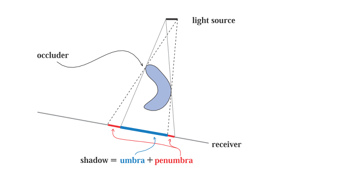
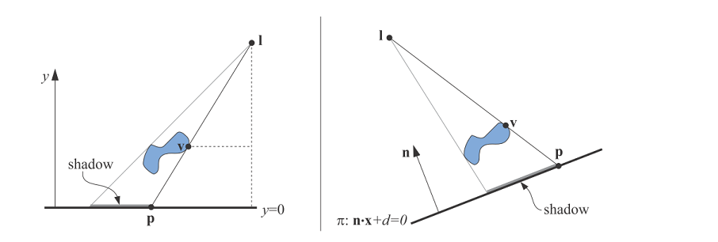
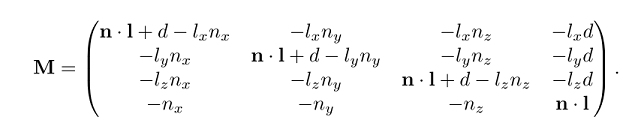
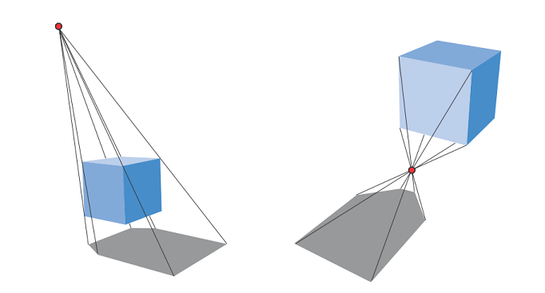
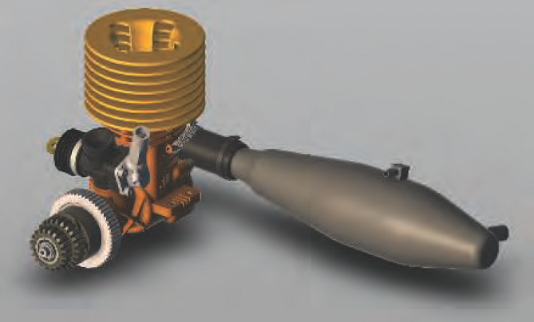
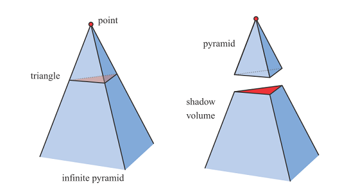
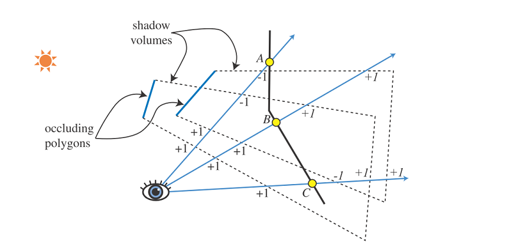

# 第7章 阴影
“All the variety, all the charm, all the beauty of life is made up of light and shadow.”  —--Tolstoy

* 有两本关于阴影的书籍[412, 1902]
* 下图为本章节用到的术语

    - occluder 投射阴影至 receiver. Punctual light souce 没有面积的点光源， 只能产生全阴影的区域，即硬阴影。如果使用有面积的光源或者体积光，则会产生软阴影。全阴影区域称之为umbra,半阴影区域称之为penumbra. 注意这里 umbra 区域不等同于硬阴影，其受光源大小和距离的影响。

## 1 平面阴影

* 将物体投影至平面，用矩阵实现。

* 通常投影平面我们增加一点偏移量， 避免阴影嵌入至其中。更安全的方法是先绘制地面，而后关闭 z-buffer，而后绘制阴影，最后如常渲染剩下的几何体。为了避免阴影落在地面的几何体之外，可以使用 stencil buffer 解决该问题。
* 绘制纹理还有种方法就是渲染到纹理，而后贴在地面上。该纹理是光照贴图(light map)的一种。这种方法支持曲面上的半影和阴影，缺点是该纹理被放大时，一个纹素的内容占多个像素， 容易产生失真。如果光源和阴影产生物体的相对位置不发生变化，我们可以反复使用该光照贴图。
* 当光源在投影物体和接受投影的平面之间，则会产生 antishadows. 如下图：

* 生成软阴影的一种方法: 生成地面平面的纹理实现软阴影的显示。
* 软阴影由带面积的光源产生，在该光源的面上采样几个点光源，从而生成几个点光源的图像结果，将其混合平均写入buffer中。这里 Heckbert 和 Herf 提供了基于视锥体的方法，光源为观察的相机处，地面构成了视锥体的远截平面，视锥体的内容要足够大到包括所有投射阴影的物体。
* 另一种办法时用卷积视线模糊。这样用一个光源点生成的硬阴影就足够了，但对于物体与地面接触的地方附近，均匀的模糊可能让人无法相信。见下图。

* 其他办法：渐变渲染轮廓边缘，球谐函数等方法 

## 2 在曲面上生成阴影
* 以光源的角度生成一张图像，产生阴影的物体被渲染成黑色，背景为白色。而后该图像贴在相应的曲面上。

## 3 阴影体
* 通过 stencil buffer 硬件实现的阴影算法
* 下图为 shadow volume 的图形化表示， 图中下面被裁剪的金字塔为 shadwo volume

* 主要原理为下图中的加一和减一的过程， 其中进入shadow valume加一，出 shadow volume 减一，大于1的情况下则位于阴影中，否则不在阴影中。使用 stencil buffer 实现. 通过分别绘制相机视角下正面的三角形和背面的三角形实现。

* 当物体被近裁剪面裁剪时会发生计数问题。使用 z-fail 方法， 只是其统计看不到的 shadow volume 技术， 如上图， 从 C 点开始，进入视锥体减一，出两个视锥体加二，最后结果为+1， 因此在阴影中。
